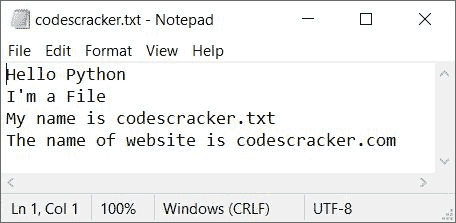
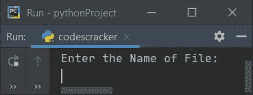
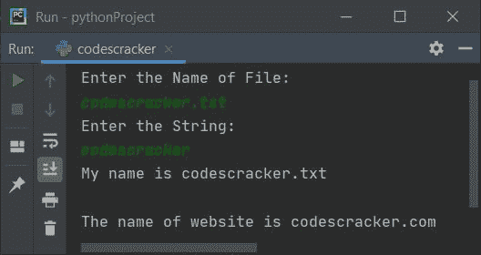
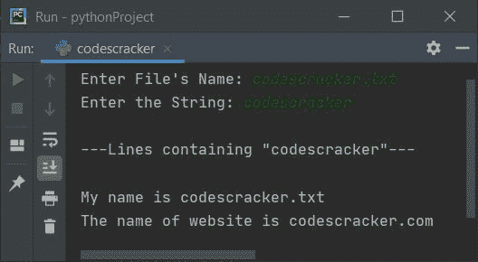
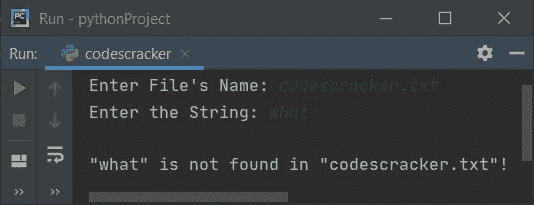
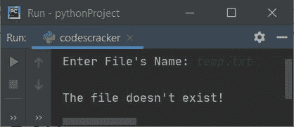

# Python 程序打印文件中包含给定字符串的行

> 原文：<https://codescracker.com/python/program/python-list-lines-containing-string-in-file.htm>

本文涵盖了 Python 中的一些程序，这些程序在给定的文件(也由用户在运行时输入)中查找并打印包含任何给定字符串(由用户在运行时输入)的行。在继续这个项目之前，让我们先做一些工作。

### 计划前要做的事情

因为下面给出的程序用于列出和打印包含用户在文本文件中输入的字符串的所有行。因此，必须创建一个文本文件，比如 **codescracker.txt** ，并保存在当前目录中。因此，创建一个包含以下内容的文件:

```
Hello Python
I'm a File
My name is codescracker.txt
The name of website is codescracker.com
```

将这个文件名为 **codescracker.txt** 的文件保存在保存 python 程序的文件夹中，该程序用于在文本文件中打印包含 给定字符串的行。以下是显示新创建文件内容的快照:



## 打印文件中包含给定字符串的行

问题是，*编写一个 Python 程序来打印包含用户输入的字符串的行。下面给出的程序是这个问题的答案:*

```
print("Enter the Name of File: ")
fileName = input()
print("Enter the String: ")
text = input()
fileHandle = open(fileName, "r")
lines = fileHandle.readlines()
for line in lines:
  if text in line:
    print(line)
fileHandle.close()
```

下面是它的运行示例:



现在提供输入，比如说 **codescracker.txt** 作为文件名，然后 **codescracker** 作为字符串来打印给定文件(codescracker.txt)中所有 包含 *codescracker* 的行，给定字符串:



#### 先前程序的修改版本

这个程序使用 *try-except* ，一个异常处理代码来处理诸如文件不存在，目录 不可访问等异常。喜欢的东西。让我们看一下这个程序及其示例运行，以便更清楚地理解。

```
print(end="Enter File's Name: ")
fileName = input()
try:
  fileHandle = open(fileName, "r")
  print(end="Enter the String: ")
  text = input()
  lines = fileHandle.readlines()
  lineList = []
  i = 0
  for line in lines:
    if text in line:
      lineList.insert(i, line)
      i = i+1
  fileHandle.close()
  if i==0:
    print("\n\"" +text+ "\" is not found in \"" +fileName+ "\"!")
  else:
    lineLen = len(lineList)
    print("\n---Lines containing \"" +text+ "\"---\n")
    for i in range(lineLen):
      print(end=lineList[i])
    print()
except IOError:
  print("\nThe file doesn't exist!")
```

下面是它的示例运行，用户输入与前一个程序的示例运行完全相同:



下面是另一个运行用户输入的示例， **codescracker.txt** 作为文件名， **what** 作为字符串:



下面是这个程序的最后一个运行示例，用户输入的文件名为 **temp.txt** (一个不存在的文件):



正如您在上面(最后一个示例运行)中看到的，异常处理代码获取异常并打印错误消息。

[Python 在线测试](/exam/showtest.php?subid=10)

* * *

* * *