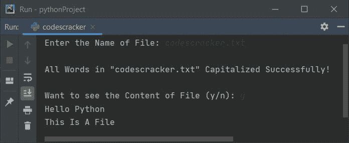

# Python 程序将文件中的每个单词大写

> 原文：<https://codescracker.com/python/program/python-capitalize-each-word-in-file.htm>

在本文中，您将学习并获得 Python 代码，以便在运行时将用户输入的文本文件中的每个(所有)单词大写。

### 计划前要做的事情

因为下面给出的程序是用来大写文件中的每个单词的。也就是说，在执行下面给出的程序后，用户输入的文件中的所有单词都变成大写。大写意味着，单词的第一个字母变成大写字母。

因此，首先创建一个名为 **codescracker.txt** 的文件，内容如下:

```
hello python
this is a file
```

将该文件保存在当前目录中，该目录是保存 python 程序将文件中的每个单词大写的目录。以下是打开文件的快照， **codescracker.txt** :


现在让我们创建一个 Python 程序来大写这个文件的所有单词。

## 文件中的每个单词都要大写

这个 Python 在运行时从用户那里接收文件名，并且将所有的单词大写。问题是，**写一个 Python 程序，将文件**中的每个单词大写。以下是它的答案:

```
totContent = ""
print("Enter the Name of File: ")
fileName = str(input())
fileHandle = open(fileName, "r")

for content in fileHandle:
    newContent = content.title()
    totContent = totContent + newContent

fileHandle.close()
fileHandle = open(fileName, "w")
fileHandle.write(totContent)

print("All Words Capitalized Successfully!")
fileHandle.close()
```

下面是它的运行示例:


现在输入文件名，说 **codescracker.txt** 并按`ENTER`键将该文件中 的每个单词的第一个字母大写。以下是运行示例:


下面是执行上述程序后打开的文件 **codescracker.txt** :


**注意-****title()**方法将每个单词的第一个字母转换成大写字母。

**注-** 如果不使用 **title()** 将每个单词大写，请参照 [将字符串](/python/program/python-capitalize-each-word-in-string.htm)中的每个单词大写 手动执行代码。

该程序的工作方式是，文件以阅读模式打开，其所有内容都被读取。所有单词都被大写并初始化为**to content**变量。现在使用 **close()** 方法关闭文件。文件再次被打开，但这次是以写模式，将**的内容放到 相同的文件中。这样，我们就把文件中的所有单词都大写了。**

#### 先前程序的修改版本

这个程序是前一个程序的修改版本。这个程序包括在操作文件时的错误处理代码。也就是说，当用户输入的文件在目录中不存在时，它处理错误。让我们来看看这个程序:

```
totContent = ""
print(end="Enter the Name of File: ")
fileName = str(input())

try:
    fileHandle = open(fileName, "r")
    for content in fileHandle:
        newContent = content.title()
        totContent = totContent + newContent
    fileHandle.close()

    try:
        fileHandle = open(fileName, "w")
        fileHandle.write(totContent)
        print("\nAll Words in \"" + fileName + "\" Capitalized Successfully!")
        print(end="\nWant to see the Content of File (y/n): ")
        ch = input()
        if ch=='y':
            fileHandle = open(fileName, "r")
            for content in fileHandle:
                print(end=content)
        else:
            print("Exiting...")
        fileHandle.close()
        print()
    except IOError:
        print("Error Occurred!")

except IOError:
    print("\nThe \"" + fileName + "\" is not Exist!")
    print("Exiting...")
```

下面是用户输入的示例运行，比如说 **codescracker.txt** (现有文件):



这里是另一个运行用户输入的示例，比如说 **codes.txt** (不存在的文件):


[Python 在线测试](/exam/showtest.php?subid=10)

* * *

* * *