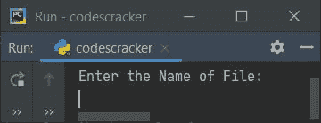

# Python 程序替换文件中的文本

> 原文：<https://codescracker.com/python/program/python-replace-text-in-file.htm>

创建这篇文章是为了介绍 Python 中一些替换文件中文本的程序。下面是本文中可用的程序列表:

*   用文件中的新文本替换特定文本
*   替换文件中的特定文本并打印新内容

### 计划前要做的事情

因为下面给出的程序是基于文件运行的。因此，一个文本文件比如说 **codescracker.txt** 必须在当前目录(保存 Python 程序源代码的文件夹)中 可用。因此，创建一个包含以下内容的文件:

```
My name is codescracker.txt
You are learning Python.
```

并将此另存为 **codescracker.txt** 。以下是在当前目录中创建的文件的快照:


这是打开的名为 **codescracker.txt** 的文件的快照:


现在让我们继续，创建一个程序，在运行时从文件中用用户提供的新文本替换一些文本。

## 用文件中的新文本替换文本

问题是，*编写一个 Python 程序，用一个 新文本替换文件中的任何特定文本。在这里，文件名、要搜索的旧文本和要替换的新文本必须由用户在运行时输入 。*这个问题的答案是下面给出的程序:

```
print("Enter the Name of File: ")
filename = input()
filehandle = open(filename, "r")
content = filehandle.read()
filehandle.close()

print("Enter text to search: ")
text = input()
print("Enter text to replace with: ")
replace = input()

if text in content:
    content = content.replace(text, replace)
    filehandle = open(filename, "w")
    filehandle.write(content)
    filehandle.close()
    print("\nThe text is replaced!")
else:
    print("Not Found!")
```

下面给出的快照显示了这个 Python 程序产生的初始输出:



现在按照程序的要求和你的要求提供所有的输入。提供输入后，将 **codescracker.txt** 作为文件名，**学习**作为要搜索的文本，**练习**作为要替换的文本，下面是使用完全相同的输入运行的示例:


现在，如果您看到与上面创建的文件相同的文件，它的内容会发生变化。也就是说，代替**学习**， 你将看到文本**练习**将可用。这是打开的名为 **codescracker.txt** 的文件的新快照:


## 替换文件中的文本并查看新内容

现在我已经更改了文件 **codescracker.txt** 的内容，如下图所示:


现在让我们创建前一个程序的修改版本，替换给定文件中的文本并打印文件的新旧内容:

```
print("Enter File's Name: ", end="")
filename = input()

filehandle = open(filename, "r")
content = filehandle.read()
filehandle.close()

print("Enter text to search for: ", end="")
text = input()
print("Enter text to replace with: ", end="")
replace = input()

oldcontent = content

if text in content:
    content = content.replace(text, replace)
    filehandle = open(filename, "w")
    filehandle.write(content)
    filehandle.close()
    print("\nThe text is replaced successfully!")
    print("\n-------Old Content-------")
    print(oldcontent)
    print("\n------New Content-------")
    print(content)
else:
    print("\nNot Found!")
```

下面是用户输入的运行示例， **codescracker.txt** 作为文件名， **Python** 作为要搜索的文本， **JavaScript** 作为要替换的文本:


下面是执行上述程序后同一文件的新快照:


[Python 在线测试](/exam/showtest.php?subid=10)

* * *

* * *