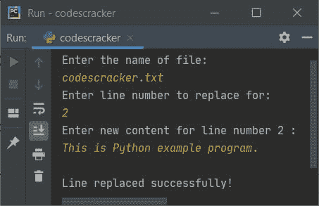

# Python 程序：替换文件中的特定行

> 原文：<https://codescracker.com/python/program/python-replace-specific-line-in-file.htm>

这篇文章介绍了一些用 Python 替换文件中特定行的程序。下面是本文涉及的程序列表:

*   替换文件中的特定行
*   替换文件中的特定行并打印文件的新内容

### 计划前要做的事情

由于下面给出的程序在文件上运行，因此在执行下面给出的程序之前必须有一个文件。因此，创建一个文件名 **codescracker.txt** 并放入以下内容:

```
This is a text file.
The name of this file is codescracker.txt
You are practicing Python by example here
```

在那个文件里。将文件保存在当前目录中。这里的当前目录是指保存程序源代码的文件夹。以下是存储在当前目录中的文件的快照:


这是打开的名为 **codescracker.txt** 的文件的快照:


现在让我们继续，创建一个程序来操作这个文件，用新行替换任何一行。

**注意-** 要替换任何一行，你必须输入行号，然后输入内容，用给定的内容替换行号。

## 替换文件中的特定行

问题是，*编写一个 Python 程序，替换文件中的任何特定行。文件名、 行号和行号的新内容必须由用户在运行时输入。下面给出的程序是这个问题的答案:*

```
print("Enter the name of file: ")
filename = input()

filehandle = open(filename, "r")
listOfLines = filehandle.readlines()
filehandle.close()

print("Enter line number to replace for: ")
lineNo = int(input())
print("Enter new content for line number", lineNo, ": ")
newline = input()
listOfLines[lineNo] = newline

filehandle = open(filename, "w")
filehandle.writelines(listOfLines)
filehandle.close()

print("\nLine replaced successfully!")
```

**注-** 输入行号时使用索引。也就是说，如果你想替换文本文件的第一行 ，那么输入 0 作为输入。如果要替换第二行，则输入 1，依此类推。

下面给出的快照显示了上述 Python 程序产生的初始输出。让我们来看看:


现在提供输入， **codescracker.txt** 作为文件名， **2** 作为行号， **这是 Python 示例程序。**作为内容替换为。以下是使用这些输入运行的示例:



现在，如果您将看到文件的内容， **codescracker.txt** ，它的第三行被替换为上面输入的新行 。以下是同一文件的新快照:


## 替换文件中的任何一行并打印新内容

在这个程序中，我实现了在替换行之后打印文件新旧内容的代码。因为它看起来更具互动性。

```
print("Enter File's Name: ", end="")
fname = input()

fhandle = open(fname, "r")
lines = fhandle.readlines()
fhandle.close()

print("Enter line number to replace it: ", end="")
lno = int(input())
print("Enter new content for line no.", lno, "\b: ", end="")
nline = input()

print("\n------Old Content-------")
content = ""
content = content.join(lines)
print(content)

lines[lno] = nline
fhandle = open(fname, "w")
fhandle.writelines(lines)
fhandle.close()

print("\n-----New Content--------")
content = ""
content = content.join(lines)
print(content)
```

下面是用户输入的运行示例， **codescracker.txt** 作为文件名， **2** 作为行号， **这是一个程序。**作为新行替换为:


[Python 在线测试](/exam/showtest.php?subid=10)

* * *

* * *