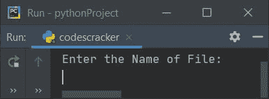
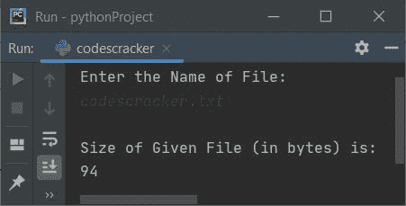
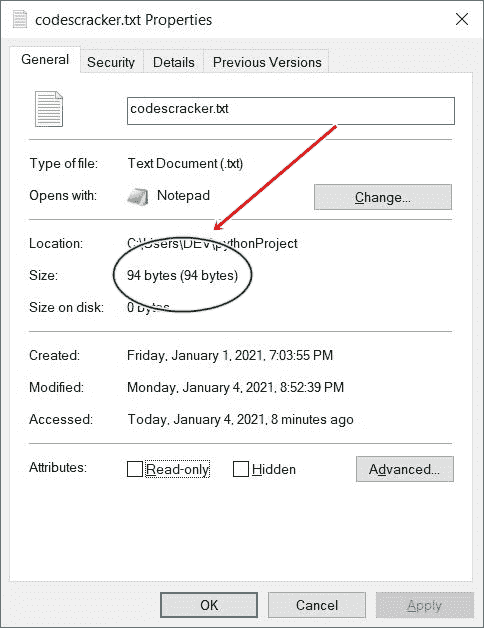
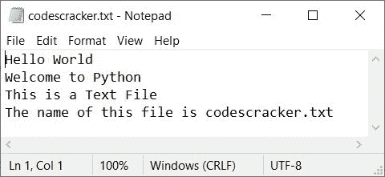
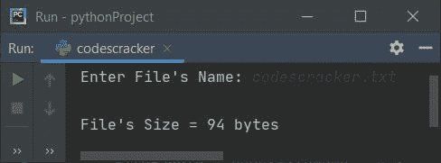
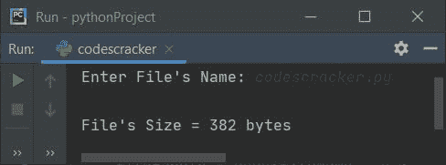
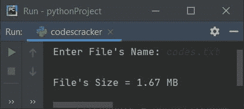
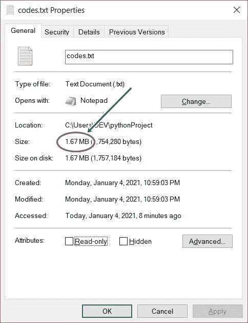

# Python 程序：计算找文件的大小

> 原文：<https://codescracker.com/python/program/python-find-size-of-file.htm>

本文涵盖了 Python 中的一些程序，这些程序在运行时查找并打印用户输入的文件大小。下面是本文涉及的程序列表:

*   使用 **getsize()** 函数查找文件大小
*   不使用任何预定义的函数来计算找文件的大小
*   查找以 KB、MB、GB、TB 为单位的文件大小

## 使用 getsize()计算找文件的大小

问题是，*编写一个 Python 程序，使用 **getsize()** 方法*找到文件的大小。下面的 节目是对这个问题的回答:

```
import os

print("Enter the Name of File: ")
fileName = input()
sizeOfFile = os.path.getsize(fileName)
print("\nSize of Given File (in bytes) is:")
print(sizeOfFile)
```

下面是它的运行示例:



现在输入文件名来查找并打印它的大小。下面是用户输入的示例输出 **codescracker.txt** 。 该文件已经存在于当前目录中。也就是保存上述程序(源代码)的文件夹:



此窗口显示了样本运行中提供的同一文件的详细信息和大小:



下面给出的快照显示了同一文件的内容:



**注-** 从文件内容可以看出， **codescracker.txt** 。有 **92 个**字符 (带空格)和 2 个换行符(看不出来)。第二行和第三行文本有换行符。也就是说 在第一行之后，有一个换行符，然后在第二行之后，有一个换行符。

## 使用基于用户的代码计算找文件的大小

问题是，*用 Python 写一个程序，在不使用任何预定义的 函数*的情况下，查找并打印文件的大小。以下程序是这个问题的答案:

```
print(end="Enter File's Name: ")
fileName = input()
try:
  fileHandle = open(fileName, "r")
  sizeOfFile = 0
  for line in fileHandle.readlines():
    sizeOfFile = sizeOfFile + (len(line)+1)
  sizeOfFile = sizeOfFile-1
  print("\nFile's Size = " +str(sizeOfFile)+ " bytes")
except IOError:
  print("\nThe File doesn't exist!")
```

以下是它的运行示例，具有相同的文件名，如 **codescracker.txt** :



下面是另一个使用用户输入运行的示例， **codescracker.py** (当前 Python 程序源代码文件的名称):



## 查找以 KB、MB、GB、TB 为单位的文件大小

现在这是本文的最后一个程序，它以 KB、MB、GB、TB 为单位查找并打印文件的大小。让我们来看看这个程序及其示例输出:

```
print(end="Enter File's Name: ")
fileName = input()
try:
  fileHandle = open(fileName, "r")
  sizeOfFile = 0
  for line in fileHandle.readlines():
    sizeOfFile = sizeOfFile + (len(line)+1)
  sizeOfFile = sizeOfFile-1
  kb = sizeOfFile/1024
  if kb>1:
    mb = kb/1024
    if mb>1:
      gb = mb/1024
      if gb>1:
        tb = gb/1024
        if tb>1:
          tb = "{0:.2f}".format(tb)
          print("\nFile's Size = " +str(tb)+ " TB")
        else:
          gb = "{0:.2f}".format(gb)
          print("\nFile's Size = " +str(gb)+ " GB")
      else:
        mb = "{0:.2f}".format(mb)
        print("\nFile's Size = " +str(mb)+ " MB")
    else:
      kb = "{0:.2f}".format(kb)
      print("\nFile's Size = " +str(kb)+ " KB")
  else:
    print("\nFile's Size = " +str(sizeOfFile)+ " bytes")
except IOError:
  print("\nThe File doesn't exist!")
```

下面是用户输入的示例运行， **codes.txt** :



以下是 **codes.txt** 文件的属性快照:



[Python 在线测试](/exam/showtest.php?subid=10)

* * *

* * *