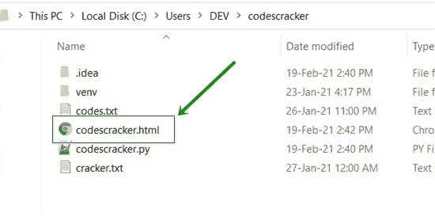
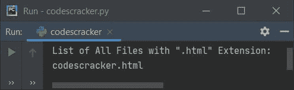

# Python 程序：列出目录中的文件

> 原文：<https://codescracker.com/python/program/python-program-list-files-in-directory.htm>

创建本文是为了涵盖 Python 中的一些程序，这些程序列出并打印目录中的文件。下面是本文中可用的程序列表:

*   列出并打印当前目录中的所有文件
*   列出当前目录中只有特定扩展名的文件
*   列出用户提供的任何目录中的文件

## 列出并打印当前目录中的所有文件

要列出当前目录中的所有文件，我们必须使用 **glob()** 方法。该方法是在**glob**T10】模块中定义的，因此在使用之前，必须将其导入。这样，我们就可以调用 中定义的 **glob()** 方法，使用模块名后跟**点(。)**运算符，然后是方法名，即 **glob.glob()**

当前目录是指保存 Python 程序源代码的目录。

**glob.glob()** 的参数定义了要列出的文件类型。也就是说，如果用户提供 ***。*** ，然后 表示列出所有文件。 ***** 表示所有类型，即点(。)表示 获取所有文件，点(.)表示获取所有扩展。

现在让我们创建一个程序来完成这个任务。但是在浏览程序之前，这里是当前目录文件夹的快照，在我的例子中，它包含三个文件:


现在让我们创建 Python 程序，通过程序列出并打印所有这些文件:

```
import glob

print("List of All Files in Current Directory:")
for file in glob.glob("*.*"):
    print(file)
```

这个程序产生如下图所示的输出。存储在当前目录(保存该程序的目录)中的任何(文件)都会在输出中列出并打印出来:


**注意-** 现在如果你在同一个目录下创建或添加另一个文件，比如说【codescracker.html】T2。这里是 创建另一个文件后当前目录文件夹的快照:



现在，如果您重新运行上述程序，那么这一次，输出包括一个新的文件名，即**codescracker.html** 作为其输出，如下图所示:


## 列出带有扩展名的目录中的文件

要列出并打印具有特定扩展名的文件，请说**。html** ，然后用 **html** 替换第二个星号(*) 。或者只列出文本文件(所有带有**的文件)。txt** 分机)，更换 ***。*** 同 ***。txt** 。下面是列出只有特定扩展名的文件的完整程序。html):

```
import glob

print("List of All Files with \".html\" Extension:")
for file in glob.glob("*.html"):
    print(file)
```

下面是它的示例输出:



当前目录下只有一个带**的文件可用。html** 扩展名。

### 列出用户提供扩展名的文件

这是前一个程序的修改版本。这个程序接收来自用户的输入作为扩展，以列出所需的扩展文件。输入**。*** 列出所有文件而不考虑扩展名:

```
import glob

print("Enter the Extension (eg, .txt, .html, .css etc): ", end="")
e = input()

fileslist = []
for file in glob.glob("*"+e):
    fileslist.append(file)

if len(fileslist)>0:
    print("\nList of All Files with \"" +e+ "\" Extension:")
    for f in fileslist:
        print(f)
else:
    print("\nNot found with \"" +e+ "\" extension!")
```

这是它的样本运行。这是最初的输出:


现在提供输入，比如说**。以 txt** 为扩展名，列出并打印所有带有**的文件。txt** 扩展名如下图所示:


这是另一个使用用户输入**运行的示例。css** (当前目录中没有此扩展名的文件):


## 按用户列出并查看任何目录中的文件

现在让我们修改上面的程序，允许用户输入他们自己需要的目录来列出所有的文件。 **chdir()** ( **改变目录**)用于改变目录。也就是说，无论提供什么目录作为它的参数。 当前工作目录被改变到那个目录。该方法在 **os** 模块中定义。

```
import glob, os

print("Enter Full Path of a Folder: ", end="")
path = input()
os.chdir(path)

print("\n1\. List all Files ?")
print("2\. List all Files with Particular Extension ?")
print("Enter Your Choice (1 or 2): ", end="")
try:
    ch = int(input())
    if ch==1:
        print("\nList of All Files:")
        for file in glob.glob("*.*"):
            print(file)
    elif ch==2:
        print("\nEnter the Extension (eg, .txt, .html, .css etc): ", end="")
        e = input()

        fileslist = []
        for file in glob.glob("*" + e):
            fileslist.append(file)

        if len(fileslist) > 0:
            print("\nList of All Files with \"" + e + "\" Extension:")
            for f in fileslist:
                print(f)
        else:
            print("\nNot found with \"" + e + "\" extension!")
    else:
        print("\nInvalid Choice!")
except ValueError:
    print("\nInvalid Input!")
```

我将操作一个目录，其中名为 **Scripts** 的文件夹包含这些文件:


复制这个文件夹(或任何你想要的文件夹)的完整路径，然后执行上面的程序并粘贴路径作为程序要求的第一个输入，如下图所示:


现在粘贴文件夹的路径说**C:\ Users \ DEV \ codescracker \ venv \ Scripts**在我的例子中，然后输入选择为 **2** ，然后是 **。exe** 作为扩展名，用**列出该目录中的所有文件。exe** 扩展名。以下是完整的示例运行:


#### 其他语言的相同程序

*   [目录中的 Java 列表文件](/java/program/java-program-list-files-in-directory.htm)
*   [C 列出目录](/c/program/c-program-list-files-in-directory.htm)中的文件
*   [C++列出目录](/cpp/program/cpp-program-list-files-in-directory.htm)中的文件

[Python 在线测试](/exam/showtest.php?subid=10)

* * *

* * *