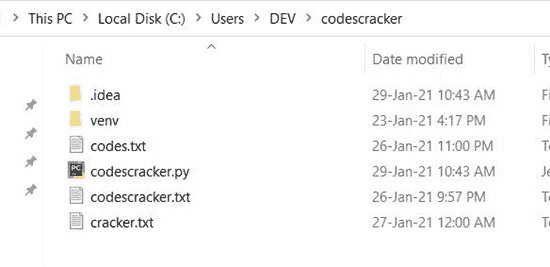
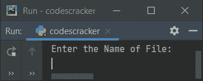
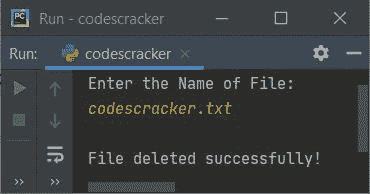
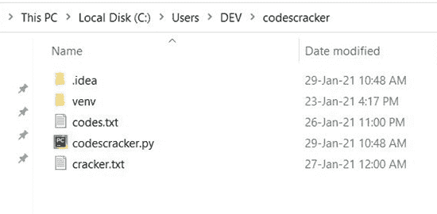
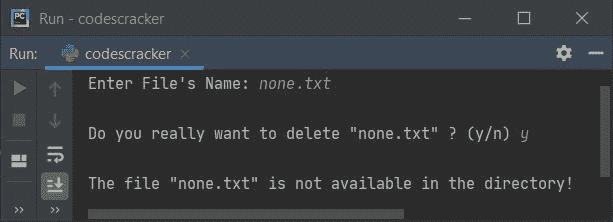
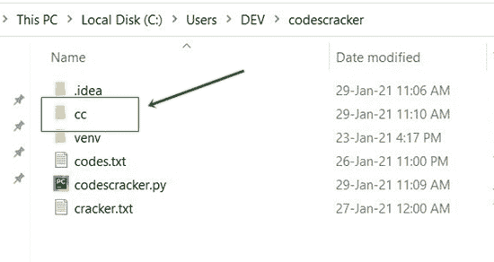
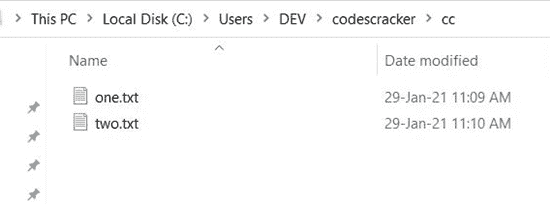
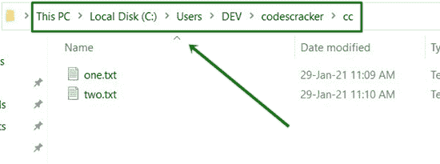
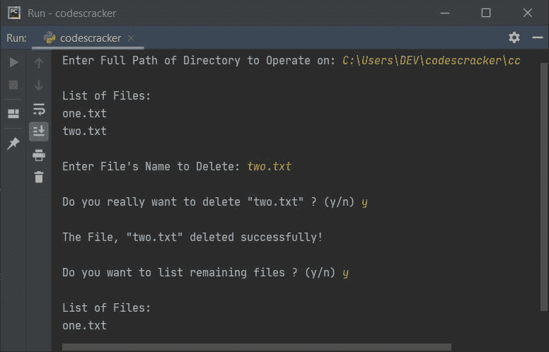

# Python 程序删除文件

> 原文：<https://codescracker.com/python/program/python-program-delete-files.htm>

这篇文章讲述了用 Python 编写的一些程序，这些程序可以在运行时删除用户输入的文件。以下是程序列表:

*   从当前目录中删除文件
*   如果存在，删除文件
*   从任何目录中删除任何文件。用户必须输入文件和目录的名称

因为下面给出的程序从当前目录中删除了一个文件。当前目录表示保存要删除文件的 Python 源代码(如下所示)的文件夹。这是在执行下面给出的程序之前，文件夹(当前目录)的快照:



正如您所看到的，这个文件夹中有一个名为 **codescracker.txt** 的文件。所以我会用下面给出的 程序删除这个文件。让我们开始吧。

## 从当前目录中删除文件

在 Python 中，要从当前目录中删除一个文件，你必须要求用户输入文件名，然后使用 **os.remove()** 来完成如下程序所示的工作:

```
import os

print("Enter the Name of File: ")
filename = input()

os.remove(filename)
print("\nFile deleted successfully!")
```

下面是这个 Python 程序产生的初始输出:



现在提供输入说 **codescracker.txt** 作为要删除的文件名，按`ENTER`键从当前目录删除 它。以下是提供这些输入后产生的输出:



以下是执行程序后当前目录的快照:



正如你从上面的截图中看到的，文件 **codescracker.txt** 不在目录中，因为 使用上面程序的执行和示例运行删除了该文件。

**注-****操作系统**模块允许我们使用操作系统的预定义功能对其进行操作。

**注意-****OS . remove()**用于移除或删除作为其参数提供的文件。

## 如果存在，删除文件

这是前一个程序的修改版本。这个程序向用户显示确认消息，不管他/她是否真的想要删除他/她输入的文件。这个程序还使用 **try-except** 来处理 删除文件时产生的错误。让我们来看看:

```
import os

print("Enter File's Name: ", end="")
filename = input()

print("\nDo you really want to delete \"" +(filename)+ "\" ? (y/n) ", end="")
ch = input()
if ch=='y':
    try:
        os.remove(filename)
        print("\nThe File, \"" +(filename)+ "\" deleted successfully!")
    except IOError:
        print("\nThe file \"" +(filename)+ "\" is not available in the directory!")
else:
    print("\nExiting...")
```

下面是它的示例运行，输入为 **none.txt** (一个不存在的文件):



执行 **try** 块中的第一条语句。也就是 **os.remove(文件名)**。当这个 语句产生一个错误，或者在删除文件时发生了一些奇怪的事情，那么使用**除了**， 我已经处理了 **IOError** (输入/输出错误)来产生或打印一个关于它的消息。

## 从任何文件夹(目录)中删除任何文件

这个程序是用 Python 从目录中删除文件的完整版本。也就是说，这个程序允许用户从任何目录中删除任何文件。

```
import os, glob

print("Enter Full Path of Directory to Operate on: ", end="")
dirpath = input()
os.chdir(dirpath)
print("\nList of Files: ")
chk = 0
for file in glob.glob("*.*"):
    chk = 1
    print(file)

if chk == 0:
    print("Empty Folder!")
else:
    print("\nEnter File's Name to Delete: ", end="")
    filename = input()

    print("\nDo you really want to delete \"" +(filename)+ "\" ? (y/n) ", end="")
    ch = input()
    if ch=='y':
        try:
            os.remove(filename)
            print("\nThe File, \"" +(filename)+ "\" deleted successfully!")
            print("\nDo you want to list remaining files ? (y/n) ", end="")
            ch = input()
            if ch=='y':
                os.chdir(dirpath)
                print("\nList of Files: ")
                for file in glob.glob("*.*"):
                    print(file)
        except IOError:
            print("\nThe file \"" +(filename)+ "\" is not available!")
    else:
        print("\nExiting...")
```

在执行程序之前，创建另一个文件夹，比如说 **cc** ，如下图所示:



在这个新创建的文件夹中创建任意两个文件，比如说 **one.txt** 和 **two.txt** 。这是包含两个新创建文件的文件夹的快照 :



现在复制该文件夹的完整路径，如下图所示:



也就是说，在我的例子中，新创建的名为 **cc** 的文件夹的完整路径是**C:\ Users \ DEV \ codescracker \ cc**。现在执行上面的 程序，复制粘贴(或键入)完整路径，按`ENTER`键，文件列表显示出来。然后输入 要删除的文件名。下面是显示上述程序完整示例运行的快照，一个接一个:



**注-**Python 的 **glob** 模块允许我们根据 Unix shell 相关规则匹配指定模式。基本上这个模块(在上面的程序中)是用来打印所有扩展名为 ***的文件。*** 。 ***** 前后点号(。)表示所有文件的名称和扩展名。

**注意-****OS . chdir()**方法用于改变当前工作目录。作为其参数传递的目录成为当前目录

上述程序的预演如下:

*   使用 **input()** ，用户输入的文件夹的完整路径被初始化为 **dirpath** 。 因此**dirpath = " C:\ Users \ DEV \ codescracker \ cc "**
*   循环的**开始执行，即当前目录下的第一个文件名 初始化为**文件**，程序流程进入循环**
*   在循环内部，使用 **print()** ，打印文件名。我已经初始化了 **1** 到**chk**T6】在退出循环后检查它的值，看看目录里是否有文件
*   现在在第二次，第二个文件被初始化为**文件**，它的值从循环内的 中打印出来
*   这个过程一直持续到每个文件都被打印出来
*   现在，在退出循环后，条件 **chk==0** 被评估。也就是说，如果程序流程进入循环内部的 ，意味着 **1** 被初始化为 **chk** 并且文件夹中有一些文件。或者当程序流 没有进入循环时，表示文件夹中没有任何文件。因此 **chk** 的值保持为 0(初始初始化)
*   现在程序流程转到 **else** 的主体(如果 **chk** 的值为 1，或者不等于 0)。所有的 语句被逐一执行。
*   在它的主体中，文件名被接收并初始化为**文件名**
*   再次使用 **input()** ，我收到了来自用户的另一个输入，不管他/她是否真的想要删除文件 。也就是说，如果输入的字符是**‘y’**，那么条件(如果**)**ch = =‘y’**或 **‘y’=‘y’**评估为真，程序流程进入其主体内部**
*   现在， **try** 的第一条语句被执行。也就是说， **os.remove(文件名)**被执行。如果 引发了一个 **IOError** (输入/输出错误)，那么程序流程转到**除了**的主体，并打印任何由程序员编写的 消息，如**文件不可用**或任何你想提供的内容
*   但是如果文件是可用的，那么文件被删除，并使用另一个 **input()** ，我已经显示了文件列表 ，如果用户输入**‘y’**

#### 其他语言的相同程序

*   [Java 删除文件](/java/program/java-program-delete-file.htm)
*   [C 删除文件](/c/program/c-program-delete-file.htm)
*   [C++删除文件](/cpp/program/cpp-program-delete-file.htm)

[Python 在线测试](/exam/showtest.php?subid=10)

* * *

* * *