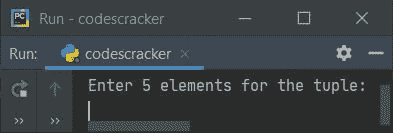
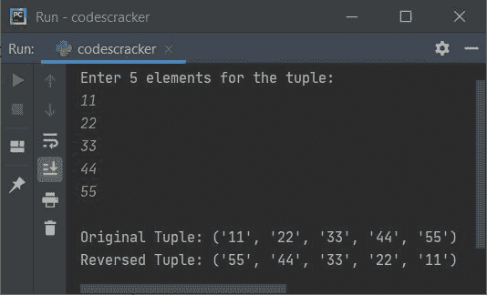
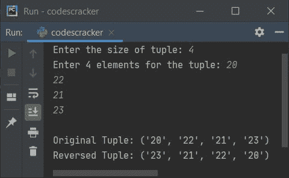

# Python 程序反转一个元组

> 原文：<https://codescracker.com/python/program/python-reverse-a-tuple.htm>

创建这篇文章是为了介绍 Python 中的一些程序，这些程序在运行时查找并打印用户输入的元组的反向内容。以下是此处涵盖的程序列表:

*   反转元组
*   反转一组 **n** 项
*   通过逐个初始化项目来反转元组

## 反转元组

问题是，*写一个 Python 程序来反转一个元组。元组的项目必须由 用户接收。*这个问题的答案是下面给出的程序:

```
mylist = list()
print("Enter 5 elements for the tuple: ")
for i in range(5):
    mylist.append(input())

mytuple = tuple(mylist)

revtuple = mytuple[::-1]

print("\nOriginal Tuple:", mytuple)
print("Reversed Tuple:", revtuple)
```

下面是它的初始输出:



现在提供输入，比如说 **11，22，33，44，55** 作为元组的五个元素，并按`ENTER` 键来反转元组，如下图所示:



在上面的程序中，我们已经从用户那里接收了条目，并存储在一个列表中。收到项目后，我们创建了一个 tuple，它包含存储在 list(由用户输入)中的完全相同的元素。然后进一步使用 **[::-1]** ，我们已经反转了元组，如上面给出的程序及其运行示例所示。

## 反转 n 个项目的元组

这个程序允许用户定义元组的大小及其项目。其余的事情和之前的程序差不多。

```
mylist = list()
print("Enter the size of tuple: ", end="")
tot = int(input())
print("Enter", tot, "elements for the tuple: ", end="")
for i in range(tot):
    mylist.append(input())

mytuple = tuple(mylist)

revtuple = mytuple[::-1]

print("\nOriginal Tuple:", mytuple)
print("Reversed Tuple:", revtuple)
```

下面是用户输入的运行示例， **4** 作为大小， **20，22，21，23** 作为四个元素:



### 通过逐个初始化项目来反转元组

您也可以使用另一种技术来反转元组，如下面给出的程序所示。这个程序将原始元组的项初始化为新的元组，但是顺序相反。这样，元组就反转了。

```
mylist = list()
print("Enter the size of tuple: ", end="")
tot = int(input())
print("Enter", tot, "elements for the tuple: ", end="")
for i in range(tot):
    mylist.append(input())

mytuple = tuple(mylist)
print("\nOriginal Tuple:", mytuple)

revtuple = ()
for i in reversed(mytuple):
    revtuple = revtuple + (i, )
print("Reversed Tuple:", revtuple)
```

在提供与前一个程序的示例运行完全相同的输入后，该程序产生与前一个程序完全相同的输出。

[Python 在线测试](/exam/showtest.php?subid=10)

* * *

* * *