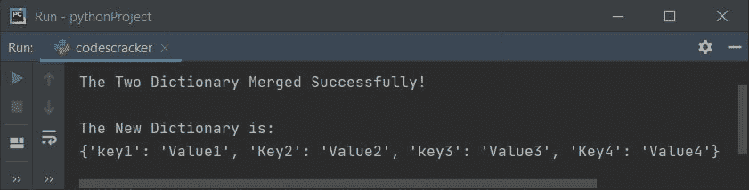
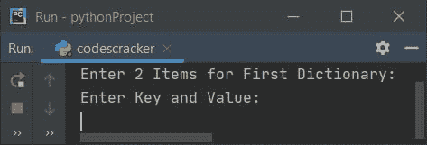
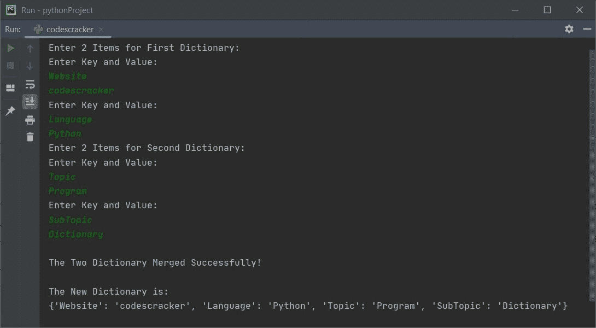
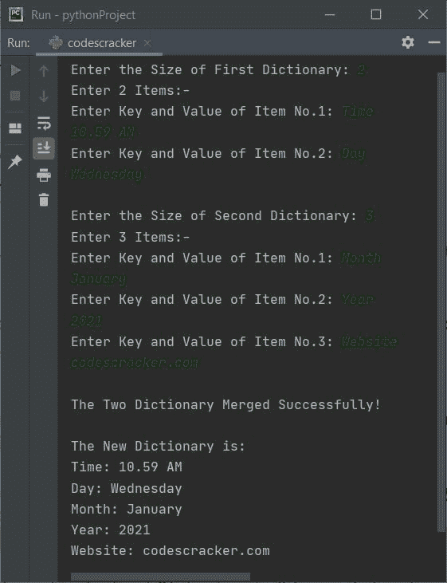

# Python 程序：合并两个字典

> 原文：<https://codescracker.com/python/program/python-merge-two-dictionaries.htm>

本文讨论了一些合并了两个字典的 Python 程序。下面是本文中可用的程序列表:

*   使用 **copy()** 和 **update()** 方法合并两个字典
*   不使用第三个字典合并两个字典
*   合并用户输入的两个字典
*   允许用户定义两个字典的大小和条目，然后执行合并操作

## 使用 copy()和 update()合并两个字典

问题是，*用 Python 的 **copy()** 和 **update()** ， 预定义方法*写一个 Python 程序合并两个字典。下面给出的程序是这个问题的答案。这个程序使用第三个字典的 帮助来完成这个任务。这个程序在运行时也不与用户交互。

```
DictionaryOne = {"key1": "Value1", "Key2": "Value2"}
DictionaryTwo = {"key3": "Value3", "Key4": "Value4"}

DictionaryThree = DictionaryOne.copy()
DictionaryThree.update(DictionaryTwo)

print("\nThe Two Dictionary Merged Successfully!")
print("\nThe New Dictionary is:")
print(DictionaryThree)
```

下面是它的示例输出:



## 合并两个字典而不合并第三个字典

现在这个程序不需要第三本字典的帮助。这个程序也不与用户交互。也就是说，这个程序不允许用户为任何字典输入任何输入值。

```
DictionaryOne = {"key1": "Value1", "Key2": "Value2"}
DictionaryTwo = {"key3": "Value3", "Key4": "Value4"}

DictionaryOne.update(DictionaryTwo)

print("\nThe Two Dictionary Merged Successfully!")
print("\nThe New Dictionary is:")
print(DictionaryOne)
```

这个程序产生与前一个程序相同的输出。

## 用用户输入合并两个字典

问题是，*用 Python 写一个程序，要求用户输入两个字典 的值，然后合并两个字典。*下面是它的回答。这个程序只从用户那里接收两个字典的两个条目。

```
DictionaryOne = {}
DictionaryTwo = {}
print("Enter 2 Items for First Dictionary: ")
for i in range(2):
  print("Enter Key and Value: ")
  dictKey = input()
  dictVal = input()
  DictionaryOne.update({dictKey: dictVal})
print("Enter 2 Items for Second Dictionary: ")
for i in range(2):
  print("Enter Key and Value: ")
  dictKey = input()
  dictVal = input()
  DictionaryTwo.update({dictKey: dictVal})

DictionaryOne.update(DictionaryTwo)

print("\nThe Two Dictionary Merged Successfully!")
print("\nThe New Dictionary is:")
print(DictionaryOne)
```

下面给出的快照显示了这个 Python 程序产生的初始输出:



现在提供输入，比如说**网站**作为第一个字典的第一项的关键字， **codescracker** 作为第一个字典的第一项的值 。类似地,**语言**和 **Python** 作为第一字典第二项 的键和值。再次输入**主题**和**程序**作为第二个 字典第一项的关键字和值。最后将**子标题**和**字典**作为第二个 字典的第二项的键和值，合并并打印新合并的字典，如下所示:



## 合并给定大小和项目的两个字典

这是所有先前程序的实际版本和修改版本。这个程序允许用户定义两个字典的大小和条目。在接收到字典的输入后，程序合并两个字典。

```
dOne = {}
dTwo = {}
print(end="Enter the Size of First Dictionary: ")
dOneSize = int(input())
print(end="Enter " +str(dOneSize)+ " Items:-\n")
for i in range(dOneSize):
  print(end="Enter Key and Value of Item No." +str(i+1)+ ": ")
  dKey = input()
  dVal = input()
  dOne.update({dKey: dVal})
print(end="\nEnter the Size of Second Dictionary: ")
dTwoSize = int(input())
print(end="Enter " +str(dTwoSize)+ " Items:-\n")
for i in range(dTwoSize):
  print(end="Enter Key and Value of Item No." +str(i+1)+ ": ")
  dKey = input()
  dVal = input()
  dTwo.update({dKey: dVal})
dOne.update(dTwo)

print("\nThe Two Dictionary Merged Successfully!")
print("\nThe New Dictionary is:")
dLen = len(dOne)
for m, n in dOne.items():
  print(str(m)+ ": " +str(n))
```

以下是用户输入的运行示例:

*   **2** 作为第一本字典的大小
*   **时间**和**上午 10.59**和第一项的键和值
*   **日**和**周三**为第二项的键和值
*   **3** 作为第二本字典的大小
*   **月**和**一月**作为第一项的关键字和值
*   **年**和 **2021** 为第二项的关键字和值
*   **网站**和 codescracker.com**为第三项的关键字和值**

 **让我们来看看使用这些输入运行的示例:



[Python 在线测试](/exam/showtest.php?subid=10)

* * *

* * ***