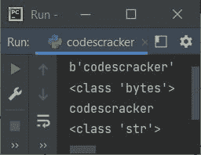
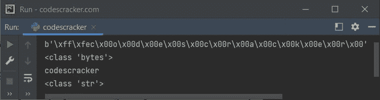
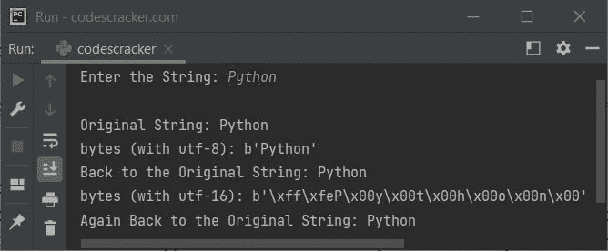

# Python 程序：将字节转换成字符串

> 原文：<https://codescracker.com/python/program/python-bytes-to-string.htm>

本文旨在介绍一个 Python 程序，该程序将[字节](/python/python-bytes.htm)转换为 [字符串](/python/python-strings.htm)。*问题是，写一个 Python 程序把字节转换成字符串。* 这个问题的答案，是下面给出的程序。

下面给出的程序定义了一个名为 **x** 的**字节**对象，然后打印该值及其类型。 然后使用 **decode()** 方法将 **bytes** 对象转换为 string 对象，然后再次打印同一个[变量](/python/python-variables.htm)的值 和类型:

```
x = b'codescracker'
print(x)
print(type(x))

x = x.decode()
print(x)
print(type(x))
```

下面给出的快照显示了上述 Python 程序产生的示例输出:



但问题是，当**字节**不包含**【UTF-8】**编码的数据时，那么就需要指定 同样的解码方法，即用来编码数据。例如，在下面的程序中，变量**x**T13】包含用 **UTF-16** 编码的*字节*对象，因此在解码成字符串时，我们需要使用与 相同的 **UTF-16** 解码:

```
x = b'\xff\xfec\x00o\x00d\x00e\x00s\x00c\x00r\x00a\x00c\x00k\x00e\x00r\x00'
print(x)
print(type(x))

x = x.decode("UTF-16")
print(x)
print(type(x))
```

下面是它的示例输出:



## Python 中字节到字符串的转换

这是本文的最后一个程序，它允许用户输入字符串。字符串用 **utf-8** 编码转换成**字节**，然后**字节**再次转换成字符串。使用 **utf-16** 编码和解码完成同样的事情 :

```
print("Enter the String: ", end="")
x = input()

print("\nOriginal String:", x)
x = bytes(x, "utf-8")
print("bytes (with utf-8):", x)
x = x.decode("utf-8")
print("Back to the Original String:", x)
x = bytes(x, "utf-16")
print("bytes (with utf-16):", x)
x = x.decode("utf-16")
print("Again Back to the Original String:", x)
```

带有用户输入 **Python** 的上述程序的示例运行显示在下面给出的快照中:



[Python 在线测试](/exam/showtest.php?subid=10)

* * *

* * *