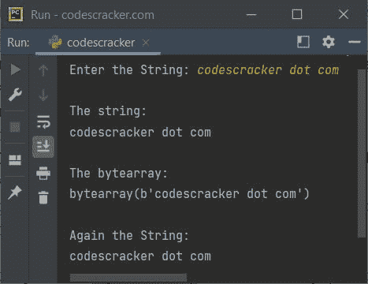

# Python 程序：将字节数组转换为字符串

> 原文：<https://codescracker.com/python/program/python-bytearray-to-string.htm>

创建这篇文章是为了介绍 Python 中的一个程序，该程序将[字节数组](/python/python-bytearray.htm) 对象转换为[字符串](/python/python-strings.htm)对象。该程序是以类似于在 [字节到字符串](/python/program/python-bytes-to-string.htm)中所做的方式创建的。

问题是，*写一个 Python 程序把 bytearray 转换成 string。*下面给出的程序是它的答案:

```
data = b'Python Programming'
print("bytearray =", data)
data = data.decode()
print("string =", data)
```

下面给出的快照显示了上述 Python 程序的示例输出，演示了从**字节数组**到**字符串**:


## Python 中的 bytearray 到 String

这个程序允许用户输入字符串。使用 **utf-8** 编码将字符串转换成**字节数组**，然后使用 **utf-8** 解码将**字节数组**转换回字符串。

```
print("Enter the String: ", end="")
x = input()

print("\nThe string:")
print(x)

x = bytearray(x, "utf-8")
print("\nThe bytearray:")
print(x)

x = x.decode()
print("\nAgain the String:")
print(x)
```

这是用户输入的示例运行**codescracker . com**



如果 **bytearray** 对象的数据使用其他编码方式，如 **utf-16** ，那么我们需要使用 same 解码，同时使用 **decode()** 方法将 **bytearray** 对象转换为 **string** 对象。

[Python 在线测试](/exam/showtest.php?subid=10)

* * *

* * *