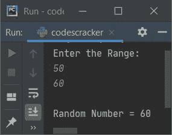
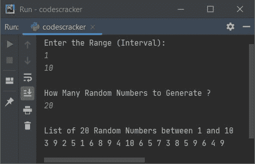

# Python 程序：生成随机数

> 原文：<https://codescracker.com/python/program/python-program-generate-random-numbers.htm>

本文涵盖了 Python 中的一些程序，这些程序生成并打印随机数。以下是用 Python 生成随机数的程序列表:

*   生成一个随机数
*   在给定范围内生成一个随机数
*   在给定范围内生成多个随机数

## 生成一个随机数

这个程序使用 **random.random()** 生成并打印一个随机数。函数 **random()** 是在 **random** 模块中定义的，因此我们在调用函数之前必须导入该模块，如下面给出的程序所示:

```
import random

randnum = random.random()
print("Random Number =", randnum)
```

下面是它的示例输出:


## 在给定范围内生成一个随机数

这个程序也做同样的工作，产生随机数，但在一个给定的范围内。该范围必须由用户在运行时提供。例如，如果用户输入范围为 **10** 和 **40** ，那么生成的随机数将大于等于 10 且小于等于 40。

```
import random

print("Enter the Range: ")
start = int(input())
end = int(input())

randnum = random.randint(start, end)
print("\nRandom Number =", randnum)
```

下面是它的运行示例:


现在提供输入，比如说 **50** 和 **60** 作为范围，以生成位于这两个数字之间的随机数，如下图所示:



#### 先前程序的修改版本

这个程序使用 **try-except** 来处理无效输入。其余的事情与前面的程序相似。

```
import random

print("Enter the Range: ")
try:
  start = int(input())
  try:
    end = int(input())
    randnum = random.randint(start, end)
    print("\nRandom Number =", randnum)
  except ValueError:
    print("\nInvalid Input!")
except ValueError:
  print("\nInvalid Input!")
```

这个程序产生与前一个程序相同的输出。

## 在给定范围内生成多个随机数

要在 Python 中生成给定范围内的多个随机数，必须要求用户输入范围，然后要求输入 **n** 的值，以打印给定范围内的 **n** 个随机数，如下面给出的程序所示:

问题是，**写一个 Python 程序，生成并打印给定范围内的 n 个随机数**。以下是它的答案:

```
import random

print("Enter the Range (Interval): ")
a = int(input())
b = int(input())

if a>b:
  t = a
  a = b
  b = t

print("\nHow Many Random Numbers to Generate ? ")
tot = int(input())

randnums = []
for i in range(tot):
  randnums.append(random.randint(a, b))

print("\nList of " +str(tot)+ " Random Numbers between " +str(a)+ " and " +str(b))
for i in range(tot):
  print(randnums[i], end=" ")
print()
```

下面是它的示例运行，使用用户输入的 **1** 和 **10** 作为范围，使用 **20** 作为大小，生成 1 到 10 之间的二十个 随机数，如下图所示:



语句(来自上面的程序) **randnums = []** 定义了一个空列表。以下代码:

```
for i in range(tot):
```

用于执行以下语句:

```
randnums.append(random.randint(a, b))
```

**tot** 次数。 **append()** 方法在列表 **randnums** 的末尾追加或添加一个元素。 以为例，如果 **tot=10** ，那么 10 个随机数将被逐一追加到名为 **randnums** 的列表中

**str()** 方法用于将 **int** 转换为 **string** 类型，这样，使用 **+** ，所有 在 **print()** 中的字符串会被连接起来，并立即打印在输出屏幕上。

#### 其他语言的相同程序

*   [Java 生成随机数](/java/program/java-program-generate-random-numbers.htm)
*   [C 生成随机数](/c/program/c-program-generate-random-numbers.htm)
*   [C++生成随机数](/cpp/program/cpp-program-generate-random-numbers.htm)

[Python 在线测试](/exam/showtest.php?subid=10)

* * *

* * *