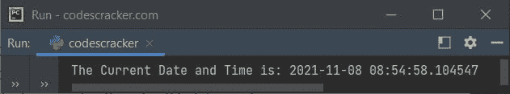
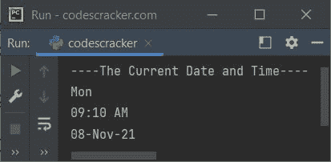

# Python 程序：打印日期和时间

> 原文：<https://codescracker.com/python/program/python-program-print-date-time.htm>

在本文中，我用 Python 创建了多个程序，以不同的方式打印日期和时间。以下是本文中包含的 项目列表:

*   以默认格式打印当前日期和时间
*   打印今天的日期名称
*   打印今天的日期
*   打印当前时间
*   以要求的格式打印当前日期和时间

## 用 Python 打印当前日期和时间的程序

问题是，*写一个 Python 程序打印当前日期时间。*下面给出的节目是它的 回答:

```
import datetime

current_dt = datetime.datetime.now()
print("The Current Date and Time is:", current_dt)
```

下面给出的快照显示了上面的 Python 程序在打印当前日期和时间时产生的示例输出，默认格式为:



## 用 Python 打印今天日期的程序

这个程序使用 **datetime** 模块的 **now()** 方法打印今天的日期。

```
import datetime
dt = datetime.datetime.now()
print("Today is", dt.strftime("%A"))
```

上述程序产生的输出将是当天的名称，如**星期一**、**星期日**、 、**星期二**等。

## 用 Python 打印今天日期的程序

这个程序打印当前日期。

```
import datetime
dt = datetime.datetime.now()
print("Date:", dt.strftime("%x"))
```

该程序产生的输出如下所示:

```
Date: 11/08/21
```

其中 **11** 是月份号，即【T11 月， **08** 指的是，今天是当月的第 8 <sup>日</sup>日 ，而 **21** 是年份，即简称 **2021** 。

## 用 Python 打印当前时间的程序

这是另一个单独打印当前时间的程序。

```
import datetime
dt = datetime.datetime.now()
print("Time:", dt.strftime("%X"))
```

该程序产生如下输出:

```
Time: 09:02:56
```

字符是一样的，但在之前的程序中是 **%x** (小写‘X’)，而在这个程序中是 **%X** (大写‘X’)

## 以指定格式打印日期和时间的程序

这是本文的最后一个 Python 程序，创建它是为了一次打印所有的东西，当然，是以手动或指定的格式。

```
import datetime

dt = datetime.datetime.now()

print("----The Current Date and Time----")
print(dt.strftime("%a"))
print(dt.strftime("%I"), ":", dt.strftime("%M"), " ", dt.strftime("%p"), sep="")
print(dt.strftime("%d"), dt.strftime("%b"), dt.strftime("%y"), sep="-")
```

上述程序产生的输出如下所示:



**注-** 要详细了解该主题，请参考其单独教程。

#### 其他语言的相同程序

*   [Java 打印日期和时间](/java/program/java-program-print-time-date.htm)
*   [C 打印日期和时间](/c/program/c-program-print-date.htm)
*   [C++ 打印日期和时间](/cpp/program/cpp-program-print-date.htm)

[Python 在线测试](/exam/showtest.php?subid=10)

* * *

* * *