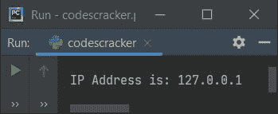
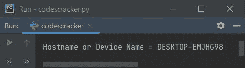
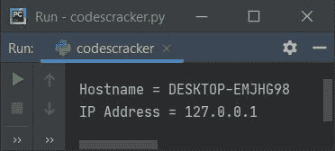
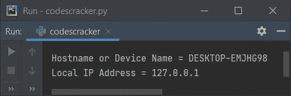

# Python 程序：获取主机名和 IP 地址

> 原文：<https://codescracker.com/python/program/python-program-get-ip-address.htm>

本文涵盖了 Python 中的一些程序，这些程序查找并打印计算机系统的主机名(设备名)和 IP 地址(本地 IP 地址)。以下是程序列表:

*   获取并打印 IP 地址
*   获取并打印主机名
*   使用函数获取主机名和 IP 地址
*   使用类和对象

## 查找并打印 IP 地址

问题是，**写一个 Python 程序来获取并打印一个计算机系统的 IP 地址。**下面是它的回答:

```
import socket

hostnm = socket.gethostname()
ipaddr = socket.gethostbyname(hostnm)

print("\nIP Address is:", ipaddr)
```

下面是它的示例输出:



两个方法，即 **gethostname()** 和 **gethostbyname()** 都是在 **socket** 模块中定义的，因此 我们必须在使用它的任何函数之前导入它。然后使用该函数，编写 **socket** object， 后跟 **dot(。)**运算符然后函数命名，就像上面给出的程序所示。

从上面的程序中，下面的语句:

```
hostnm = socket.gethostname()
```

将主机名分配给名为 **hostnm** 的 Python 变量。和下面的声明:

```
ipaddr = socket.gethostbyname(hostnm)
```

将 **hostnm** (主机名或设备名)的 IP 地址分配给 Python 变量 **ipaddr** 。上面的程序也可以写成:

```
import socket
print("\nIP Address is:", socket.gethostbyname(socket.gethostname()))
```

## 查找并打印主机名或设备名

这个程序获取并打印主机名或设备名，就像前面程序一样。

```
import socket

hn = socket.gethostname()
print("\nHostname or Device Name =", hn)
```

下面是它的示例输出:



如果您从**系统属性**中打开您的计算机系统的**关于**窗口，您会看到下面的 信息，其中包含的设备名称与通过上述程序产生的完全相同。在我的例子中，下面给出的快照 显示了我的计算机系统的窗口的**的一部分:**


## 使用函数获取主机名和 IP 地址

这个程序使用两个用户定义的函数来获取和打印计算机系统的主机名和 IP 地址。也就是说，名为 **FindHost()** 的第一个函数返回主机名，而名为 **FindIP()** 的第二个函数返回 IP 地址。

```
import socket

def FindHost():
    return socket.gethostname()

def FindIP():
    hn = FindHost()
    ip = socket.gethostbyname(hn)
    return ip

print("\nHostname =", FindHost())
print("IP Address =", FindIP())
```

下面是它的示例输出:



## 使用类获取主机名和本地 IP 地址

这是使用名为 **CodesCracker** 的类创建的最后一个程序。这个类包含两个成员函数，即 **FindHost()** 和 **FindIP()** 。要访问一个类的成员函数，需要一个相同类的对象

因此我创建了一个名为 **obj** 的对象，它属于 **CodesCracker** 类。所以使用这个对象，我可以使用**点 来访问类的成员函数。)**运算符。 **self** 是对 class 的当前对象的引用。

```
import socket

class CodesCracker:
    def FindHost(self):
        return socket.gethostname()
    def FindIP(self):
        hn = self.FindHost()
        ip = socket.gethostbyname(hn)
        return ip

obj = CodesCracker()
print("\nHostname or Device Name =", obj.FindHost())
print("Local IP Address =", obj.FindIP())
```

下面是它的示例输出:



#### 其他语言的相同程序

*   [Java 获取 IP 地址](/java/program/java-program-get-ip-address.htm)
*   [C 获取 IP 地址](/c/program/c-program-get-ip-address.htm)
*   [C++获取 IP 地址](/cpp/program/cpp-program-get-ip-address.htm)

[Python 在线测试](/exam/showtest.php?subid=10)

* * *

* * *