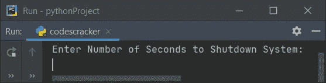
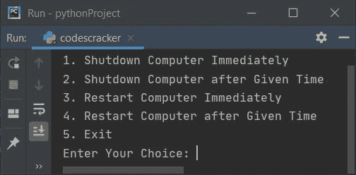
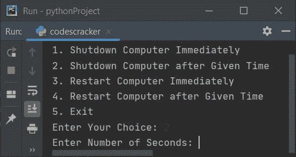

# Python 程序：关闭和重启计算机

> 原文：<https://codescracker.com/python/program/python-program-shutdown-restart-computer.htm>

在本文中，您将学习并获得 Python 中的代码，以关闭或重启计算机系统。这里列出了可用的程序:

*   关闭计算机
*   立即关闭计算机
*   用户在给定时间内关闭计算机
*   重新启动计算机
*   立即重启计算机
*   用户在给定时间内重启计算机
*   根据用户的选择关闭/重启计算机
*   关闭基于 Linux 的系统

**注意-** 本文中给出的所有 python 程序(在关机/重启时)都经过了良好的测试和执行。因此 在执行这里给出的任何程序之前，一定要保存所有的文件。

**注意** -在执行下面给出的任何程序之前，确保保存并关闭所有文件。因为在 执行这些代码(程序)后，你的系统会关机/重启，你可能会丢失未保存的文件。

要使用 python 代码关闭或重启您的计算机系统(PC 或笔记本电脑)，您必须首先导入 **os** 库，然后以这种方式使用 **os.system()** :

```
os.system("shutdown /s")
```

关闭系统。用 **/r** 替换 **/s** 重新启动系统。现在让我们用 Python 创建程序来完成这个任务。

## 使用 Python 关闭计算机

这个 python 程序在默认时间后关闭你的计算机系统，即 **30** 秒。你一运行下面给出的 程序，你的电脑就会在 30 秒后关机:

```
import os
os.system("shutdown /s")
```

**注意-** 在执行该程序之前，关闭所有文件。

**注-****OS**模块提供与[操作系统](/operating-system/index.htm)交互的功能。

**注意-****OS . system()**方法用于在 subshell 中执行*命令*。这里， *命令*属于*字符串*类型。

### 立即关闭计算机

要立即关闭系统，请将计时器设置为 0 秒。以便系统在 0 秒内关闭或立即关闭，如该程序所示:

```
import os
os.system("shutdown /s /t 0")
```

**注-****/T0**是本程序(比前一个程序)增加的额外代码。这里 **/t** 代表 定时器， **0** 表示 **0 秒**。因此在执行这个程序后，系统在 0 秒内关闭。

### 在给定时间内关闭计算机

该程序要求用户输入秒数来设置关闭系统的计时器:

```
import os

print("Enter Number of Seconds to Shutdown System: ")
sec = int(input())

strOne = "shutdown /s /t "
strTwo = str(sec)
str = strOne+strTwo

os.system(str)
```

下面是这个 python 程序产生的初始输出:



现在输入秒数，比如说 **10** 在 10 秒内关闭系统。

**注意-****str(sec)**用于将 **sec** (一个整型值)转换为字符串。因为要用 **+** 运算符来连接两个字符串值。也就是 **strOne** 和 **strTwo** 。第二个字符串是用户输入的计时器值。

## 使用 Python 重启计算机

要使用 python 程序重启计算机系统，只需将 **/s** 替换为 **/r** 即可，该来自给**的 程序，用于关闭系统**。其余的事情将与下面给出的程序相同:

```
import os;
os.system("shutdown /r")
```

### 立即重启计算机

这个 python 程序在 0 秒钟内或立即重启计算机:

```
import os
os.system("shutdown /r /t 0")
```

### 在给定时间内重新启动计算机

该程序与**在给定时间**内关闭计算机部分给出的程序相同。唯一要做的是，替换下面的语句:

```
strOne = "shutdown /s /t "
```

下面给出了声明:

```
strOne = "shutdown /r /t "
```

**注-** 就因为 **s** 和 **r** 的问题，整个节目都变了。

**注-** 也将**关机**字替换为**重启**，从打印消息。

## 根据用户选择关闭和重启

这里是两个程序的组合版本，即 python 中的关机和重启程序。

这个 python 程序要求用户输入执行所需操作的选项。也就是说，可以选择执行诸如立即关机、在给定时间关机等操作，如下面给出的程序所示:

```
import os

print("1\. Shutdown Computer Immediately")
print("2\. Shutdown Computer after Given Time")
print("3\. Restart Computer Immediately")
print("4\. Restart Computer after Given Time")
print("5\. Exit")
print(end="Enter Your Choice: ")
choice = int(input())

if choice==1:
    os.system("shutdown /s /t 0")
elif choice==2:
    print(end="Enter Number of Seconds: ")
    sec = int(input())
    strOne = "shutdown /s /t "
    strTwo = str(sec)
    str = strOne+strTwo
    os.system(str)
elif choice==3:
    os.system("shutdown /r /t 0")
elif choice==4:
    print(end="Enter Number of Seconds: ")
    sec = int(input())
    strOne = "shutdown /r /t "
    strTwo = str(sec)
    str = strOne+strTwo
    os.system(str)
elif choice==5:
    exit()
else:
    print("Wrong Choice!")
```

这里是上面 python 程序的快照，给用户提供了五个选项，他/她想做什么。即关闭、重启或退出程序:



如果用户输入 **1** 或 **3** 作为选择，则按下`ENTER`键后计算机立即关机/重启。 当用户输入 **2** 作为选择时，程序进一步要求输入关闭系统的秒数:



现在输入输入，比如说 **180** 在 180 秒或 3 分钟后关闭系统。

## 关闭基于 Linux 的系统

要使用 Python 程序关闭基于 linux 的系统，下面是代码:

```
import os
os.system("sudo shutdown now")
```

这个程序会立即关闭基于 linux 的系统。

#### 其他语言的相同程序

*   [Java 关机重启电脑](/java/program/java-program-shutdown-computer.htm)
*   [C 关机并重启电脑](/c/program/c-program-shutdown-computer.htm)
*   [C++ 关机并重启计算机](/cpp/program/cpp-program-shutdown-computer.htm)

[Python 在线测试](/exam/showtest.php?subid=10)

* * *

* * *