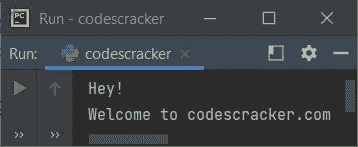
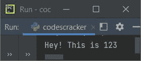
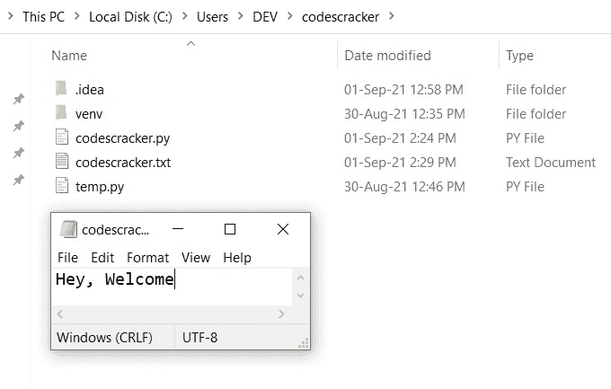
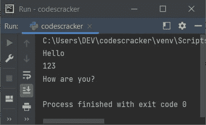
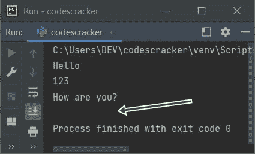

# Python `print()`关函数

> 原文：<https://codescracker.com/python/python-print-statement.htm>

Python 中的 **print()** [函数](/python/python-functions.htm)或语句是我认为在我的 视角中使用最多的语句。因为每次我们需要制作或打印一些输出时，就需要用到 **print()** 函数。这篇文章教你 关于这个函数的一切。

### print()函数的定义

**print()** 函数用于产生输出。例如:

```
print("Hey!\nWelcome to codescracker.com")
```

上述程序产生的输出与下面给出的快照完全相同:



## print()函数的语法

使用 **print()** 函数的语法是:

```
print(value(s), sep=' ', end='\n', file=sys.stdout, flush=False)
```

**注-** 除**值**外，其他参数均为可选参数。甚至**值**也是可选的。也就是说，如果不为 print() 提供任何参数，它不会产生任何错误。但是如果您没有提供任何值/表达式，那么对于那个 **print()** 语句，输出 将是空的。

**注意-** 通常我们不需要最后两个参数。这里也给出了这两个参数的解释。

## print()函数的所有参数

在上面的**语法中 print()** 。下面是对所有参数的逐一描述。

#### 值/表达式参数

这是最常用的参数。可以传递任意数量的值/表达式。也就是说， **print()** 中传递的表达式并不 局限于只有一个。也就是说，您可以向 **print()** 传递任意数量的表达式，其中表达式必须用逗号分隔，如下面给出的程序中的 所示:

```
print("Hey!", "\nWelcome to codescracker.com")
```

产生与本文第一个程序相同的输出。

**注意-****print()**函数在将 的东西写入或打印到输出屏幕之前，将传递给它的所有表达式转换成一个字符串。



#### sep=参数

现在第二个参数是 **sep=' '** 。它用于使用手动分配的字符或字符组合 来分隔表达式。要了解更多信息，请参考 Python 中的 [sep 参数。如果不使用 或将该参数提供给 **print()** 。那么默认情况下，所有表达式都用一个空格分隔。](/python/python-sep.htm)

#### end=参数

第三个参数是 **end='\n'** 。使用输出 屏幕上的 **print()** 跳过自动换行的插入。要了解更多信息，请参考 Python 中的[结束参数。如果您不使用它，那么在每个 **print()** 语句之后的 ，一个新行会自动插入到输出屏幕上。](/python/python-end.htm)

#### 文件=参数

第四个参数是 **file=sys.stdout** 。该参数用于将一些内容写入文件，而不是写入输出 屏幕。如果不使用这个参数，那么会自动使用 **sys.stdout** ，在输出屏幕上打印对象或表达式 。下面是一个使用**文件=** 参数的示例程序:

```
with open('codescracker.txt', mode='w') as file_object:
    print('Hey, Welcome', file=file_object)
```

在当前目录下创建一个文件 **codescracker.txt** 并将**嘿，欢迎使用**字符串写入该文件。如果打开 文件夹，上面程序的源代码就保存在这里。然后你看到一个文件 **codescracker.txt** 是可用的。如果你 打开那个文件，它包含**嘿，欢迎使用**作为内容。也就是说，如果需要将 **print()** 的所有表达式写入一个文件而不是写入输出屏幕，就需要使用 **file** 参数。这里是创建 文件的文件夹的快照，以及打开的文件 **codescracker.txt** :



**注意-** 要了解 Python 中的[文件处理，请参考单独的教程。](/python/python-file-io.htm)

#### 冲洗=参数

最后或第五个参数是 **flush** 。它被用来冲洗水流。该参数的默认值为**假**。 为其指定 **True** ，意味着输出被一个接一个地写成字符序列。一次写一个字符 是一个缓慢的过程。因此，我们不需要它，直到出现特殊要求，我们需要一次写一个字符。

## print()函数示例

下面是一个 **print()** 函数的例子，它使用了上面给出的语法中显示的所有参数:

```
import sys
print("Hello", 123, "How are you?", sep="\n", end="\n", file=sys.stdout, flush=False)
```

该程序产生的输出与下面给出的快照完全相同:



**注-** 除 **sep=** 外，以上程序中所有参数均赋予默认值。

我已经向您展示了由上述程序生成的完整输出屏幕。使用的 IDE 是 **PyCharm** 。因此，如果您在 **PyCharm** 中运行上面的 程序，那么您将看到完全相同的输出。

显示完整输出的原因是，主要向您展示 **sep** 和 **end** 的用法。可以看到，每个 表情都在说**你好**、 **123** 和**你好吗？**使用 **sep** 由换行符分隔，因为 **sep** 在当前 **print()** 函数可用时对其表达式进行操作。

然而**结束**并不作用于表达式，而是作用于当前完整的 **print()** 函数，其中 可用。其效果应用于下一次打印()。因此，在完成表达式的打印后，下一个输出被移到一个换行符 ，如下图所示:



但是在上面的程序中，如果您使用 **end=""** 来代替 **end="\n"** ，那么下面是您将看到的输出:


[Python 在线测试](/exam/showtest.php?subid=10)

* * *

* * *