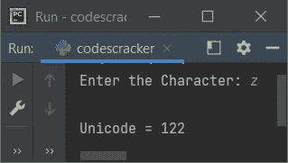

# Python ord()函数

> 原文：<https://codescracker.com/python/python-ord-function.htm>

Python 中的 **ord()** 函数在我们需要从指定的字符中获取 [Unicode](/computer-fundamental/unicode-characters.htm) 值时使用。例如:

```
ch = 'A'
print(ord(ch))
ch = 'B'
print(ord(ch))
ch = '4'
print(ord(ch))
ch = '5'
print(ord(ch))
ch = 'c'
print(ord(ch))
```

输出将是:

```
65
66
52
53
99
```

## Python ord()函数语法

Python 中的 **ord()** 函数的语法是:

```
ord(character)
```

## Python ord()函数示例

这里有一个 Python 中的 **ord()** 函数的例子。该程序在运行时从用户处接收一个字符 ，并打印给定字符的 Unicode 值:

```
print("Enter the Character: ", end="")
ch = input()
print("\nUnicode =", ord(ch))
```

下面给出的快照显示了上述程序的示例运行，用户输入 **z** 作为查找 并打印其 Unicode 值的字符:



但问题是，当用户输入一个无效输入时，比如 **codescracker** ，那么这个函数就会引发 **TypeError** 异常，因为 **ord()** 接受单个字符作为它的参数。因此 程序需要这样修改:

```
print("Enter the Character: ", end="")
ch = input()

try:
    uc = ord(ch)
    print("\nUnicode =", ord(ch))
except TypeError:
    print("\nInvalid Input!")
```

您将得到与前一个程序相同的输出。此外，程序打印出**无效输入！当用户输入不是单个字符的输入时，出现异常错误的**而不是 。

[Python 在线测试](/exam/showtest.php?subid=10)

* * *

* * *