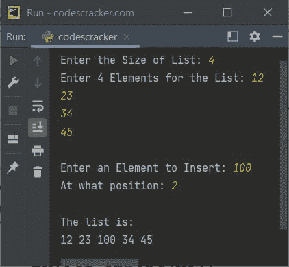

# Python `insert()`函数

> 原文：<https://codescracker.com/python/python-insert-function.htm>

Python 中的 **insert()** 函数用于 [在指定索引的列表](/python/program/python-insert-element-in-list.htm)中插入一个元素。例如:

```
a = [32, 43, 65, 75, 23]
a.insert(2, 100)
print(a)
```

上面的 Python 程序产生的输出，演示了 **insert()** 函数是:

```
[32, 43, 100, 65, 75, 23]
```

也就是说，元素 **100** 被插入到[列表](/python/python-lists.htm) **a** 中的第二个索引处。

## Python `insert()`函数语法

Python 中 **insert()** 函数的语法是:

```
listName.insert(indexNumber, element)
```

## Python `insert()`函数示例

下面是 Python 中 **insert()** 函数的示例程序。

```
print("Enter the Size of List: ", end="")
s = int(input())
print("Enter", s, "Elements for the List: ", end="")
mylist = []
for i in range(s):
    val = input()
    mylist.append(val)

print("\nEnter an Element to Insert: ", end="")
element = input()
print("At what position: ", end="")
pos = int(input())

mylist.insert(pos, element)
print("\nThe list is:")
for i in range(s+1):
    print(mylist[i], end=" ")
```

下面给出的快照显示了上述 Python 程序的示例运行，用户输入的 **4** 为列表大小， 12、23、34、45 为列表的四个元素， **100** 为要插入的元素， **2** 为索引:



[Python 在线测试](/exam/showtest.php?subid=10)

* * *

* * *