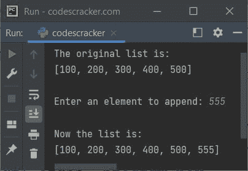
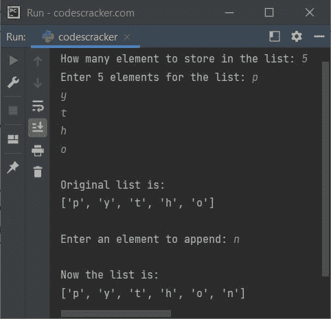

# Python `append()`关函数

> 原文：<https://codescracker.com/python/python-append-function.htm>

Python 中的 **append()** 函数，用于在 [列表](/python/python-lists.htm)的末尾添加新元素。例如:

```
mylist = [11, 22, 33, 44, 55]
print("Original list is:")
print(mylist)

mylist.append(66)
print("\nNow the list is:")
print(mylist)
```

上面的 Python 代码产生的输出说明了 **append()** 函数，它是:

```
Original list is:
[11, 22, 33, 44, 55]

Now the list is:
[11, 22, 33, 44, 55, 66]
```

## Python append()语法

下面是 Python 中 **append()** 函数的语法:

```
listName.append(new_element)
```

## Python append()示例

下面是 Python 中 **append()** 函数的一个例子。这个程序的创建方式是将用户输入的元素 添加到列表中:

```
mylist = [100, 200, 300, 400, 500]
print("The original list is:")
print(mylist)

print("\nEnter an element to append: ", end="")
element = int(input())
mylist.append(element)
print("\nNow the list is:")
print(mylist)
```

下面给出的快照显示了上述程序的示例运行，用户输入 **555** 作为要追加的新元素:



**注-** 到[在特定或 要求的索引处插入元素](/python/program/python-insert-element-in-list.htm)，然后使用 [insert()](/python/python-insert-function.htm) 功能。

## Python `append()`关函数-主要用途

当我们需要允许用户定义一个列表的大小以及它的所有元素时，那么 **append()** 方法 或者函数就发挥作用了。这里有一个例子:

```
print("How many element to store in the list: ", end="")
n = int(input())
print("Enter", n, "elements for the list: ", end="")
mylist = []
for i in range(n):
    val = input()
    mylist.append(val)

mylist = mylist
print("\nOriginal list is:")
print(mylist)

print("\nEnter an element to append: ", end="")
val = input()
mylist.append(val)
print("\nNow the list is:")
print(mylist)
```

下面是它的示例运行，用户输入的 **5** 作为要存储的元素数量， **p** 、 **y** 、 **t** 、 **h** 、 **o** 作为五个元素，而 **n** 作为要追加的元素:



**注意-****input()**函数将每个输入值都视为**字符串**类型。如果你想使用 整数值，那么使用 **int(input())** 。

## Python `append()`关函数——将一个列表追加到另一个列表

因为 Python 允许嵌套列表，所以可以使用 **append()** 函数将一个列表追加到另一个列表中。 这里有一个例子:

```
listOne = [1, 2, 3]
listTwo = [4, 5, 6]
print(listOne)
listOne.append(listTwo)
print(listOne)
```

该程序产生以下输出:

```
[1, 2, 3]
[1, 2, 3, [4, 5, 6]]
```

**注意-** 追加多个条目，而不是追加一个列表，以避免创建嵌套列表。然后 Python 提供了另一个功能，那就是 [extend()](/python/python-extend-function.htm) 。

[Python 在线测试](/exam/showtest.php?subid=10)

* * *

* * *