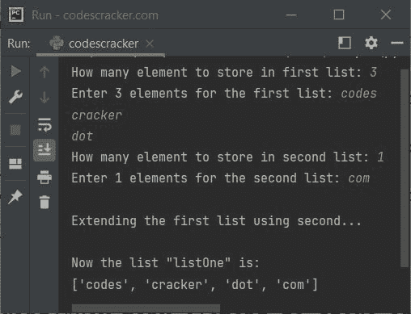

# Python extend()函数

> 原文：<https://codescracker.com/python/python-extend-function.htm>

Python 中的 **extend()** 函数，用于在 [列表](/python/python-lists.htm)的末尾添加多个元素或一个 iterable。例如:

```
a = [65, 7, 8]
print("The list a is:")
print(a)

a.extend([76, 890])
print("\nNow the list a is:")
print(a)

b = [1, 2, 78, 43]
a.extend(b)
print("\nNow the list a is:")
print(a)
```

上面的 Python 程序产生的输出，演示了 **extend()** 函数，是:

```
The list a is:
[65, 7, 8]

Now the list a is:
[65, 7, 8, 76, 890]

Now the list a is:
[65, 7, 8, 76, 890, 1, 2, 78, 43]
```

**注意-** 不限于每次使用 **extend()** 添加多个元素。也就是说，使用这个函数，你可以自由地 在列表末尾添加单个元素。

**建议**——如果你想在列表的末尾添加单个元素，请选择 [【append()](/python/python-append-function.htm)，而不是 **【extend()**。同样，如果你想添加一个 iterable 如 list、 [tuples](/python/python-tuples.htm) 、 [set](/python/python-set.htm) 等。本身在一个列表的末尾以某种方式使这个列表变成了嵌套的 列表，然后转到 **append()** 。

## Python extend()函数语法

使用 **extend()** 函数的语法是:

```
listName.extend([value1, value2, value3, ..., valueN])
```

或者

```
listName.extend(iterable)
```

**iterable** 可以是列表、元组、集合等。

## Python extend()函数示例

下面是一个用 Python 演示 **extend()** 函数的例子:

```
a = ["codes", "cracker"]
b = {1, 2, 3}
a.extend(b)
print(a)

c = ['p', 'y', 't']
d = ('o', 'n')
c.extend(d)
print(c)
```

下面是它的示例输出:

```
['codes', 'cracker', 1, 2, 3]
['p', 'y', 't', 'o', 'n']
```

下面给出的程序也产生与上面相同的输出:

```
a = ["codes", "cracker"]
a.extend({1, 2, 3})
print(a)

c = ['p', 'y', 't']
c.extend(('o', 'n'))
print(c)
```

让我们创建另一个示例程序，演示 Python 中的 **extend()** 函数:

```
a = ["codes", "cracker"]
b = (1, 2, 3)
c = {'c', 'o', 'm'}

a.extend(b)
a.extend(c)

print(a)
```

该程序产生以下输出:

```
['codes', 'cracker', 1, 2, 3, 'c', 'o', 'm']
```

下面是另一个示例，演示了 Python 中的 **extend()** 方法，带有用户输入:

```
print("How many element to store in first list: ", end="")
tot = int(input())
print("Enter", tot, "elements for the first list: ", end="")
listOne = []
for i in range(tot):
    listOne.append(input())

print("How many element to store in second list: ", end="")
tot = int(input())
print("Enter", tot, "elements for the second list: ", end="")
listTwo = []
for i in range(tot):
    listTwo.append(input())

print("\nExtending the first list using second...")
listOne.extend(listTwo)
print("\nNow the list \"listOne\" is:")
print(listOne)
```

下面给出的快照显示了上述 Python 程序的示例运行，用户输入的 **3** 作为第一个列表的大小， T2【代码】T3、**破解**、**点**作为其三个元素，以及 **1** 作为第二个列表的大小，而 **com** 作为其元素:



**注意-****+**操作符也可以用来扩展一个列表。

[Python 在线测试](/exam/showtest.php?subid=10)

* * *

* * *