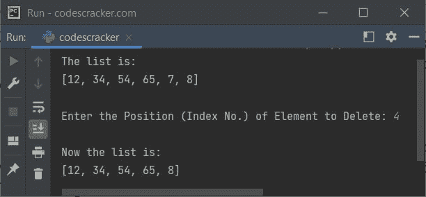
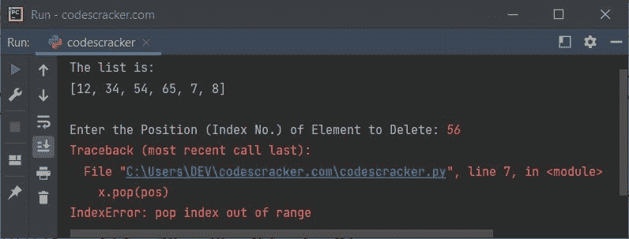
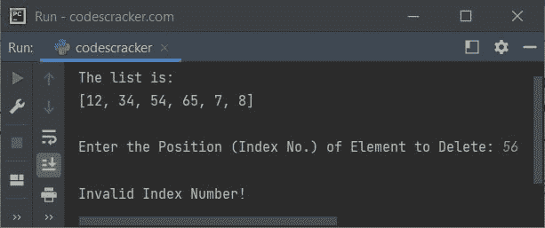
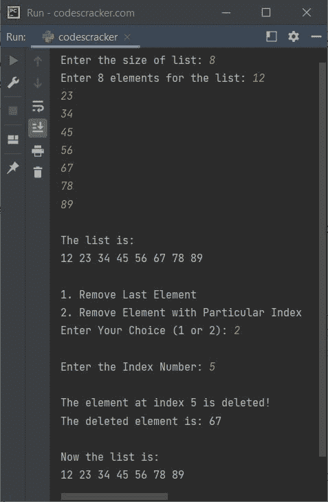
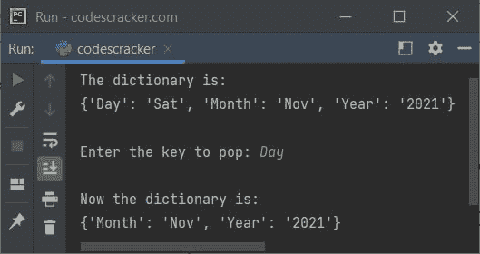
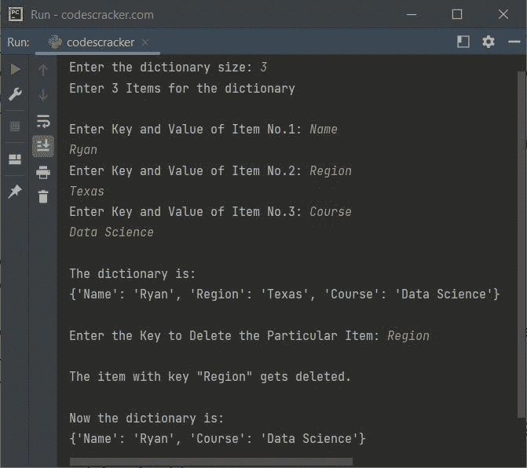

# Python pop()函数

> 原文：<https://codescracker.com/python/python-pop-function.htm>

Python 中的 **pop()** 函数用于<u>从列表</u>中删除一个项目。例如:

```
mylist = [10, 40, 50, 60, 30, 32]

mylist.pop()
print(mylist)

mylist.pop(3)
print(mylist)
```

上面的 Python 程序产生的输出展示了 **pop()** 函数，如下所示:

```
[10, 40, 50, 60, 30]
[10, 40, 50, 30]
```

**注意-** 如果你不给 **pop()** 提供任何参数，那么最后一个元素将被删除。并且 如果你给 **pop()** 提供任何参数，那么这个参数就被认为是索引。并且在该索引处可用的元素 将被删除。

**pop()** 函数也可以用来<u>从字典</u>中删除一个条目。例如:

```
mydict = {"Name": "Logan", "Region": "Colorado"}
mydict.pop("Region")
print(mydict)
```

以下是该程序产生的输出:

```
{'Name': 'Logan'}
```

如果是字典，**键**值必须指定为 **pop()** 的参数，以删除具有该指定键的项目 。

## Python pop()函数语法

下面给出了 Python 中使用 **pop()** 函数的语法。使用列表时使用以下语法:

```
listName.pop(position)
```

其中**位置**是要移除的元素的索引号。**位置**参数 是可选的。**位置**参数的默认值为 **-1** 。索引 **-1** 指的是最后一个元素。 因此，当我们没有向 **pop** 提供任何参数时，最后一个元素将被删除。

**注意-****pop()**函数返回被移除的项目。

下面是使用字典时， **pop()** 函数的另一种语法:

```
mydict.pop(keyname, defaultValue)
```

**keyname** 是必需的，而 **defaultValue** 是可选的。当指定的 **keyname** 在字典中不可用时， **defaultValue** 用于避免 引发错误。

**注意-** 不要想太多的语法，你会学到所有的，稍后使用下面 给出的示例程序。

## Python pop()函数示例

本节分为两类。一个包含使用 [列表](/python/python-lists.htm)时的 **pop()** 函数的示例，而第二个包含使用 [字典](/python/python-dictionary.htm)时的 **pop()** 的示例。所以我们先从列表开始。

### Python pop()函数示例-用于列表

下面是一个简单的例子，使用 **pop()** 函数从 [列表中删除一个元素](/python/program/python-delete-element-from-list.htm):

```
x = [12, 34, 54, 65, 7, 8]
print("The list is:")
print(x)

print("\nEnter the Position (Index No.) of Element to Delete: ", end="")
pos = int(input())
x.pop(pos)
print("\nNow the list is:")
print(x)
```

上面程序的示例运行，使用用户输入的 **4** 作为索引号来删除索引 4 处的可用元素，如下面给出的快照所示:



但是这个程序并不完美，因为当用户输入的位置大于列表的长度时，程序会试图弹出列表中不存在的元素。在这种情况下，会产生一些错误，如下面给出的示例运行快照所示:



现在这可以被处理，或者使用 **try** 和 **except** 块或者通过检查输入的 索引号是否小于列表的长度。第二种方法是处理下面给出的第二个程序。但是 现在，让我们创建一个程序，它使用第一种方法来处理 Python 中的 **pop()** 函数引发的错误:

```
x = [12, 34, 54, 65, 7, 8]
print("The list is:")
print(x)

print("\nEnter the Position (Index No.) of Element to Delete: ", end="")
pos = int(input())
try:
    x.pop(pos)
    print("\nNow the list is:")
    print(x)
except IndexError:
    print("\nInvalid Index Number!")
```

现在，如果您试图输入一些无效的索引号，那么程序将执行除了块之外的**块中的语句。以下是其示例运行，用户输入与之前的示例运行中提供的相同:**



这是先前程序的修改版本，允许用户选择是弹出最后一个元素还是弹出特定索引处的元素:

```
print("Enter the size of list: ", end="")
tot = int(input())
print("Enter", tot, "elements for the list: ", end="")
x = []
for i in range(tot):
    val = input()
    x.append(val)

print("\nThe list is:")
for i in range(tot):
    print(x[i], end=" ")

print("\n\n1\. Remove Last Element")
print("2\. Remove Element with Particular Index")
print("Enter Your Choice (1 or 2): ", end="")
choice = input()
if choice == '1':
    x.pop()
    print("\nNow the list is:")
    for i in range(len(x)):
        print(x[i], end=" ")
elif choice == '2':
    print("\nEnter the Index Number: ", end="")
    pos = int(input())
    if pos < tot:
        removed = x.pop(pos)
        print("\nThe element at index", pos, "is deleted!")
        print("The deleted element is:", removed)
        print("\nNow the list is:")
        for i in range(len(x)):
            print(x[i], end=" ")
    else:
        print("\nInvalid Input!")
else:
    print("\nInvalid Input!")
```

下面给出的快照显示了上述程序的示例运行，用户输入的 **8** 作为列表大小， **12** 、 、 **23** 、 **34** 、 **45** 、 **56** 、 **67** 、 **78** 、 **89** 作为八个元素， **2** 作为选择



### Python pop()函数示例-用于字典

下面是一个示例程序，用户在程序运行时使用 **pop()** 函数从字典中弹出或删除由项目的 键指定的项目:

```
x = {"Day": "Sat", "Month": "Nov", "Year": "2021"}
print("The dictionary is: ")
print(x)

print("\nEnter the key to pop: ", end="")
key = input()
x.pop(key)
print("\nNow the dictionary is: ")
print(x)
```

下面给出的快照显示了以用户输入的**日**为关键字的示例运行:



类似于上一节在处理列表时使用 **pop()** 的内容。下面是另一个程序，可以认为 是上述程序的修改版本。

这是本文的最后一个程序，创建它是为了向您展示如何使用 **pop()** 函数从字典中删除具有特定或指定键的条目:

```
print("Enter the dictionary size: ", end="")
tot = int(input())
print("Enter", tot, "Items for the dictionary\n")
mydict = {}
for i in range(tot):
    print("Enter Key and Value of Item No.", i+1, ": ", end="")
    key = input()
    value = input()
    mydict.update({key: value})

print("\nThe dictionary is: ")
print(mydict)

print("\nEnter the Key to Delete the Particular Item: ", end="")
key = input()
try:
    removed = mydict.pop(key)
    print("\nThe item with key \"", key, "\" gets deleted.")
    print("\nNow the dictionary is: ")
    print(mydict)
except KeyError:
    print("\nInvalid Key!")
```

该示例运行时使用用户输入的 **3** 作为字典的大小，**姓名**和**瑞安**作为第一项 的键和值，**区域**和**德克萨斯**作为第二项的键和值，**课程**和**数据科学**作为第三项和最后一项的键和值，最后**区域**作为删除该项的键，如所示



[Python 在线测试](/exam/showtest.php?subid=10)

* * *

* * *