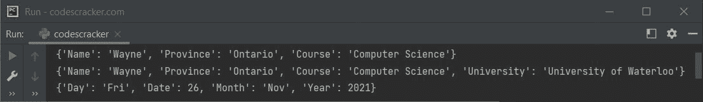

# Python `dict()`关函数

> 原文：<https://codescracker.com/python/python-dict-function.htm>

Python 中的 **dict()** 函数用于创建[字典](/python/python-dictionary.htm)。例如:

```
x = dict()
print(type(x))
```

输出将是:

```
<class 'dict'>
```

## Python `dict()`关函数语法

使用 **dict()** 函数创建字典总共有三种方法。 第一种方式是，当我们需要使用关键字自变量(named argument)来创建字典时。下面是语法:

```
dict(**kwarg)
```

**注-** 关于**夸**或<u>k</u>ey<u>w</u>ord<u>arg</u>的单据。您可以使用任意数量的关键字参数。每一个都要用逗号隔开，这样:
key1 = value1，key2 = value2，key3 = value3，...，keyN = valueN

第二个是，当我们需要使用另一个字典来创建字典时。下面是语法:

```
dict([mapping, **kwarg])
```

**注意-** 字典是标准的映射类型。

第三个是，当我们需要使用一个 iterable 对象(以键-值对的形式)来创建一个字典时。下面是语法:

```
dict([iterable, **kwarg])
```

Iterable 可以是一个[列表](/python/python-lists.htm)或[元组](/python/python-tuples.htm)等。

## Python `dict()`关函数示例

下面是一个简单的例子，使用 **dict()** 函数用 语法一节中讲述的三种方法创建字典:

```
x = dict(Name = "Wayne", Province = "Ontario", Course = "Computer Science")
print(x)

y = dict(x, University = "University of Waterloo")
print(y)

z = dict([["Day", "Fri"], ["Date", 26], ["Month", "Nov"], ["Year", 2021]])
print(z)
```

下面给出的快照显示了该程序产生的示例输出:



[Python 在线测试](/exam/showtest.php?subid=10)

* * *

* * *