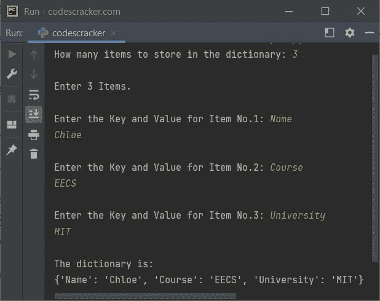

# Python `update()`函数

> 原文：<https://codescracker.com/python/python-update-function.htm>

Python 中的 **update()** 函数在我们需要更新 指定的[字典](/python/python-dictionary.htm)的指定键值时使用。如果指定的键不可用，则将插入一个具有给定键和值的新 项目。例如:

```
x = {"Day": "Sun", "Month": "Dec"}

x.update({"Day": "Mon"})
print(x)

x.update({"Year": "2021"})
print(x)
```

输出是:

```
{'Day': 'Mon', 'Month': 'Dec'}
{'Day': 'Mon', 'Month': 'Dec', 'Year': '2021'}
```

## Python `update()`函数语法

Python 中 **update()** 函数的语法是:

```
dictionary.update(iterable)
```

**iterable** 指的是字典或键值对的 iterable。**更新()**函数 不返回任何值。因此，如果您尝试执行以下语句:

```
print(x.update({"Day": "Mon"}))
```

其中 **x** 引用一个字典对象，那么输出将是 **None** 。

## Python `update()`函数示例

下面是 Python 中 **update()** 函数的一个例子。该程序在更新字典时，同时使用字典和可迭代 ( [元组](/python/python-tuples.htm))作为**可迭代**参数；

```
x = {'Day': 'Sun'}
print(x)

a = {'Day': 'Mon', 'Date': '06'}
x.update(a)
print(x)

x.update(Month='Dec', Year='2021')
print(x)
```

输出是:

```
{'Day': 'Sun'}
{'Day': 'Mon', 'Date': '06'}
{'Day': 'Mon', 'Date': '06', 'Month': 'Dec', 'Year': '2021'}
```

让我们创建 **update()** 函数的最后一个例子。该程序允许用户定义 字典及其所有条目的大小:

```
x = dict()
print("How many items to store in the dictionary: ", end="")
noOfItem = int(input())
print("\nEnter", noOfItem, "Items.")
for i in range(noOfItem):
    print("\nEnter the Key and Value for Item No.", i+1, ": ", sep="", end="")
    key = input()
    value = input()
    x.update({key: value})

print("\nThe dictionary is:")
print(x)
```

下面给出的快照显示了示例运行，用户输入 **3** 作为要插入到 字典中的条目数，**姓名**和**克洛伊**作为第一个条目的键和值，**课程**和 **EECS** 作为第二个条目，**大学**和**麻省理工学院**作为第三个条目:



[Python 在线测试](/exam/showtest.php?subid=10)

* * *

* * *