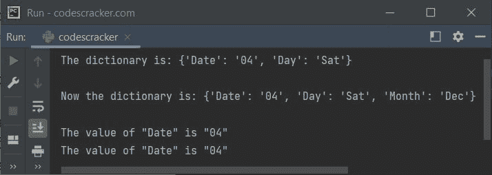

# Python `setdefault()`函数

> 原文：<https://codescracker.com/python/python-setdefault-function.htm>

Python 中的 **setdefault()** 函数返回一个 [字典](/python/python-dictionary.htm)中带有指定键的给定项的值。如果给定的键不存在，则插入一个带有 指定键和值的新项目。例如:

```
mydict = {"Date": "04", "Day": "Sat"}

x = mydict.setdefault("Date", "05")
print(x)

x = mydict.setdefault("Month", "Dec")
print(x)
```

输出将是:

```
04
Dec
```

我不认为 Python 有名字与其工作方式不同的内置函数，比如 **setdefault()** 。 但是我想他们(Python 的创造者)把它命名为**【set default()**，以便设置一个新项(默认项) ，以防在字典中找不到指定的键。

## Python `setdefault()`函数语法

Python 中 **setdefault()** 函数的语法是:

```
dictionary.setdefault(key, value)
```

**注-****值**参数是可选的。该参数的默认值为**无**。 这意味着，如果指定的键在字典中不可用，也没有给定值参数 ，那么一个具有指定的**键**和**无**作为值的新项目将被插入字典。

**setdefault()** 函数返回指定**键**的值，如果**键**存在于字典中，则 返回指定值。如果**键**不存在，也没有给 **setdefault()** ， 赋值，则返回 **None** 。

## Python `setdefault()`函数示例

下面是 Python 中 **setdefault()** 函数的一个例子:

```
d = {"Date": "04", "Day": "Sat"}
print("The dictionary is:", d)

d.setdefault("Month", "Dec")
print("\nNow the dictionary is:", d)

print("\nThe value of \"{}\" is \"{}\"".format("Date", d.setdefault("Date", "20")))
print("The value of \"{}\" is \"{}\"".format("Date", d.setdefault("Date")))
```

下面给出的快照显示了上述程序产生的示例输出，演示了 Python 中的 **setdefault()** 函数:



**注-**[format()](/python/python-format-function.htm)函数用于格式化 [字符串](/python/python-strings.htm)。

上面的程序也可以这样创建:

```
d = {"Date": "04", "Day": "Sat"}
print("The dictionary is:", d)

d.setdefault("Month", "Dec")
print("\nNow the dictionary is:", d)

str = "\nThe value of \"{}\" is \"{}\""
print(str.format("Date", d.setdefault("Date", "20")))
print(str.format("Date", d.setdefault("Date")))
```

现在的输出是:

```
The dictionary is: {'Date': '04', 'Day': 'Sat'}

Now the dictionary is: {'Date': '04', 'Day': 'Sat', 'Month': 'Dec'}

The value of "Date" is "04"

The value of "Date" is "04"
```

这与前面输出几乎相同，除了最后两句之间的换行符。

[Python 在线测试](/exam/showtest.php?subid=10)

* * *

* * *