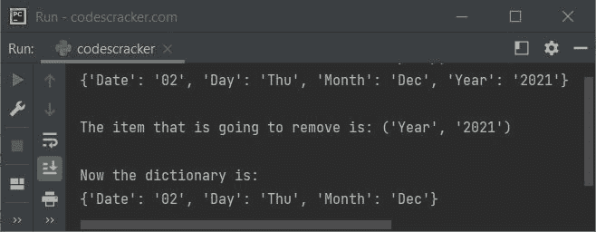

# Python `popitem()`关函数

> 原文：<https://codescracker.com/python/python-popitem-function.htm>

**popitem()** 函数用于从指定的[字典](/python/python-dictionary.htm)中删除最后一项。 例如:

```
x = {"Date": "02", "Day": "Thu", "Month": "Dec", "Year": "2021"}
print(x)

x.popitem()
print(x)
```

输出将是:

```
{'Date': '02', 'Day': 'Thu', 'Month': 'Dec', 'Year': '2021'}
{'Date': '02', 'Day': 'Thu', 'Month': 'Dec'}
```

**注意-** 如果你听说过 **popitem()** ，它从指定的字典中随机删除一个条目， ，而不是最后一个。那么让我告诉你，是的，这是真的，但在 Python 版本之前。

## Python `popitem()`关函数语法

Python 中 **popitem()** 函数的语法是:

```
dictionaryName.popitem()
```

它返回移除的项目。

## Python `popitem()`关函数语法

下面是 Python 中 **popitem()** 的一个例子:

```
x = {"Date": "02", "Day": "Thu", "Month": "Dec", "Year": "2021"}
print(x)

print("\nThe item that is going to remove is:", x.popitem())
print("\nNow the dictionary is:")
print(x)
```

下面给出的快照显示了这个 Python 程序产生的示例输出，演示了 **popitem()** 函数:



[Python 在线测试](/exam/showtest.php?subid=10)

* * *

* * *