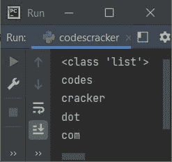

# Python `split()`函数

> 原文：<https://codescracker.com/python/python-split-function.htm>

Python 中的 **split()** 函数在我们需要将一个[字符串](/python/python-strings.htm) 拆分成一个[列表](/python/python-lists.htm)时使用。例如:

```
str = "codes cracker dot com"
print(str.split())
```

输出是:

```
['codes', 'cracker', 'dot', 'com']
```

**默认情况下**-**split()**将一个字符串转换成一个列表，其中字符串的每个单词，都成为列表的 元素。例如:

```
str = "codes cracker dot com"

str = str.split()
print(type(str))

for x in str:
    print(x)
```

这个程序产生的输出展示了 Python 中的 **split()** 函数，显示在下面给出的 快照中:



## Python `split()`函数语法

Python 中 **split()** 函数的语法是:

```
string.split(separator, maxsplit)
```

其中**分隔符**是用来分隔字符串的分隔符，每个分隔部分 成为 list 的元素。 **maxsplit** 参数用于指定要执行的分割数量。

**注-** 两个参数，即**分隔符**和 **maxsplit** 都是可选的。

**注-****分隔符**的默认值为任意空格，而 **maxsplit** 的默认值为 **-1** ，-1 表示拆分所有出现的分隔符。

如果给**max split**3，那么由**分隔符**分隔的前三个短语被拆分，所有短语的剩余 成为列表的最后一个元素。

## Python `split()`函数示例

下面是 Python 中 **split()** 函数的一个例子:

```
x = "Sun-05-Dec-2021"
x = x.split("-", 2)
print(x)

x = "Hey, Python is fun!, Isn't it?"
x = x.split(",")
print(x)

x = "Hey, Python is fun!, Isn't it?"
x = x.split()
print(x)
```

输出是:

```
['Sun', '05', 'Dec-2021']
['Hey', ' Python is fun!', " Isn't it?"]
['Hey,', 'Python', 'is', 'fun!,', "Isn't", 'it?']
```

[Python 在线测试](/exam/showtest.php?subid=10)

* * *

* * *