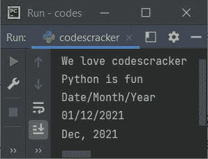

# Python `join()`关函数

> 原文：<https://codescracker.com/python/python-join-function.htm>

Python 中的 **join()** 函数在我们需要将一个 iterable 的所有条目连接成一个 [字符串](/python/python-strings.htm)时使用。例如:

```
mylist = ["01", "Dec", "2021"]
str = "-"

res = str.join(mylist)
print(res)
```

输出将是:

```
01-Dec-2021
```

## Python `join()`关函数语法

Python 中 **join()** 函数的语法是:

```
str.join(iterable)
```

其中 **str** 指的是字符串， **iterable** 指的是可迭代对象。当 [字典](/python/python-dictionary.htm)被用作 iterable 时，它们的键将被使用。

**注意-****str**在指定的 iterable 的所有连接项中充当分隔符。

## Python `join()`关函数示例

这是一个字符串的例子。**Python 中的 join()** 函数:

```
a = ["We", "love", "codescracker"]
b = ("Python", "is", "fun")
c = {"Date": "01", "Month": "Dec", "Year": "2021"}
d = {"01": "Date", "12": "Month", "2021": "Year"}
e = {"Dec", "2021"}

m = " ".join(a)
n = " ".join(b)
o = "/".join(c)
p = "/".join(d)
q = ", ".join(e)

print(m)
print(n)
print(o)
print(p)
print(q)
```

下面给出的快照显示了上述程序产生的示例输出，演示了 Python 中的 **join()** 函数:



当然上面的程序也可以用这种方式创建:

```
print(" ".join(["We", "love", "codescracker"]))
print(" ".join(("Python", "is", "fun")))
print("/".join({"Date": "01", "Month": "Dec", "Year": "2021"}))
print("/".join({"01": "Date", "12": "Month", "2021": "Year"}))
print(", ".join({"Dec", "2021"}))
```

[Python 在线测试](/exam/showtest.php?subid=10)

* * *

* * *