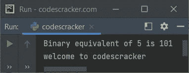
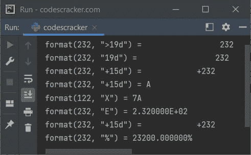
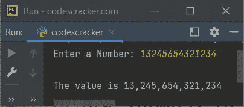
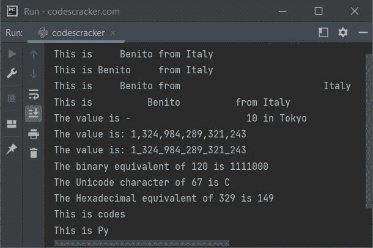

# Python format()函数

> 原文：<https://codescracker.com/python/python-format-function.htm>

本文旨在从两个方面介绍 Python 的 **format()** 函数。也就是说，一个使用**格式()** 进行数字格式化，而第二个使用**格式()**进行字符串格式化。

Python 中的 **format()** 函数在我们需要格式化指定值时使用。例如:

```
x = 5
xBin = format(x, 'b')
print("Binary equivalent of", x, "is", xBin)

a = "welcome"
b = "codes"
c = "cracker"
x = "{} to {}{}".format(a, b, c)
print(x)
```

下面给出的快照显示了这个 Python 程序产生的示例输出，演示了 **format()** 函数:



在上面的程序中，第一个 **format()** 函数用于格式化指定的数字。而第二个 **()**用于格式化字符串。程序也可以这样创建:

```
x = 5
xBin = format(x, 'b')
print("Binary equivalent of", x, "is", xBin)

sn = "codescracker"
print("welcome to {}".format(sn))
```

## Python format()函数语法-数字

既然我们讨论的是两种类型的 **format()** 函数，一种是格式化一个[数字](/python/python-numbers.htm)、 ，另一种是格式化一个[字符串](/python/python-strings.htm)。 使用格式说明符返回指定值的格式化版本的 **format()** 的语法是:

```
format(val[, fs])
```

其中 **val** 指的是必须格式化的值，而 **fs** 指的是格式说明符 ，它定义了该值应该以何种方式格式化。

**format()** 的第二个参数，格式说明符必须采用以下形式:

```
[[fill]align][sign][#][0][width][,][.precision][type]
```

其中:

*   **填充** -一个字符
*   **对齐**
    *   **<** -向右对齐。右填充
    *   **>** -向左对齐。左填充
    *   **=** -将加号/减号放在最左侧位置
    *   **&帽子；** -对齐剩余空间的中心。中间填充
*   **标志**
    *   **+** -在左侧添加加号
    *   **-** -在左边加减号
*   **宽度** -定义宽度的整数值
*   **精度** -定义精度的整数值
*   **式**式
    *   **b** -将值格式化为二进制格式
    *   **c** -将值格式化为等价的 Unicode 字符
    *   **d** -将数值格式化为十进制格式
    *   **n** -类似于‘d ’,除了它使用数字分隔符的当前区域设置
    *   **o** -将数值格式化为八进制格式
    *   **x** -将值格式化为十六进制格式(小写)
    *   **X** -将值格式化为十六进制格式(大写)
    *   **e** -将数值格式化为指数符号(小写)
    *   **E** -将数值格式化为指数符号(大写)
    *   **f** -格式化数值以显示定点数。默认值为 6
    *   **F** -与‘F’相似，除了它显示大写的‘INF’和‘NAN’而不是‘INF’和‘NAN’
    *   **g** -将数值四舍五入到 p 位有效数字。默认精度为 6
    *   **G** -与‘G’相似，除了它使用大写字母‘E’，以防数值(数字)很大
    *   **%** -用于乘以 100，最后加%

## Python format()函数示例-数字

下面是一个简单的例子，使用 **format()** 函数来格式化数字。这个程序使用多种方式 来格式化数字:

```
print("format(232, \">19d\") =", format(232, ">19d"))
print("format(232, \"19d\") =", format(232, "19d"))
print("format(232, \"+15d\") =", format(232, "+15d"))
print("format(232, \"+15d\") =", format(65, "c"))
print("format(122, \"X\") =", format(122, "X"))
print("format(232, \"E\") =", format(232, "E"))
print("format(232, \"+15d\") =", format(232, "+15d"))
print("format(232, \"%\") =", format(232, "%"))
```

该程序的示例输出显示在下面给出的快照中:



### 使用 format()以逗号分隔第一千位数字

创建这个程序是为了演示如何使用 **format()** 函数以一种 的方式格式化一个数字，用逗号分隔每一千个数字。

```
print(format(13232433432, ",d"))
```

输出将是:

```
13,232,433,432
```

上面的程序也可以这样创建。该程序允许用户定义号码:

```
print("Enter a Number: ", end="")
num = int(input())
print("\nThe value is {:,}".format(num))
```

用户输入 **13245654321234** 的示例运行显示在下面给出的快照中:



**注意-** 上面的程序使用了 **String.format()** 函数。下面给出了使用 **format()** 格式化 字符串的详细描述。

## Python format()函数语法-字符串

**format()** 函数在 Python 中格式化字符串的语法是:

```
str.format(val1, val2, val3, ..., valN)
```

其中 **str** 指的是字符串。而 **val1** 、 **val2** 等则是指数值。参数 到 **format()** 函数用来格式化字符串，是必需的。参数可能由单个或 多个值组成。这些值是:

*   由逗号分隔的一些值列表
*   或者以逗号分隔的 **key=value** 对形式的一些值列表

**注意-****format()**函数的参数值可以是任何数据类型。

对于相同数量的参数，字符串必须包含 **{}** (作为值的占位符)。以 为例，如果有 5 个参数，那么字符串必须包含 5 个 **{}** 才能将所有参数放在字符串中的这个 花括号内(作为**格式()**参数值的占位符)。

## Python format()函数示例-字符串

这是一个简单的示例程序，演示了 **format()** 函数:

```
x = "Python"
print("Welcome to {} Programming.".format(x))
```

输出将是:

```
Welcome to Python Programming.
```

### 在 Python 中使用不带索引的 format()

这个程序使用 **format()** 函数的正常方式来格式化字符串，不加索引:

```
a = "Alicia"
b = "EECS"
c = "University of California"
d = "Berkeley"

print("This is {}, studying {} at {}, {}".format(a, b, c, d))
```

输出将是:

```
This is Alicia, studying EECS at University of California, Berkeley
```

### 在 Python 中使用带索引的 format()

该程序展示了如何将 **format()** 函数用于索引:

```
a = "Alicia"
b = "EECS"
c = "University of California"
d = "Berkeley"

print("This is {3}, studying {2} at {1}, {0}".format(d, c, b, a))
```

输出将与前一个程序的输出相同。在上面的程序中:

*   **format()** 函数的第一个参数是索引为 0 的 **d**
*   第二个参数是索引为 1 的 **c**
*   第三个参数是索引为 2 的 **b**
*   第四个参数是索引为 3 的 **a**

因此，将 **3** 放入 **{}** 中会考虑索引 3 处的值(意味着在上面的程序中， **a** 的值会被放置到 **{3}** )。其他人也一样。

### 键=值对中格式()的参数

该程序是以使用 **format()** 函数的方式创建的，该函数的参数是以 **key=value** 对的形式。

```
print("This is {a}, studying {b}".format(a="Alicia", b="EECS"))
```

输出将是:

```
This is Alicia, studying EECS
```

下面是另一个示例程序:

```
c = "University of California"
d = "Berkeley"
print("This is {a}, studying {b} at {c}, {d}".format(a="Alicia", b="EECS", c=c, d=d))
```

输出将是:

```
This is Alicia, studying EECS at University of California, Berkeley
```

### Python String.format()示例

这是 **format()** 函数的最后一个示例程序，以不同的 方式格式化字符串:

```
print("This is {:>10} from Italy".format("Benito"))
print("This is {:<10} from Italy".format("Benito"))
print("This is {:>10} from {:>30}".format("Benito", "Italy"))
print("This is {:&Hat;24} from Italy".format("Benito"))
print("The value is {:=24} in Tokyo".format(-10))
print("The value is: {:,}".format(1324984289321243))
print("The value is: {:_}".format(1324984289321243))
print("The binary equivalent of 120 is {:b}".format(120))
print("The Unicode character of 67 is {:c}".format(67))
print("The Hexadecimal equivalent of 329 is {:X}".format(329))
print("This is {:.5}".format("codescracker"))
print("This is {:.2}".format("Python Programming"))
```

示例输出显示在下面给出的快照中:



**注-****{:. 5 }**用于当我们只需要打印**()**函数的参数 中指定的字符串的前五个字符时，对于这个占位符。

[Python 在线测试](/exam/showtest.php?subid=10)

* * *

* * *