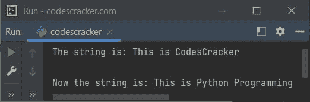
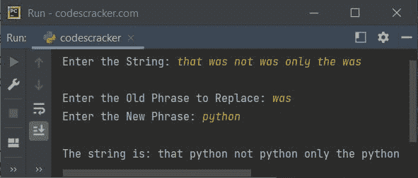
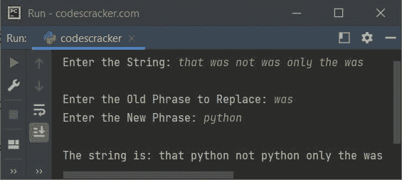

# Python `replace()`函数

> 原文：<https://codescracker.com/python/python-replace-function.htm>

Python 中的 **replace()** 函数在我们需要用[字符串](/python/python-strings.htm)中的 另一个(新短语)替换字符串(旧短语)的某个部分时使用。例如:

```
str = "This is CodesCracker"
print("The string is:", str)

str = str.replace("CodesCracker", "Python Programming")
print("\nNow the string is:", str)
```

下面给出的快照显示了上述程序的示例输出，演示了 **replace()** 函数:



## Python `replace()`函数语法

Python 中 **replace()** 函数的语法是:

```
string.replace(oldPhrase, newPhrase, count)
```

在用 **新短语**替换**旧短语**之后，函数 **replace()** 返回字符串的新版本。第三个参数，即 **count** 参数是可选的，用于指定 出现的**旧短语**要替换。

**注-****计数**的默认值基本上是**旧短语**的全部出现，以**新短语**代替 。

## Python `replace()`函数示例

下面是 Python 中 **replace()** 函数的一个例子。该程序允许用户将字符串定义为 以及新旧短语，以执行替换操作，当然使用的是 **replace()** 函数:

```
print("Enter the String: ", end="")
str = input()

print("\nEnter the Old Phrase to Replace: ", end="")
oldPhrase = input()
print("Enter the New Phrase: ", end="")
newPhrase = input()

str = str.replace(oldPhrase, newPhrase)
print("\nThe string is:", str)
```

不包含用户输入的示例运行**只是将**作为字符串数据，**作为旧短语， 和 **python** 作为新短语，用 **python** 替换**为**:**



如果您想用新短语删除旧短语，但只针对特定的出现次数。例如，用 **python** 删除**只有 2 次。然后使用以下代码:**

```
str = str.replace(oldPhrase, newPhrase, 2)
```

现在，具有相同用户输入的输出结果是:



由于给定的字符串中有 3 个**是**，但是我们只需要替换 2 个**是**，因此 字符串中最后一个**是**仍然可用，在用 **python** 替换**是**之后，只出现了 2 个 。

[Python 在线测试](/exam/showtest.php?subid=10)

* * *

* * *