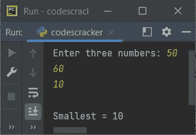
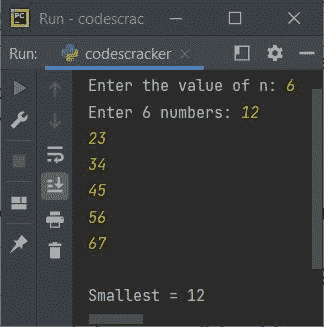
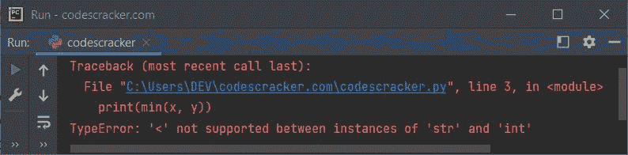
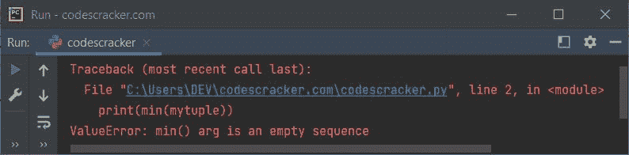

# Python min()函数

> 原文：<https://codescracker.com/python/python-min-function.htm>

Python 中的 **min()** 函数用于在给定的一组值中寻找最小或最小值作为其 参数。这个函数也可以用来查找 iterable 中的最小项。例如:

```
print(min(12, 43, 6, 45))

mylist = [32, 54, 34, 13, 54, 65]
print(min(mylist))
```

上面的 Python 程序生成的输出展示了 **min()** 函数，如下所示:

```
6
13
```

也就是说，6 是 12、43、6 和 45 中最小的数。鉴于 **13** 是 32、54、 34、13、54 和 65 中最小的元素。

**注意-****min()**函数的工作与 [max()](/python/python-max-function.htm) 类似。 唯一的区别是 **min()** 返回最小的，而 **max()** 返回最大的。就是这样。

## Python min()函数语法

在 Python 中使用 **min()** 函数的语法是:

```
min(arg1, arg2, arg3, ..., argN, key)
```

其中 **arg1** 、 **arg2** 等为数值。当我们需要根据长度找到最小的字符串 时，使用**键**参数，因为默认情况下， **min()** 函数会根据 的字母顺序返回最小的字符串。

**注-** 不用多想语法，用下面给出的例子程序，一切都会变得清晰。

下面是使用 iterable 时， **min()** 函数的另一种语法。

```
min(iter1, iter2, iter3, ..., iterN, key, default)
```

与前面的语法类似， **iter1** 、 **iter2** 等等都是可迭代的。**默认**参数是 ，当 iterable 为空时，我们需要打印默认的最小值。

## Python min()函数示例

让我们从简单的 **min()** 函数的例子开始:

```
print("Enter three numbers: ", end="")
x = int(input())
y = int(input())
z = int(input())

print("\nSmallest =", min(x, y, z))
```

用户输入 **50、60、10** 的该程序的示例运行显示在下面给出的快照中:



现在，让我们创建另一个程序，做与上述程序类似的工作。唯一不同的是，这个程序使用[列表](/python/python-lists.htm)到 列表中找到最小的元素。由于 程序使用 list，因此我创建了这个程序，允许用户定义 list 的大小，以及 它的元素:

```
print("Enter the value of n: ", end="")
n = int(input())
print("Enter", n, "numbers: ", end="")
mylist = []
for i in range(n):
    num = int(input())
    mylist.append(num)

print("\nSmallest =", min(mylist))
```

下面是它的示例运行，使用用户输入的 **6** 作为列表的大小， **12，23，34，45，56，67** 作为它的六个元素:



**需要注意的一点——**如果我们将字符串作为参数传递给 **min()** 来寻找最小的或者最小的字符串， 函数根据字母顺序返回最小的。例如:

```
minstr = min("William", "Matthew", "Noah", "Ethan")
print(minstr)
```

以下是该 Python 程序生成的输出:

```
Ethan
```

根据字母表，**伊森**是最小的一个。现在，如果我们需要根据 的字符数或长度找到最小的字符串，该怎么办呢？
那么我们需要在那种情况下使用 **min()** 函数的**键**参数。 下面是一个例子:

```
minstr = min("William", "Matthew", "Noah", "Ethan", key=len)
print(minstr)
```

现在输出将是:

```
Noah
```

下面是另一个演示 Python 中的 **min()** 函数的例子:

```
x = [12.4, 54.6, 1.43]
print(min(x))
print(min(12.32, 43, 54.65, 98.56, 32))
x = "codescracker"
print(min(x))
x = {"Name": "Daniel", "Region": "Hawaii"}
print(min(x))
```

以下是该程序的输出:

```
1.43
12.32
a
Name
```

### 处理 Python 中 min()函数引发的异常

如果我们提供多种类型的值，那么 **min()** 函数会引发一个名为 **TypeError** 的异常。 举个例子，下面的程序:

```
x = 23
y = "codescracker"
print(min(x, y))
```

生产:



现在，为了处理这个异常，我们需要将 **min()** 包装在 **try** 块中，以便使用 **except** 块可以很容易地捕捉到这个函数引发的异常 ，如下面给出的程序所示:

```
x = 23
y = "codescracker"

try:
    print(min(x, y))
except TypeError:
    print("Invalid combination of arguments!")
```

现在输出将是:

```
Invalid combination of arguments!
```

当然同样的程序也可以这样创建:

```
x = 23
y = "codescracker"

try:
    smallest = min(x, y)
    print(smallest)
except TypeError:
    print("\nInvalid combination of arguments!")
```

## 多重可迭代的 min()函数

下面是一个带有多个可迭代的 **min()** 函数的示例:

```
x = [10, 4, 5, 6, 3, 32]
y = [32, 4, 6, 7]
z = [43, 6, 54, 76, 7]

print(min(x, y, z))
```

以下是该 Python 程序生成的输出:

```
[10, 4, 5, 6, 3, 32]
```

由于第一个列表，即 **x** 在所有 列表的所有元素中具有最小的元素，即 **3** ，因此输出为第一个列表，即 **x** 。

### 带有默认参数的 min()函数

这是本文的最后一个程序，用来演示如何使用带有**默认** 参数的 **min()** 函数:

```
mylist = []
print(min(mylist, default=0))
```

这个程序产生的输出将是 0。因为 0 是默认值，在 iterable ( **list** 这里)为空的情况下，它将被认为是最小的值。基本上，**默认**参数用于避免 在可迭代项为空时产生错误，或者在可迭代项为空时将默认值视为最小值。

但是如果 iterable 为空，并且没有使用**默认的**参数，那么 **min()** 函数就会产生 错误。让我们来看看下面的程序:

```
mytuple = ()
print(min(mytuple))
```

生产:



因此，要么使用**默认的**参数来避免这种错误。但问题是，如果 iterable 是空的，我们不希望将默认参数的值指定为最小值，该怎么办呢？
那么在这种情况下，您可以将 **【min()**函数放在 **try** 块中，使用 **except** 块来引发异常，如下面给出的 程序所示:

```
mytuple = ()
try:
    print(min(mytuple))
except ValueError:
    print("The tuple is empty!")
```

现在输出将是:

```
The tuple is empty!
```

[Python 在线测试](/exam/showtest.php?subid=10)

* * *

* * *