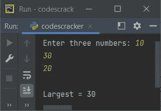
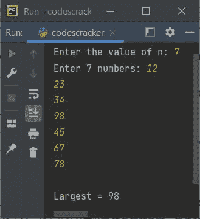
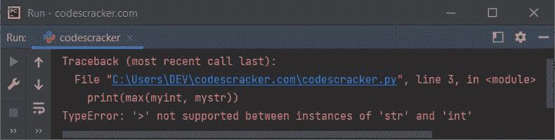
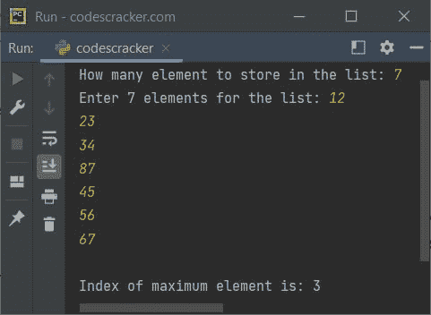

# Python `max()`函数

> 原文：<https://codescracker.com/python/python-max-function.htm>

Python 中的 **max()** 函数用于查找 iterable 中的最大项，或 两个/多个参数中的最大项。例如:

```
mylist = [32, 34, 56, 76, 7]
print(max(mylist))

print(max(65, 76))
print(max(23, 45, 56, 67, 8, 100, 98))
```

上面的 Python 程序产生的输出，演示了 **max()** 函数，将完全是:

```
76
76
100
```

## Python `max()`函数语法

使用 **max()** 函数的语法是:

```
max(value1, value2, value3, ..., valueN, key)
```

其中 **value1** 、 **value2** 等等，直到 **valueN** 都是整数、浮点数 和字符串等参数。

在多个字符串中寻找最大值时， **max()** 函数根据 按字母顺序返回最大值字符串。因此，**键**参数在根据所有字符串的 长度查找最大字符串时起着重要作用。下面是可迭代对象的另一种语法。

```
max(iterable1, iterable2, ..., iterableN, key, default)
```

这里的 **iterable1** 、 **iterable2** 等是可迭代的，如[列表](/python/python-lists.htm)、 [元组](/python/python-tuples.htm)、[字典](/python/python-dictionary.htm)、 [集合](/python/python-set.htm)。

如果 iterable 为空， **default** 参数用于获取默认值作为最大值。

不要多想上面的语法。通过下面给出的例子程序，你会一个接一个地了解所有的事情。

## Python `max()`函数示例

让我们用 Python 创建一个简单的 **max()** 函数示例:

```
print("Enter three numbers: ", end="")
a = int(input())
b = int(input())
c = int(input())

print("\nLargest =", max(a, b, c))
```

下面给出的快照显示了上述程序的示例运行，用户输入的 **10** 、 **30** 和**20**T6 为三个数字:



现在的问题是，如果用户想输入 **n** 个数字，在所有给定的 **n** 个数字中找到并打印最大的数字，该怎么办？
在这种情况下，我们需要一个列表来使用。以下是先前程序的修改版本:

```
print("Enter the value of n: ", end="")
n = int(input())
print("Enter", n, "numbers: ", end="")
nums = []
for i in range(n):
    num = int(input())
    nums.append(num)

print("\nLargest =", max(nums))
```

下面是它的示例运行，用户输入七个数字 **12** 、 **23** 、 **34** 、 **98** 、 **45** 、 **67** 和 **78** ，使用 **max()** 函数查找并打印这七个数字中的最大值:



**重要**——如果我们传递多个字符串作为 **max()** 的参数来寻找最大字符串，那么我们得到 的最大字符串是基于字母顺序，而不是长度。我们举个例子。

```
maxStr = max("Anthony", "Alexander", "Alden", "David", "Daniel")
print(maxStr)
```

以下是该程序产生的输出:

```
David
```

**重要的** -根据长度找到最大的字符串，然后使用**键**参数，以 **len** 作为其值，如下面给出的示例程序所示。

```
maxStr = max("Anthony", "Alexander", "Alden", "David", "Daniel", key=len)
print(maxStr)
```

现在输出将是:

```
Alexander
```

因为单词 **Alexander** 在所有其他 4 个单词中字符数最多。

下面给出的程序是 Python 中 **max()** 函数的另一个例子:

```
mylist = [12.4, 54.6, 1.43]
print(max(mylist))
print(max(12.32, 43, 54.65, 98.56, 32))
mystring = "codescracker"
print(max(mystring))
mydict = {"Name": "Ethan", "Region": "Maryland"}
print(max(mydict))
```

以下是该 Python 程序生成的输出:

```
54.6
98.56
s
Region
```

### 如何处理 max()函数的无效参数？

当我们传递多种类型的参数时，函数 **max()** 引发了一个名为 **TypeError** 的异常。 例如:

```
myint = 12
mystr = "python"
print(max(myint, mystr))
```

该程序产生的输出显示在下面给出的快照中:



因此，为了处理这些类型的异常，我们需要将函数包装在一个 **try** 块中，这样我们就可以使用 **except** 块捕获 引发的异常，如下面给出的程序所示:

```
myint = 12
mystr = "python"
try:
    print(max(myint, mystr))
except TypeError:
    print("\nInvalid combination of arguments!")
```

现在输出将是:

```
Invalid combination of arguments!
```

上面的程序也可以这样创建:

```
myint = 12
mystr = "python"
try:
    m = max(myint, mystr)
    print(m)
except TypeError:
    print("\nInvalid combination of arguments!")
```

### 使用 max()查找最大元素的索引

最大元素的索引也可以使用 **max()** 与 [index()](/python/python-index-function.htm) 函数来计算。这里有一个例子:

```
print("How many element to store in the list: ", end="")
n = int(input())
print("Enter", n, "elements for the list: ", end="")
x = []
for i in range(n):
    v = input()
    x.append(v)

maxindex = x.index(max(x))
print("\nIndex of maximum element is:", maxindex)
```

以用户输入的 **7** 作为列表大小， **12** 、 **23** 、 **34** 、 **87** 、 **45** 、 **56** 、 67 作为七个元素的示例运行如下面给出的快照所示:



## 带默认参数的 Python `max()`函数

如果 iterable 为空，**默认**参数的值被视为最大值。这里有一个例子:

```
mylist = []
print(max(mylist, default=50))
```

这个程序产生的输出将完全是:

```
50
```

## Python `max()`函数具有多个可迭代项

如 **max()** 函数的语法所示，我们也可以传递多个 iterable 来寻找具有 最大元素的 iterable。这里有一个例子演示了那个版本的语法:

```
a = [12, 23, 34, 10]
b = [76, 8, 9, 10]
c = [1, 5, 7, 34]
print(max(a, b, c))
```

该程序产生的输出如下所示:

```
[76, 8, 9, 10]
```

因为 **76** 是三个列表中所有可用数字中最高的数字。并且 号码 **76** 在 **b** 列表中有。因此，列表 **b** 打印在输出上。

[Python 在线测试](/exam/showtest.php?subid=10)

* * *

* * *