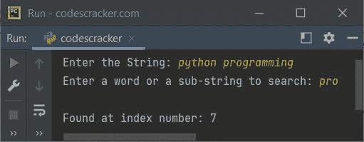
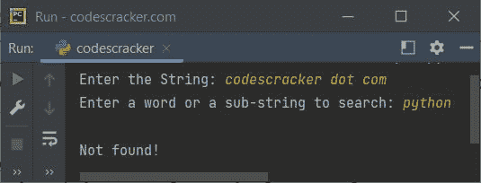
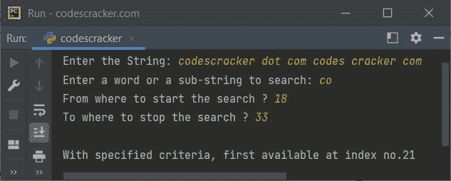
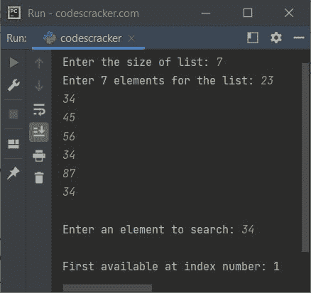

# Python `index()`函数

> 原文：<https://codescracker.com/python/python-index-function.htm>

Python 中的 **index()** 函数返回指定值在 [列表](/python/python-lists.htm)或[字符串](/python/python-strings.htm)中第一次出现的索引号。例如:

```
mylist = [13, 43, 54, 43, 65]
print(mylist.index(43))

mystring = "codescracker dot com"
print(mystring.index("co"))
```

上面的 Python 程序产生的输出，演示了 **index()** 函数是:

```
1
0
```

从上面的程序中，语句:

```
print(mylist.index(43))
```

打印名为 **mylist** 的列表中值 **43** 的索引号。因为第一次出现的 43 位于索引号 1。因此，上面的语句在输出时输出 1。鉴于以下声明:

```
print(mystring.index("co"))
```

在字符串 **mystring** 或**codescracker . com**中搜索子字符串 **co** 。并且因为， **co** 的 第一次出现在字符串的第 0 <sup>个</sup>索引处。因此输出为 0。

## Python `index()`函数语法

在 Python 中使用 **index()** 函数的语法是:

```
mystring.index(value, start, end)
```

**值**是指将要搜索的值(元素或子串)，**开始**告诉从 开始搜索，**结束**告诉从哪里停止搜索。

**开始**和**结束**这两个参数都是可选的。**开始**的默认值为 0，而**结束**的 默认值为列表或字符串的长度。

#### 如果指定的值在列表或字符串中不可用怎么办？

如果指定的值在列表或字符串中可用， **index()** 函数返回或引发 一个名为 **ValueError** 的异常。因此，为了处理这个异常，函数 **index()** 需要 被包装在一个 **try** 块中，以使用 **except** 块捕获引发的异常。下面给出了一个显示 如何处理此类错误的示例程序。

## Python index()示例-用于字符串

下面是一个 **index()** 函数的例子。这个程序演示了如何搜索 并找到用户输入的一个子字符串在字符串中的位置的功能:

```
print("Enter the String: ", end="")
str = input()
print("Enter a word or a sub-string to search: ", end="")
s = input()

pos = str.index(s)
print("\nFound at index number:", pos)
```

下面给出的快照显示了上述 Python 程序的示例运行，用户输入 **python 编程**作为 字符串和 **pro** 作为子字符串来搜索和打印其索引:



下面是另一个使用 **index()** 函数在给定字符串中搜索子字符串的例子。当指定的值不可用时，这个程序处理 由 **index()** 引发的异常。

```
print("Enter the String: ", end="")
str = input()
print("Enter a word or a sub-string to search: ", end="")
s = input()

try:
    pos = str.index(s)
    print("\nFound at index number:", pos)
except ValueError:
    print("\nNot found!")
```

下面是它的示例运行，用户输入**codescracker . com**作为字符串，使用 **python** 作为 搜索的子字符串:



下面是另一个使用 **index()** 函数及其所有参数的例子:

```
print("Enter the String: ", end="")
str = input()
print("Enter a word or a sub-string to search: ", end="")
s = input()
print("From where to start the search ? ", end="")
start = int(input())
print("To where to stop the search ? ", end="")
end = int(input())

if start > len(str) or end > len(str):
    print("\nInvalid Input!")
elif start > end:
    print("\nInvalid Input!")
else:
    try:
        pos = str.index(s, start, end)
        print("\nWith specified criteria, first available at index no.", pos, sep="")
    except ValueError:
        print("\nNot found!")
```

使用用户输入**codescracker . com codes cracker com**作为字符串， **co** 作为 搜索的子字符串， **18** 作为开始索引， **33** 作为停止索引的示例运行，如下面给出的快照所示:



## Python index()示例-用于列表

这是本文的最后一个示例程序，创建该程序是为了演示在 Python 中使用 list 时使用 **index()** 函数:

```
print("Enter the size of list: ", end="")
tot = int(input())
print("Enter", tot, "elements for the list: ", end="")
arr = []
for i in range(tot):
    val = input()
    arr.append(val)

print("\nEnter an element to search: ", end="")
element = input()
try:
    pos = arr.index(element)
    print("\nFirst available at index number:", pos)
except ValueError:
    print("\nNot available in the list!")
```

使用用户输入的 **4** 作为列表大小， **23，34，45，56，34，87，34** 作为其四个元素， **34** 作为元素来搜索和打印其索引的示例运行，如下面给出的快照所示:



**注-** 索引编号总是从 0 开始。

在使用 list 时，您也可以在需要时使用两个可选参数，方法与上一个程序相同，即 string 部分的 **index()** 函数的最后一个示例程序。

[Python 在线测试](/exam/showtest.php?subid=10)

* * *

* * *