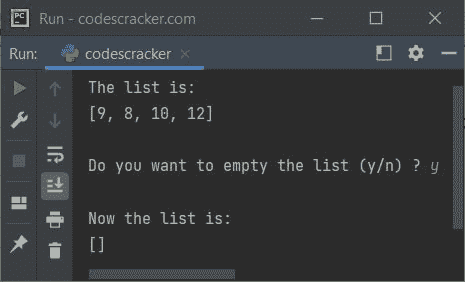

# Python `clear()`函数

> 原文：<https://codescracker.com/python/python-clear-function.htm>

Python 中的 **clear()** 函数用于清空[列表](/python/python-lists.htm)、 、[字典](/python/python-dictionary.htm)，或者[集合](/python/python-set.htm)。也就是说， **clear()** 函数从列表、字典或集合中删除所有项目。例如:

```
mylist = [9, 8, 10, 12]
print("The list is:")
print(mylist)

mylist.clear()
print("\nNow the list is:")
print(mylist)
```

上面的 Python 代码产生的输出，演示了 **clear()** 函数，是:

```
The list is:
[9, 8, 10, 12]

Now the list is:
[]
```

列表存在，但变为空。下面是另一个 **clear()** 函数的例子。在这个例子中，我已经用 这个函数删除了字典中的所有条目:

```
mydictionary = {"Name": "Mathew", "City": "California"}
print("The dictionary is:")
print(mydictionary)

mydictionary.clear()
print("\nNow the dictionary is:")
print(mydictionary)
```

这个程序产生的输出将完全是:

```
The dictionary is:
{'Name': 'Mathew', 'City': 'California'}

Now the dictionary is:
{}
```

布景也是一样。下面是一个例子，使用 **clear()** 函数清空集合，或者删除集合中的所有 元素:

```
myset = {1, 2, 3}
print(myset)
myset.clear()
print(myset)
```

该 Python 程序产生的输出如下所示:

```
{1, 2, 3}
set()
```

## Python `clear()`函数语法

Python 中使用 **clear()** 函数的语法是:

```
variableName.clear()
```

## Python `clear()`函数示例

这里是 Python 中另一个 **clear()** 函数的例子，如果用户需要，它会清空列表:

```
mylist = [9, 8, 10, 12]
print("The list is:")
print(mylist)

print("\nDo you want to empty the list (y/n) ? ", end="")
choice = input()
if choice == 'y':
    mylist.clear()
    print("\nNow the list is:")
    print(mylist)
else:
    print("\nOk!")
```

下面给出的快照显示了上述 Python 代码的示例运行，用户输入 **y** 作为清空名为 **mylist** 的 列表的选择:



[Python 在线测试](/exam/showtest.php?subid=10)

* * *

* * *