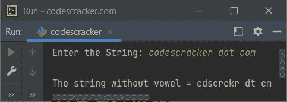

# Python `过滤器()`关函数

> 原文：<https://codescracker.com/python/python-filter-function.htm>

Python 中的 **filter()** 函数在我们需要修改迭代器时使用。这个函数有两个 参数，第一个参数指执行修改的函数，而第二个参数 指要修改的迭代器对象。例如:

```
nums = [12, 23, 34, 45, 56, 67, 78, 89, 90]

def myfun(x):
    if x%2 == 0:
        return True
    else:
        return False

even = filter(myfun, nums)

for val in even:
    print(val)
```

该程序产生的输出将是:

```
12
34
56
78
90
```

## Python `filter()`关函数语法

Python 中 **filter()** 函数的语法是:

```
filter(function, iterable)
```

其中**函数**指的是一个用户自定义函数，它将被创建来检查**可迭代**中的每个可用 项，如[列表](/python/python-lists.htm)、 [元组](/python/python-tuples.htm)等。

## Python `filter()`关函数示例

下面是 Python 中 **filter()** 函数的一个例子。该程序允许用户在程序运行时输入一个 [字符串](/python/python-strings.htm)。使用 [list ()](/python/python-list-function.htm) 函数，字符串的所有字符被初始化 到 **char** list。并使用 **filter()** 函数，以打印不带元音的相同字符串 的方式进行过滤:

```
print("Enter the String: ", end="")
str = input()

chars = list(str)
vowels = ['A', 'E', 'I', 'O', 'U', 'a', 'e', 'i', 'o', 'u']

def myfun(x):
    if x not in vowels:
        return True
    else:
        return False

v = filter(myfun, chars)
print("\nThe string without vowel = ", end="")
for c in v:
    print(c, end="")
```

下面给出的快照显示了该程序的示例运行，用户输入**codescracker . com**:



[Python 在线测试](/exam/showtest.php?subid=10)

* * *

* * *