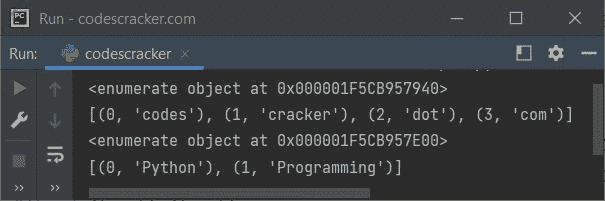

# Python `枚举()`关函数

> 原文：<https://codescracker.com/python/python-enumerate-function.htm>

Python 中的 **enumerate()** 函数，将计数器添加到类似[列表](/python/python-lists.htm)、 [元组](/python/python-tuples.htm)等可迭代对象中。并返回枚举对象。例如:

```
a = ["codes", "cracker", "dot", "com"]
x = enumerate(a)
print(x)
print(list(x))

b = ("Python", "Programming")
y = enumerate(b)
print(y)
print(list(y))
```

下面给出的快照显示了该程序产生的示例输出，演示了 Python 中的 **enumerate()** 函数:



**注-** 详细了解 [Python 枚举](/python/python-enum.htm)。参考 它的单独教程。

## Python `enumerate()`关函数语法

Python 中 **enumerate()** 函数的语法是:

```
enumerate(iterable, start)
```

其中 **iterable** 是一个 iterable 对象，如列表、元组等。而 **start** 参数在我们需要定义启动计数器的数字时使用 ，而不是从 0 开始。

**注-** 第二个参数，即**开始**参数是可选的。 该参数的默认值为 0

## Python `enumerate()`关函数示例

这是 Python 中 **enumerate()** 函数的一个简单例子。这个程序将一个列表转换成一个 枚举对象。使用循环的 [进一步打印枚举对象中可用的项目:](/python/python-for-loop.htm)

```
a = ["Python", "Django", "Flask", "Numpy"]

x = enumerate(a)
for v in x:
    print(v)
```

示例输出显示在下面给出的快照中:


如果你想用指定的数字来改变计数器的值，而不是 0，那么你需要使用第二个参数为 **enumerate()** ，来完成这项工作，就像下面给出的程序所示:

```
a = ["Python", "Django", "Flask", "Numpy"]

x = enumerate(a, 100)
for count, item in x:
    print(count, item)
```

现在输出将是:

```
100 Python
101 Django
102 Flask
103 Numpy
```

[Python 在线测试](/exam/showtest.php?subid=10)

* * *

* * *