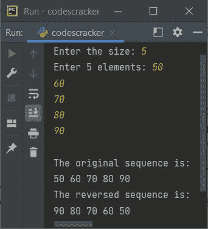
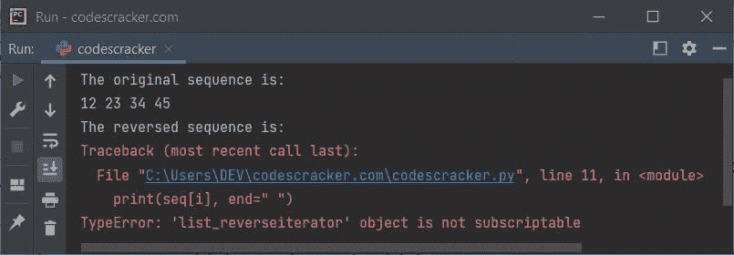

# Python reversed()函数

> 原文：<https://codescracker.com/python/python-reversed-function.htm>

Python 中的 **reversed()** 函数返回反向迭代器对象或给定序列 的迭代器，如[列表](/python/python-lists.htm)、[元组](/python/python-tuples.htm)、 [字符串](/python/python-strings.htm)等。例如:

```
a = [32, 34, 56, 76]
b = reversed(a)
for x in b:
    print(x, end=" ")
```

下面是这个 Python 程序产生的输出，演示了 **reversed()** 函数:

```
76 56 34 32 
```

## Python reversed()函数语法

**reversed()** 函数的语法是:

```
reversed(sequence)
```

## Python reversed()函数示例

下面是一个使用 **reversed()** 函数获取序列的反向迭代器的示例:

```
print("Enter the size: ", end="")
n = int(input())
print("Enter", n, "elements: ", end="")
seq = []
for i in range(n):
    val = input()
    seq.append(val)

print("\nThe original sequence is:")
for x in seq:
    print(x, end=" ")

seq = reversed(seq)
print("\nThe reversed sequence is:")
for x in seq:
    print(x, end=" ")
```

下面给出的快照显示了上述程序的示例运行，用户输入的 **5** 为大小， **50、60、70、80、90** 为顺序的 五个数字:



**重要-****list _ reverse iterator**对象不可订阅。因此，我们不能通过索引访问 元素。如果我们这样做，就像下面给出的程序所示:

```
seq = [12, 23, 34, 45]
n = 4

print("The original sequence is:")
for i in range(n):
    print(seq[i], end=" ")

seq = reversed(seq)
print("\nThe reversed sequence is:")
for i in range(n):
    print(seq[i], end=" ")
```

然后，它将引发如下图所示的错误。该快照取自上述程序产生的输出:



因此，我们需要替换上述程序中的以下代码块:

```
for i in range(n):
    print(seq[i], end=" ")
```

下面给出了代码块:

```
for x in seq:
    print(x, end=" ")
```

如果你创建一个程序，比如:

```
seq = [12, 23, 34, 45]
print(reversed(seq))
```

您将看到的输出类似于:

```
<list_reverseiterator object at 0x000001E89AF18040>
```

这不是我们需要的输出。因为我们需要相同的序列，但顺序相反。因此，我们需要将 **reversed()** 包装在一个列表中。以下是先前程序的修改版本:

```
seq = [12, 23, 34, 45]
print(list(reversed(seq)))
```

现在输出将是:

```
[45, 34, 23, 12]
```

下面是另一个使用 **reversed()** 函数获得一个序列的反向迭代器对象的例子。

```
mystring = "codescracker"
print(list(reversed(mystring)))

mylist = [1, 2, 3]
print(list(reversed(mylist)))

mytuple = (4, 5, 6)
print(list(reversed(mytuple)))

myrange = range(10)
print(list(reversed(myrange)))
```

这个程序产生的输出将完全是:

```
['r', 'e', 'k', 'c', 'a', 'r, 'c', 's', 'e', 'd', 'o', 'c']
[3, 2, 1]
[6, 5, 4]
[9, 8, 7, 6, 5, 4, 3, 2, 1, 0]
```

[Python 在线测试](/exam/showtest.php?subid=10)

* * *

* * *