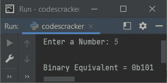
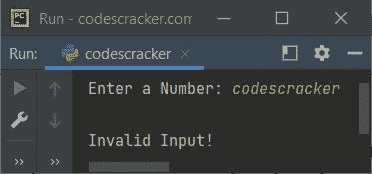

# Python `bin()`关函数

> 原文：<https://codescracker.com/python/python-bin-function.htm>

Python 中的 **bin()** 函数返回指定整数的二进制等效值。例如:

```
x = 10
print(bin(x))
```

这个 Python 程序的输出展示了 **bin()** 函数，它是:

```
0b1010
```

**注-** 返回的二进制等效值以 **0b** (前缀)开头。也就是说，在 **0b** 之后，例如 的数字 **1010** 是指定数字的二进制等价物，在这种情况下就是 10。

## Python `bin()`关函数语法

Python 中 **bin()** 函数的语法是:

```
bin(val)
```

**注意-** 参数 **val** 必须是整数。此参数是必需的。

## Python `bin()`关函数示例

下面是 Python 中 **bin()** 函数的一个例子。该程序在运行 程序时从用户处接收一个整数，并打印输入整数值的二进制等效值:

```
print("Enter a Number: ", end="")
num = int(input())
print("\nBinary Equivalent =", bin(num))
```

下面给出的快照显示了上述程序的示例运行，用户输入 **5** 作为一个整数值来查找 并打印其二进制等效值:



现在的问题是，如果用户输入了一个无效的输入怎么办？
然后我们需要将 **input()** 函数包装在一个 **try** 块中，使用 **except** 块来捕捉引发的异常。这里有一个例子:

```
print("Enter a Number: ", end="")
try:
    num = int(input())
    print("\nBinary Equivalent =", bin(num))
except ValueError:
    print("\nInvalid Input!")
```

下面是用户输入的示例运行 **codescracker** :



**注意-** 当我们传递除了整数值 之外的任何值时，函数 **bin()** 本身会引发一个**类型错误**异常。因此我们也需要处理这种类型的错误。这里有一个例子:

```
x = 43
try:
    xbin = bin(x)
    print("\nBinary Equivalent of", x, "is", xbin)
except TypeError:
    print("\nInvalid Argument!")
```

输出将是:

```
Binary Equivalent of 43 is 0b101011
```

但是如果您将 **x** 的值从 43 更改为某个字符串或除整数之外的任何东西，如 **54.66** ，那么 的输出将是:

```
Invalid Argument!
```

[Python 在线测试](/exam/showtest.php?subid=10)

* * *

* * *