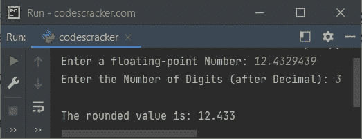

# Python `round()`关函数

> 原文：<https://codescracker.com/python/python-round-function.htm>

Python 中的 **round()** 函数在我们需要寻找指定浮点 值的最近整数时使用。例如:

```
num = 43.15034
print(round(num))

num = 24.9876
print(round(num))

num = 67.51
print(round(num))
```

输出将是:

```
43
25
68
```

**注-** 在 Python 中使用 **round()** 函数对数字进行舍入时， **0.1** 给出 0， T6】0.9 给出 1， **0.2** 给出 0，以此类推。即大于 **0.5 的数**给出 1， 否则给出 0。

## Python `round()`关函数语法

Python 中 **round()** 函数的语法是:

```
round(value, digits)
```

其中**值**参数代表必须四舍五入的值。而**位数**参数 是在我们需要用到小数的时候使用的，在四舍五入的数字。

**注-****位数**参数是可选的。并且**位数**参数的默认值为 0。

## Python `round()`关函数示例

下面是 Python 中 **round()** 函数的一个例子。本程序允许用户在 程序运行时定义数字，也允许输入小数位数进行四舍五入:

```
print("Enter a floating-point Number: ", end="")
x = float(input())
print("Enter the Number of Digits (after Decimal): ", end="")
d = int(input())

print("\nThe rounded value is:", round(x, d))
```

下面给出的快照显示了上述程序的示例运行，其中用户输入 **12.4329439** 作为浮点 数，并且 **3** 作为小数点后的位数:



在上面的示例运行中，因为小数点后的第四位数字是 9，所以我们看到的是输出 **12.433** ，而不是 **12.432**

[Python 在线测试](/exam/showtest.php?subid=10)

* * *

* * *