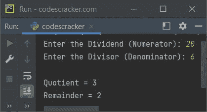
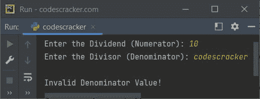
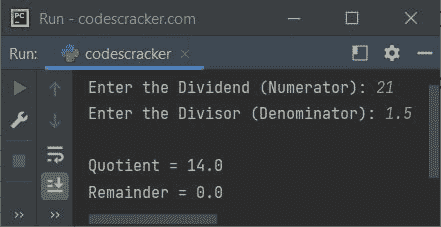

# Python `divmod()`函数

> 原文：<https://codescracker.com/python/python-divmod-function.htm>

Python 中的 **divmod()** 函数接受两个参数，在将第一个参数的值除以第二个参数后，以[元组](/python/python-tuples.htm)的形式返回 中的商和余数值。例如:

```
x = divmod(10, 5)
print(x)

x = divmod(100, 2.5)
print(x)

x = divmod(10, 3)
print(x)
```

输出将是:

```
(2, 0)
(40.0, 0.0)
(3, 1)
```

## Python `divmod()`函数语法

Python 中 **divmod()** 函数的语法是:

```
divmod(dividend, divisor)
```

## Python `divmod()`函数示例

下面这个例子演示了 Python 中的 **divmod()** 函数。这个程序允许用户在运行时定义 被除数和除数的值:

```
print("Enter the Dividend (Numerator): ", end="")
num = int(input())
print("Enter the Divisor (Denominator): ", end="")
den = int(input())

res = divmod(num, den)
print("\nQuotient =", res[0])
print("Remainder =", res[1])
```

下面给出的快照显示了样本运行，用户输入 **20** 作为分子， **6** 作为分母:



现在的问题是，如果用户想为分子和/或分母输入浮点值呢？
因此，我们需要修改上面的程序以将输入值转换成浮点的方式。当用户试图 输入一个非数字的输入时，这个 程序还捕捉到使用 **try-except** 块转换时引发的异常:

```
print("Enter the Dividend (Numerator): ", end="")
num = input()
print("Enter the Divisor (Denominator): ", end="")
den = input()

try:
    num = float(num)
    try:
        den = float(den)
        res = divmod(num, den)
        print("\nQuotient =", res[0])
        print("Remainder =", res[1])
    except ValueError:
        print("\nInvalid Denominator Value!")
except ValueError:
    print("\nInvalid Numerator Value!")
```

下面是它的示例运行，用户输入 **10** 作为分子， **codescracker** 作为分母:



这是另一个使用用户输入 **21** 和 **1.5** 运行的示例:



[Python 在线测试](/exam/showtest.php?subid=10)

* * *

* * *