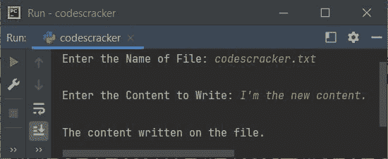
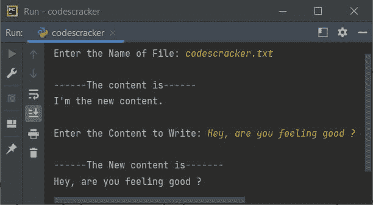

# Python open()函数

> 原文：<https://codescracker.com/python/python-open-function.htm>

**open()** 函数是使用 Python 在[文件处理中使用最多的函数。因此，一定要专注于本教程， ,它将通过许多例子教你关于这个函数的一切。我已经用 Python 讲述了与 **open()** 相关的所有话题。先说它的语法。](/python/python-file-io.htm)

## Python open()语法

在 Python 中打开一个文件，我们需要使用 **open()** 函数。下面是语法:

```
open(filename, mode, buffering, encoding, errors, newline, closefd, opener)
```

**注意-** 在 **open()** 函数的全部 8 个参数中，一般只需要前两个参数。其余的 6 个参数大部分时间都不需要 。

最后 6 个参数是可选的。甚至第二个参数，即**模式**也可以被认为是可选的，因为如果 你不提供该模式，那么它被视为 **r** ，因为 **r** 是默认的文件打开模式。

下面是演示代码，使用 **open()** 函数在阅读模式下打开一个文件 **codescracker.txt** 。我没有使用 这段代码中所有的 6 个可选参数:

```
open("codescracker.txt", "r")
```

如果文件可用，函数 **open()** 返回文件对象。否则会产生**FileNotFoundError**T4 的错误。我也创建了这类程序，可以处理这类错误。

## open()函数所有参数的描述

下表描述了 Python 中 **open()** 函数的所有参数。参数 的描述以简单或一行的形式给出。但是我已经用例子描述了关于所有参数，在表格下面， 一个接一个。

| 参数 | 描述 | 缺省值 |
| 文件名 | 要打开的文件的名称。 | 没有默认值，我们需要传递文件名 |
| 方式 | 这是文件的打开方式。 | 默认值为“r”。它表示以阅读模式打开文件 |
| 减轻 | 该参数用于设置缓冲策略。 | 默认值为-1 |
| 编码 | 该参数用于提供对文件进行编码/解码的编码格式。 | 默认值为无 |
| 错误 | 该参数主要用于处理编码/解码错误 | 默认值为无 |
| 新行 | 这个参数有助于控制换行符的工作 | 默认值为无 |
| 关闭的 | **closefd** 代表**关闭文件描述符**。如果给定文件名，则**为真**。否则，当文件关闭时，文件描述符将保持打开 | 默认值为 True |
| 开启工具 | 该参数用于以自定义方式打开文件。 | 默认值为无 |

## Python open()示例

因为函数 **open()** 用于打开一个文件。因此，让我们首先创建一个名为 **codescracker.txt** 的文件。我已经创建并保存了文件。这是打开的 **codescracker.txt** 的快照，是当前 目录下新创建的文件:


因为文件是创建的。现在我们可以开始操作这个文件了。因此，我为 **open()** 函数创建了一些有用示例程序，如下所示。

## open()函数中的文件名参数

这是 Python 中 **open()** 函数的第一个参数。如前所述，它用于给出文件的名称，即 将要操作的文件(读、写、更新、删除)。

**注-** 文件名必须和扩展名一起给出，如 **myfile.txt** 、【myfile.html】T4 等。

下面是一个以阅读模式打开文件的示例:

```
fp = open("codescracker.txt")
if fp:
    print("The file, \"codescracker.txt\" opened successfully!")
```

因为上面程序中给出的文件已经在当前目录中创建了。因此，上面的程序产生如下图所示的输出:


因为在下面的代码中 **fp** 等于**真**:

```
if fp:
```

从上面的程序。因此程序流进入 **if** 的主体，并执行 **print()** 语句。 意味着， **open()** 函数返回 **True** ，如果该文件在目录中可用。否则，将产生 中的 **FileNotFoundError** 错误。例如，让我们创建相同的程序，给一个不存在于当前目录 中的文件名:

```
fp = open("none.txt")
if fp:
    print("The file, \"none.txt\" opened successfully!")
```

如果文件 **none.txt** 不存在，您将看到以下输出:


下面是另一个程序，展示了如何手动处理 **FileNotFoundError** 错误来创建一个良好的用户体验 程序:

```
try:
    fp = open("none.txt")
    print("The file, \"none.txt\" opened successfully!")
except FileNotFoundError:
    print("The file, \"none.txt\" not found!")
```

该程序产生以下输出:

```
The file, "none.txt" not found!
```

#### 通过用户输入打开文件

让我们创建一个程序，在程序运行时从用户那里接收文件名:

```
print("Enter the Name of File: ", end="")
filename = input()

try:
    fp = open(filename)
    print("The file, \"" + filename + "\" opened successfully!")
except FileNotFoundError:
    print("The file, \"" + filename + "\" not found!")
finally:
    fp.close()
```

以下是上述程序产生的初始输出，用户输入 **codescracker.txt** 作为文件名:


**注意-****结束**使用 **print()** 的默认行为跳过自动换行符的插入。

在上面的程序中，**尝试...除...之外...最后**是异常处理块。关于 异常处理有一个单独的教程。所以要详细了解，可以参考它的单独教程。

## open()函数中的模式参数

mode 参数主要用于提供文件的访问模式。Python 中有许多可用的模式。让我们列出所有这些模式并进行简要描述。

### Python 文件打开模式

以下是 Python 中可用的文件打开模式列表:

*   **r** -以阅读模式打开文件。这是默认模式
*   **r+** -以读写模式打开文件
*   **rb** -与 **r** 相同，但为二进制格式
*   **rb+** -与 **r+** 相同，但为二进制格式
*   **w** -以写模式打开文件。如果文件不存在，则创建一个新文件。文件名将等于 **open()** 函数的 文件名参数
*   **w+** -以读写模式打开文件
*   **wb** -与 **w** 相同，但为二进制格式
*   **wb+** -与 **w+** 相同，但为二进制格式
*   **a** -以追加模式打开文件。如果文件不存在，则创建一个新文件。该模式用于追加数据，即 是在不擦除以前数据的情况下写入新数据
*   **a+** -以读取和附加模式打开文件
*   **ab** -与 **a** 相同，但为二进制格式
*   **ab+** -与 **a+** 相同，但为二进制格式
*   **x** -创建文件。如果指定文件已经存在，则返回错误

#### r 模式示例

下面给出的程序演示了在打开文件时使用 **r** 文件打开模式。

```
print("Enter the Name of File: ", end="")
filename = input()

try:
    fp = open(filename, "r")
    print("\nThe file, \"" + filename + "\" opened successfully!")
    print("\n------The content is-------")
    print(fp.read())
except FileNotFoundError:
    print("\nThe file, \"" + filename + "\" not found!")
finally:
    fp.close()
```

下面是上面的程序产生的输出，带有用户输入，与前面创建的文件一样:


#### r+模式示例

下面给出的例子演示了在 Python 中使用 **r+** 文件打开模式:

```
print("Enter the Name of File: ", end="")
filename = input()

try:
    fp = open(filename, "r+")
    print("\nThe file, \"" + filename + "\" opened successfully!")
    print("\n------The content is-------")
    print(fp.read())
    print("\nEnter New Content to Write: ", end="")
    content = input()
    fp.write(content)
    print("\n------The New content is-------")
    fp.seek(0)
    print(fp.read())
except FileNotFoundError:
    print("\nThe file, \"" + filename + "\" not found!")
finally:
    fp.close()
```

下面是上面程序的运行示例，用户输入 **codescracker.txt** 作为文件名，**是新内容。** 作为新内容写入文件:


**注-** 上述程序中的 **seek()** 函数，用于将文件指针 **fp** 指向 文件的开头。这样，我们可以从头开始阅读所有内容。作为其参数提供的 **0** 表明 文件指针指向文件的开头。

您可能会有另一个顾虑，那就是为什么新内容最后会被写在同一行上。因此，要避免或从新行中放入新内容。只需添加以下代码或语句:

```
fp.write("\n")
```

就在以下语句之前:

```
fp.write(content)
```

## rb 模式示例

**rb** 模式用于以二进制格式的读取模式打开文件。意味着，以 一种不变的形式读取文件的内容。也就是说，文件的内容以不变的形式传输。让我们先来看一下 的例子，然后将对它进行简要的讨论:

```
print("Enter the Name of File: ", end="")
filename = input()

try:
    filehandle = open(filename, "rb")
    print("\nThe file, \"" + filename + "\" opened successfully!")
    print("\n------The content is-------")
    print(filehandle.read())
except FileNotFoundError:
    print("\nThe file, \"" + filename + "\" not found!")
finally:
    filehandle.close()
```

以下是使用用户输入 **codescracker.txt** 作为文件名运行的示例:


这是打开的文件的快照，如上面程序的示例运行中所输入的:


**注意-** 从上面的文件中，我已经删除了内容**我是新的内容。**从文件来看，那是作为 新内容写在以前的示例程序中的。

现在你可以看到，从上面原始文件的内容和程序显示的文件内容来看，打开文件后使用 **open()** 中的 **rb** 打开方式。也就是说，在二进制格式中，内容以不变的 形式传输。因此，以下输出:

```
b'Hey!\r\nThis is a file.\r\nThe name of this file is codescracker.'
```

作为文件内容生成。这里第一个字符 **b** 表示二进制格式。在 **b** 和 内容之后，还有一个**()**。在这个撇号中，我们将得到如上所示的 格式的文件内容。

**注意-****\ r**将光标移动到行首。

**注意-****\ n**插入一个新行。

但是在二进制格式中，我们会看到代码。我们看不到代码的输出，如\ r \ n 等。

**重要-** 以二进制格式打开文件进行读取，意味着从文件中读取的内容或数据将作为**字节**对象返回 ，而不是 **str** 对象。

**注意-** 我不建议你使用这种模式。在二进制模式下或当一个文件以二进制格式打开阅读时， 意味着文件不被视为文本行，而是被视为一系列字节。我已经提供了例子，只是为了让你理解事情是如何工作的。

#### rb+模式示例

```
print("Enter the Name of File: ", end="")
filename = input()

try:
    fp = open(filename, "rb+")
    print("\nThe file, \"" + filename + "\" opened successfully!")
    print("\n------The content is-------")
    print(fp.read())
    print("\nEnter New Content to Write: ", end="")
    content = input()
    fp.write(content.encode('utf-8'))
    print("\n------The New content is-------")
    fp.seek(0)
    print(fp.read())
except FileNotFoundError:
    print("\nThe file, \"" + filename + "\" not found!")
finally:
    fp.close()
```

下面是用户输入的运行示例， **codescracker.txt** 作为文件名，**我是新内容。**如新 内容写:


**注意-** 在文件的第二次读取中，内容被放在双引号中，因为 **I 是新的内容**， 是字符串的第一个字符 **I** 和第三个字符 **m** 之间的撇号。

在上面的程序中，下面的代码或语句:

```
fp.write(content.encode('utf-8'))
```

用于将存储在**内容**变量中的字符串编码成 **UTF-8** 格式。以避免 使用 **rb+** 文件打开模式将文件打开后的内容以二进制格式进行读写时出错。 因为，如果你用正常的语句来写作，比如:

```
fp.write(content)
```

然后它会产生一个错误，这是一个**类型的错误**，看起来像:


#### w 模式示例

```
print("Enter the Name of File: ", end="")
filename = input()

try:
    fp = open(filename, "w")
    print("\nEnter the Content to Write: ", end="")
    content = input()
    fp.write(content)
finally:
    fp.close()
    print("\nThe content written on the file.")
```

这是它的示例运行，文件名与前一个程序的文件名相同，而 **I 是新的内容。**如内容 写:



下面是执行上述程序后，直接打开的文件的快照:


**指向注释-** 如果我们以 **w** 模式打开文件，之前的内容会被删除。我们需要用 **a** 来代替 **w** 。这样，以前的内容不会被删除。

上述程序根本没有提供良好的用户体验。因此，我修改了上面的程序，提供了良好的用户体验:

```
print("Enter the Name of File: ", end="")
filename = input()

try:
    fp = open(filename, "r")
    print("\n------The content is------")
    print(fp.read())
    fp.close()
    fp = open(filename, "w")
    print("\nEnter the Content to Write: ", end="")
    content = input()
    fp.write(content)
    fp.close()
    fp = open(filename, "r")
    print("\n------The New content is-------")
    print(fp.read())
except FileNotFoundError:
    print("\nThe file, \"" + filename + "\" not found!")
    print("Creating the file...")
    fp = open(filename, "w")
    print("The file created successfully.")
    print("\nEnter the Content to Write: ", end="")
    content = input()
    fp.write(content)
    fp.close()
    fp = open(filename, "r")
    print("\n------The content is-------")
    print(fp.read())
finally:
    fp.close()
```

下面是以 **codescracker.txt** 作为文件名的示例运行，以及**嘿，你感觉好吗？**如内容 写:



下面是另一个示例运行，使用用户输入的 **none.txt** (一个不可用的文件)作为文件名，内容 与之前或以上示例运行相同:


如果打开当前目录，则是保存上述 Python 源代码的目录。然后，您将看到创建了 **none.txt** 文件。以下是快照:


#### w+模式示例

该程序可通过与 **r+** 模式类似的方式创建，仅用于读取。如果将 **r+** 和 **w** 中给出的程序 组合修改，那么你一定会得到 **w+** 模式的程序。来吧，自己动手。

#### wb 模式示例

该程序类似于在 **rb** 部分创建的程序。唯一的区别是，这个部分是用来写 内容的，而那个部分是用来阅读内容的。

#### wb+模式示例

该 **wb+** 的程序也类似于 **rb+** 部分给出的程序。

#### 典型的例子

当我们需要将内容写入文件时，使用 **a** 模式代替 **w** ，而不删除文件之前的 内容。

```
print("Enter the Name of File: ", end="")
filename = input()

try:
    fp = open(filename, "a")
    print("\nEnter the Content to Append: ", end="")
    content = input()
    fp.write("\n")
    fp.write(content)
finally:
    fp.close()
    print("\nThe content appended on the file.")
```

下面是它的运行示例，文件名与之前创建的文件名相同，当然还有**作为要追加的内容:**


**注意-** 我推荐你使用语句，`fp.write("\n")`在用于追加 内容的语句之前。因为，我们要追加，所以从换行开始追加内容更好。

现在，如果您打开该文件，您将看到如下所示的快照:


看，内容是追加的，从新行开始。要创建一个提供良好用户体验的程序，那么从第**段修改第二个程序为**模式。修改只是把 **w** 改成了 **a** 。

#### a+模式示例

这种模式类似于**一种**模式，具有额外的特性，在追加文件的同时也提供读取文件的功能。

```
print("Enter the Name of File: ", end="")
filename = input()

try:
    fp = open(filename, "a+")
    print("\n------The content is------")
    fp.seek(0)
    print(fp.read())
    print("\nEnter the Content to Append: ", end="")
    content = input()
    fp.write("\n")
    fp.write(content)
    print("\n------The New content is-------")
    fp.seek(0)
    print(fp.read())
finally:
    fp.close()
    print("\nDone! Closing the Program.")
```

这是它的样本运行与相同的文件名和**谢谢！**作为要追加的内容:


你可以自己玩更多的文件。这些只是一些演示程序，提供给你一些想法，里面的东西是如何运行的。

#### ab 模式示例

如果你阅读 **rb** 模式和 **a** 模式中提供的程序，这个程序很容易创建。

#### ab+模式示例

如果您组合并修改 **rb+** 和 **a** 部分给出的程序，也可以创建该程序。

#### x 模式示例

```
print("Enter the Name of File: ", end="")
filename = input()

try:
    fp = open(filename, "x")
    print("\nThe file, \"" + filename + "\" created successfully.")
except FileExistsError:
    print("\nThe file, \"" + filename + "\" already exists.")
```

以下是它的示例运行，使用用户输入作为已经存在的文件名:


下面是另一个不存在的运行示例，文件名为**python.html**:


如果你打开当前目录，然后你会发现有一个新创建的名为**python.html**的文件将会出现在 目录中。

## open()函数中的缓冲参数

提供 **buffering=-1** 或省略该参数，意味着它将被用作系统默认值。而提供 **缓冲=1** 意味着，我们需要将数据块从原始操作系统文件流转移到缓冲区。

**注-** 基本上是用缓冲来更快的处理数据。

换句话说，数据缓冲区是一个物理内存存储区域，用于在数据从一个地方移动到另一个地方时临时存储数据。

**注-** 数据缓冲区在进程间加载或移动数据时起着重要的作用。像缓冲发生在网上看视频的时候 。因此， 数据向缓冲器的传输提供了更快的数据加载，而不是将数据传输到物理存储存储器。

**注意-** 如果我们想要缓冲数据/文件，我们需要设置**缓冲**等于 1。

### 检查默认缓冲区大小

```
import io

print("The default buffer size:", io.DEFAULT_BUFFER_SIZE)
```

上述程序产生的输出是:


尺寸 **8192** 或**2<sup>13</sup>T5 是指字符或字节数。即 8192 个字符或 8192 个字节或 8 KB 是系统默认的缓冲区大小。**

**注意-** 使用**缓冲**参数的目的是为了更快地执行代码。

## open()函数中的编码参数

如前所述，**编码**参数用于编码/解码数据。使用最多的编码是 **utf-8** 。 现在的问题是，对数据进行编码或解码意味着什么？
答案是，在计算机科学中，编码这个词意味着根据使用的格式将普通或人类可读的文本转换成编码形式 。下面列出了一些流行的数据编码或解码格式:

*   utf-8
*   utf-16
*   美国信息交换标准码
*   ISO-8859-1

等等。在所有这些中， **utf-8** 是编码或解码数据最常用和推荐的编码格式。

**注意-** 要对 Unicode 字符进行编码，我们需要使用 **utf-8** 。

**注意-** 二进制，模式不接受编码参数。如果你这样做，它将抛出一个基于**值错误**的错误 消息。

关于参数**编码**的大问题是，因为我们可以以正常的方式存储文件，也就是说，不需要使用 编码参数以任何我们想要的编码格式编码数据，那么为什么我们需要在读取或写入之前或为了任何我们想要的编码或解码 数据。因为，在现代世界中，我们的程序需要处理大量的 字符。

因此，Python 的字符串类型使用 Unicode 标准来表示这些字符。因为，每种语言中的所有字符都有唯一的编码。也就是 Unicode。

**注-** 要详细了解 [Unicode 字符](/computer-fundamental/unicode-characters.htm)，请参考 的单独教程。

在访问了关于 **Unicode** 的独立文章后，您将对 Unicode 有一个完整的了解。举个例子 使用 **open()** 函数中的**编码**参数打开一个文件:

```
print("Enter the Name of File: ", end="")
filename = input()

try:
    fp = open(filename, "r")
    print("\n------The content is------")
    print(fp.read())
    fp.close()
    fp = open(filename, "w", encoding="utf-16")
    print("\nEnter the Content to Write: ", end="")
    content = input()
    fp.write(content)
    fp.close()
    fp = open(filename, "r", encoding="utf-16")
    print("\n------The New content is-------")
    print(fp.read())
except FileNotFoundError:
    print("\nThe file, \"" + filename + "\" not found!")
    print("Creating the file...")
    fp = open(filename, "w", encoding='utf-16')
    print("The file created successfully.")
    print("\nEnter the Content to Write: ", end="")
    content = input()
    fp.write(content)
    fp.close()
    fp = open(filename, "r", encoding="utf-16")
    print("\n------The content is-------")
    print(fp.read())
finally:
    fp.close()
```

下面是它的示例运行，使用用户输入的 **codescracker.txt** 作为文件名，使用编码的**新内容**作为内容 来编写:


**注意-** 如果您已经使用**编码**参数写入数据，那么不要忘记在 从输出屏幕上读取数据时使用相同的编码。否则，它将显示如下所示的数据。

也就是说，如果你读取数据，使用相同的文件，使用如下程序:

```
fp = open("codescracker.txt", "r")
print("\n------The content is------")
print(fp.read())
fp.close()
```

下面是您将看到的输出:


在写入新内容后查看内容的输出。由于内容是使用 **utf-16** 编码的，因此 你会看到这个输出。但是，如果您直接打开该文件，您将看到原始内容，如下面给出的快照 所示:


但是如果，我们在打印之前对数据进行显式编码，也就是不使用 open()函数中的编码参数，如下面给出的程序所示。创建这个程序是为了打印基于 **UTF-16** 格式的所有字符的 Unicode 值

```
fp = open("codescracker.txt", "r")
print("\n------The content is------")
content = fp.read()
content = content.encode("utf-16")
print(content)
fp.close()
```

以下是基于 **UTF-16** 编码格式打印 Unicode 值的输出:


如您所见，整个输出不可能在一个窗口中显示出来。以下是完整的输出:

```
------The content is------
b'\xff\xfe\xff\x00\xfe\x00N\x00\x00\x00e\x00\x00\x00w\x00\x00\x00 \x00\x00\x00c\x00\x00\x00o\x00\x00\x00n\x00\x00\x00t\x00\x00\x00e\x00\x00\x00n\x00\x00\x00t\x00\x00\x00 \x00\x00\x00w\x00\x00\x00i\x00\x00\x00t\x00\x00\x00h\x00\x00\x00 \x00\x00\x00e\x00\x00\x00n\x00\x00\x00c\x00\x00\x00o\x00\x00\x00d\x00\x00\x00i\x00\x00\x00n\x00\x00\x00g\x00\x00\x00'
```

现在的问题是，接下来我们需要做的是，以原始形式看到内容。这样，我们或用户就能够阅读文件的内容，无论内容是什么。然后，我们需要在打印前解码数据，使用以下代码:

因此，要打印文件中的普通文本或内容。这是你需要的程序:

```
fp = open("codescracker.txt", "r", encoding="utf-16")
print("\n------The content is------")
print(fp.read())
fp.close()
```

生产:

```
------The content is------
New content with encoding
```

**注-** 以一种编码格式编码的文件比如说 **utf-16** 不能用其他编码格式 比如说 **utf-8** 进行编码或解码。如果你这样做，就像下面给出的程序那样，就会产生错误。让我们看看如何:

```
fp = open("codescracker.txt", "r", encoding="utf-8")
print("\n------The content is------")
print(fp.read())
fp.close()
```

上述程序将产生如下所示的输出错误:


**注-** 目录中可用的文件 **codes.py** :

```
C:\Users\DEV\AppData\Local\Programs\Python\Python39\Lib
```

指 **Python 的编解码器注册表、API 和帮助器。**在您的情况下，在 **DEV** 的位置，可能会有另一个 名称，基于您系统的用户名。如果您打开该文件，它看起来像:


**注-** 但是您可以以您想要的编码格式对数据进行重新编码，然后使用该 格式读取数据。

**重要-** 如果你想对数据进行编码，我建议你只使用 **UTF-8** 编码格式。

## open()函数中的错误参数

由于 **print()** 中的 **errors** 参数是用来指定如何处理编解码错误的。 默认值为**无**。也就是说，如果你不使用这个参数，那么它被认为是 **None** ，如果你 使用这个参数，其值为 **None** ，那么它也被认为是默认参数。

以下是可赋予 **open()** 函数中 **errors** 参数的值列表:

*   **‘严格’**-给定该值，引发一个 **ValueError** 异常。
*   **‘忽略’**-当我们需要简单地忽略错误时，使用该值。但是忽略编码错误，可能 导致有用数据的丢失。
*   还有一些是**【替换】****【代理人场景】****【xmlcharrefreplace】****【回拉替换】**。 由于教程变得比平时大。简而言之，我提供了这些值。尽管这些在大多数情况下都没有用，除非你是一个专业人士，需要满足程序的需求

**注-** 基本上， **open()** 中的**错误**参数，用来读取文件而不引发异常。 这可以做到，只需向**错误**提供值，除了**无**和**‘严格’**，因为这两者几乎 一样工作。

下面是最简单的示例程序，使用 **errors** 参数，用**‘忽略’**作为值来读取文件:

```
fp = open("codescracker.txt", "r", encoding='utf-16', errors='ignore')
print(fp.read())
fp.close()
```

这是输出，你会看到:

```
New content with encoding
```

由于之前的文件是在使用 **utf-16** 对数据进行编码后写入的，因此我使用了相同的编码格式 从文件中读取数据。问题是，如果我们从同一个文件中读取数据，使用其他编码格式，比如说 **【utf-8】**，而不使用**错误**参数，会怎么样。让我们找出答案。程序如下:

```
fp = open("codescracker.txt", "r", encoding='utf-8')
print(fp.read())
fp.close()
```

如果您执行上述程序，您将在输出屏幕上看到以下错误消息:


如您所见，产生了 **UnicodeDecodeError** 错误。因此，要打开文件并读取数据，而 不会引发异常，我们需要使用**错误**参数，将**‘忽略’**作为其值。以下是之前程序的修改版 :

```
fp = open("codescracker.txt", "r", encoding='utf-8', errors='ignore')
print(fp.read())
fp.close()
```

现在，上述程序产生的输出将是:


**注-** 我不建议您也这样做，或者在写入数据时，绕过或使用带有**‘忽略’** 值的**错误**参数。这可能会导致数据丢失。

从上面的输出来看，输出仍然不是我们想要看到的。也就是说，我们能够忽略或删除错误消息，但是输出不是可读的格式。这是因为，文件中的内容是用 **utf-16** 编码的，但是 我们试图用 **utf-8** 来读取它。

## open()中的换行参数

**newline** 参数可以用来定义换行的工作。该参数的值可以是:

*   没有人
*   ''
*   \n '
*   \r '
*   \r\n '

这些值为**换行符**参数，只适用于文本数据。如果你不使用这个参数，或者使用它与 其值**无**或 **''** ，那么通用换行符模式被使用。

基本上， **newline** 参数用于提供转义序列，如 **'\n'** 、 **'\r\n'** 、 **'\r'** 、 来结束该行。并且所有这些字符都翻译成 **'\n'** 再返回给调用者。

在大多数情况下，根据系统的默认设置，转义序列 **'\r\n'** 会自动添加到每一行的末尾。

**注意-** 正如您在 **rb 模式示例**部分给出的输出中所看到的，在那里，我们已经看到当我们以二进制读取模式打开文件时，输出 在**行尾**或换行符的位置包含**。但是， 如果您在将内容写入文件时使用带有 **\r** 或 **\n** 的**换行符**参数，从我们读取数据的地方， 那么就会看到这个或 **\r** 或 **\n** 来代替默认的**。****

## open()中的 closefd 参数

**closefd** 参数也可以是已知的或者代表<u>关闭文件描述符</u>，用于包装代表已经打开的文件的文件描述符 ，或者从其名称打开给定的文件。

**注意-** 如果使用 **closefd** 参数 并以 **True** 为其值，则当返回的输入/输出(I/O)对象关闭时，文件关闭。

**注-****关闭**参数是一个布尔值，它以**真**或**假**作为值。

如果参数 **closefd** 被赋值为 **False** ，当文件 关闭时，底层文件描述符将保持打开。给定文件名时，这不起作用。因此必须将**赋值为真**。由于**真** 是默认值，因此你也删除这个参数来达到这个目的。

**注意-** 文件描述符是由操作系统(OS)分配给文件对象的一个整数，比如说 **fp** ，所以 Python 可以请求输入/输出操作。要获得 python 中任何文件对象整数值，使用下面的 代码。这个程序使用 **fileno()** 方法获得利息值:

```
print("Enter the Name of File: ", end="")
filename = input()
fp = open(filename, "r", closefd=True)
print("\nFile Descriptor Integer Value:", fp.fileno())
fp.close()
```

下面是它的运行示例:


## open()中的开启器参数

在 Python 版
中增加了**开启器**参数也就是在这个版本之前，在 **open()** 函数中 没有使用这个参数。即使添加了这个参数，Python 程序员也几乎不使用它。

**官方说的**——Python 官方说的 **open()** 的**开启器**参数是，<u>自定义开启器 可以通过传递一个可调用的 As 开启器</u>来使用。官方也没有给出使用这个参数的任何特别的好处。也许，在以后的版本中，会有一些修改，可能会发挥一些有益的用法。

使用自定义开启符的语法是:

```
open('codescracker.txt', 'w', opener=opener)
```

**注-** 该参数的默认值为**无**。因此，如果您省略该参数，或者如果您将 **None** 分配给该参数，那么它将被视为默认工作。

[Python 在线测试](/exam/showtest.php?subid=10)

* * *

* * *