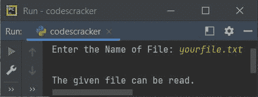
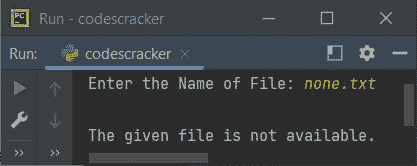

# Python `可读()`关函数

> 原文：<https://codescracker.com/python/python-readable-function.htm>

Python 中的 **readable()** 函数，用于检查文件是否可读。函数 **readable()** 如果文件可读则返回**真**，否则返回**假**。

## Python `可读()`关函数语法

在 Python 程序中使用 **readable()** 函数的语法是:

```
file.readable()
```

其中 **file** 表示文件指针或文件对象或文件处理程序，随你怎么说。

## Python `可读()`关函数示例

下面是一个示例程序，使用 **readable()** 函数来检查用户输入的文件是否可读:

```
print("Enter the Name of File: ", end="")
filename = input()

fp = open(filename, "r")
if fp.readable():
    print("\nThe given file can be read.")
else:
    print("\nThe given file is not readable.")
```

在执行上述程序之前，请确保在当前目录下创建一个文件。因为在我的例子中，我在当前目录中有一个名为 **yourfile.txt** 的文件。因此，让我们来看看上面程序的运行示例， 显示在下面给出的快照中:



您可能会想到，如果用户在运行时输入的文件在当前目录中不存在，该怎么办？
答案是，如果文件不存在于当前目录中，那么上面的程序会引发错误。 因此，让我们修改程序并创建另一个程序来处理该错误:

```
print("Enter the Name of File: ", end="")
filename = input()

try:
    fp = open(filename, "r")
    if fp.readable():
        print("\nThe given file can be read.")
    else:
        print("\nThe given file is not readable.")
except FileNotFoundError:
    print("\nThe given file is not available.")
```

下面是它的示例运行，其中用户输入了一个不存在的文件:



[Python 在线测试](/exam/showtest.php?subid=10)

* * *

* * *