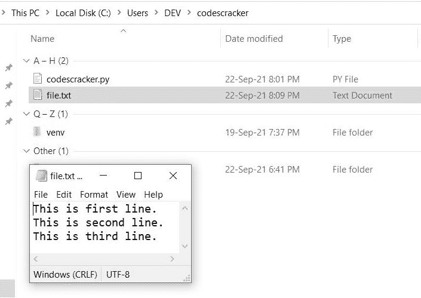
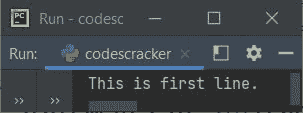
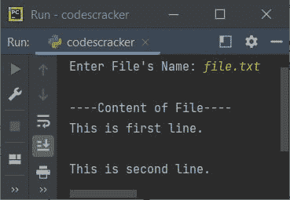

# Python `readline()`关函数

> 原文：<https://codescracker.com/python/python-readline-function.htm>

与 [readlines()](/python/python-readlines-function.htm) 不同，Python 中的 **readline()** 函数用于从文件中读取第一行。

如果在同一个程序中有多个 **readline()** 函数的语句可用。然后第一个 **readline()** 返回第一行，第二个 **readline()** 返回第二行，依此类推。

## Python readline()语法

在 Python 中使用 **readline()** 函数的语法是:

```
fo.readline(size)
```

其中 **fo** 是指文件对象或处理程序。**尺寸**参数是可选的。如果 **readline()** 的 size 参数被提供为 **10** ，那么只有该行的前 10 个字符被返回或读取。否则，如果这个 参数为空，那么返回整行。

## Python readline()示例

在创建程序之前，使用 **readline()** 函数从文件中读取该行。我们需要先创建一个文件。 因此，我将创建一个文件，比如说 **file.txt** ，其中包含 3 行。该文件必须保存在当前的 目录下。下面是当前目录的快照，文件为 **file.txt** :



现在该创建一个 **readline()** 函数的示例程序了:

```
fo = open("file.txt", "r")
myline = fo.readline()
print(myline)
```

下面给出的快照显示了这个 Python 程序产生的示例输出:



看，只有函数 **readline()** 返回的第一行，使用 **print()** 语句打印在输出上。 现在让我们使用该函数的**大小**参数，如下面给出的程序所示:

```
fo = open("file.txt", "r")
myline = fo.readline(7)
print(myline)
```

这一次，输出将是:

```
This is
```

看，函数 **readline()** 以 **7** 为参数值，只返回包括空格在内的前 7 个字符。

现在的问题是，如果文件不存在呢？
因此，让我们修改上面的程序，它处理当给定的文件在当前的 目录中不可用时产生的错误。也就是修改后的程序，在程序运行时从用户处接收文件名。我在一个程序中使用了多个 **readline()** 函数，如下所示:

```
print("Enter File's Name: ", end="")
filename = input()
try:
    file_object = open(filename, "r")
    print("\n----Content of File----")
    print(file_object.readline())
    print(file_object.readline())
except FileNotFoundError:
    print("\nThe given file is not available.")
```

下面是用户输入的示例运行:



打印的双换行符，一个是由于作为由 **readline()** ， 返回的行的最后一个字符的换行符，另一个是由于 [print()](/python/python-print-statement.htm) 的默认行为。为了避免双换行符， 替换上面程序中的以下语句:

```
print(file_object.readline())
```

下面给出了声明:

```
print(file_object.readline(), end="")
```

**注意-**[end =](/python/python-end.htm)参数用于改变 **print()** 的默认行为。详细学习，参考其单独教程。

[Python 在线测试](/exam/showtest.php?subid=10)

* * *

* * *