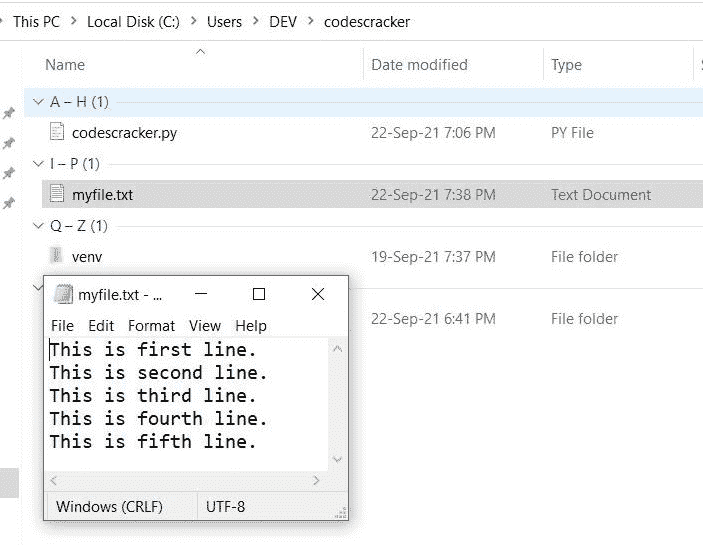
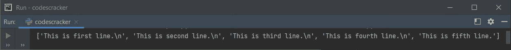
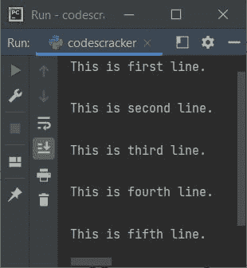
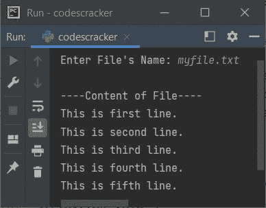

# Python readlines()函数

> 原文：<https://codescracker.com/python/python-readlines-function.htm>

与 [readline()](/python/python-readline-function.htm) 不同，Python 中的 **readlines()** 函数，用于一次性返回文件的所有行。也就是说， 使用 **readlines()** 函数返回文件的所有行。

所有使用 **readlines()** 返回的行，将以列表的形式出现。其中每个元素是一行。也就是说，第一个 元素将是文件的第一行，第二个元素将是文件的第二行，依此类推。

## Python readlines()语法

在 Python 中使用 **readlines()** 函数的语法是:

```
fo.readlines(size_hint)
```

其中 **fo** 是文件处理程序或对象。 **size_hint** 参数是可选的。该参数用来限制 要返回的行数。

**注意-** 如果返回的字节总数超过了 **size_hint** 参数的值，那么 将不再返回更多的行。

## Python readlines()示例

在创建一个程序作为 Python 中 **readlines()** 函数的例子之前，我们先在当前目录下创建一个文件比如说 **myfile.txt** 里面有一些内容比如说 5 行内容。下面是显示当前目录的快照， 以及打开的新建文件 **myfile.txt** :



现在让我们创建一个程序，使用 **readlines()** 从这个文件中读取所有行:

```
fo = open("myfile.txt", "r")
mylines = fo.readlines()
print(mylines)
```

这个 Python 程序产生的输出显示在下面给出的快照中:



查看输出。它以列表的形式出现，如下所示:

```
['This is first line.\n', 'This is second line.\n', 'This is third line.\n', 'This is fourth line.\n', 'This is fifth line.']
```

要逐行读取文件的内容，我们需要一个接一个地获取并打印元素，如下面给出的程序所示:

```
fo = open("myfile.txt", "r")
mylines = fo.readlines()

tot = len(mylines)
for i in range(tot):
    print(mylines[i])
```

现在，这个 Python 程序产生的输出如下所示:



请查看每个元素或行之间的双换行符。这是因为，一个换行符使用了 [print()](/python/python-print-statement.htm) 的默认行为，另一个换行符使用了每个元素或行的最后一个字符 ，也就是 **\n** ，间接换行符。因此，我们需要从上面的程序中修改下面的语句:

```
print(mylines[i])
```

下面给出了声明:

```
print(mylines[i], end="")
```

现在让我们用一个在程序运行时从用户那里接收文件名的程序来修改上面的程序。当用户输入一个不存在的文件时，这个程序也会处理错误:

```
print("Enter File's Name: ", end="")
fn = input()
try:
    fo = open(fn, "r")
    ml = fo.readlines()
    print("\n----Content of File----")
    for i in range(len(ml)):
        print(ml[i], end="")
except FileNotFoundError:
    print("\nThe file does not found.")
```

下面是它的示例运行，文件名与前面的程序相同，即 **myfile.txt** :



**注意-**[end =](/python/python-end.htm)参数用于改变 **print()** 的默认行为。详细学习，参考其单独教程。

## 带有 size_hint 参数的 Python readlines()

现在让我们创建另一个程序，它使用可选参数 **readlines()** 来读取有限的行数:

```
fo = open("myfile.txt", "r")
print(fo.readlines(17))
```

上述程序产生的输出将是:

```
['This is first line.\n']
```

这是另一个程序:

```
fo = open("myfile.txt", "r")
print(fo.readlines(23))
```

这一次，上述程序产生的输出将是:

```
['This is first line.\n', 'This is second line.\n']
```

看，当字节数超过当前行中可用的总字节/字符数时，下一行也会与当前行一起打印。

例如，如果有 10 行，每行包含 30 个字符，包括换行符。因此，提供 1 到 29 之间的任何值都会打印第一行。提供任何从 30 到 59 打印第一和第二行。提供从 60 到 89 的任何内容打印前三行，依此类推。

[Python 在线测试](/exam/showtest.php?subid=10)

* * *

* * *