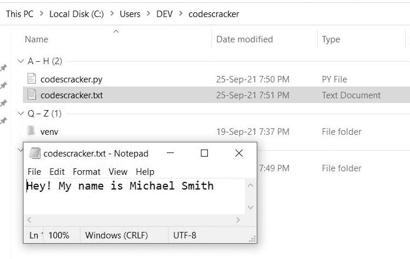
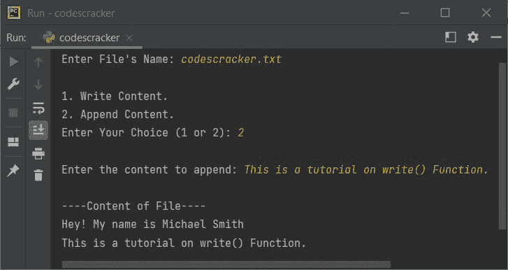

# Python `write()`函数

> 原文：<https://codescracker.com/python/python-write-function.htm>

Python 中的 **write()** 函数用于[将内容(文本)写入文件](/python/program/python-program-write-to-file.htm)。 根据文件 的打开模式，该函数用于向文件 写入或[追加数据。](/python/program/python-append-text-to-file.htm)

**注-****w**模式用于写入，而 **a** 模式用于追加。

## Python write()语法

在 Python 程序中使用 **write()** 函数的语法是:

```
fo.write(string_to_write)
```

其中 **fo** 表示文件对象或句柄， **string_to_write** 是需要写入句柄为 **fo** 的文件中的字符串或文本 。

## Python write()示例

下面给出的程序使用 **write()** 函数写一些文字说**嘿！我的名字是迈克尔史密斯**到一个文件说 **codescracker.txt** 。在写入文件之前，我们需要打开文件，所以这里我使用了 **w** 打开模式。

因为我使用了 **w** 的打开方式，所以如果当前的 目录下没有 **codescracker.txt** 文件，那么这个文件会自动被创建，内容会被写入其中。否则，如果文件可用，则 内容被覆盖，或者先前的内容被删除，新的内容被写入。让我们看看怎么做。

```
fo = open("codescracker.txt", "w")
fo.write("Hey! My name is Michael Smith")
print("The content written in the file.")
fo.close()
```

如果您执行这个程序，那么产生的输出将是:


现在，如果你打开当前目录，那么这个具有相同内容的文件将是可用的。下面是在我的例子中使用上述程序创建的文件的快照:



现在让我们创建另一个程序，在单个 Python 程序中演示所有关于 **write()** 函数的内容。这个程序 被创建，因此，文件名在程序运行时被用户接收。

```
print("Enter File's Name: ", end="")
filename = input()
print("\n1\. Write Content.")
print("2\. Append Content.")
print("Enter Your Choice (1 or 2): ", end="")
choice = int(input())
if choice == 1:
    fo = open(filename, "w+")
    print("\nEnter the content to write: ", end="")
    content = input()
    fo.write(content)
    print("\n----Content of File----")
    fo.seek(0)
    print(fo.read())
    fo.close()
elif choice == 2:
    fo = open(filename, "a+")
    print("\nEnter the content to append: ", end="")
    content = input()
    fo.write("\n")
    fo.write(content)
    print("\n----Content of File----")
    fo.seek(0)
    print(fo.read())
    fo.close()
else:
    print("\nInvalid Input!")
```

下面是它的示例运行，用户输入 **codescracker.txt** 作为文件名， **2** 作为选择， **这是一个关于 write()函数的教程。**作为内容:



**注-** 上述程序中的 [end=参数](/python/python-end.htm)，使用 [print()函数](/python/python-print-statement.htm)的默认行为，用于跳过自动插入 一个新行。

以下声明:

```
fo.seek(0)
```

用于将文件处理程序移动到文件的开头，以从头到尾读取所有内容。要详细了解 [seek()](/python/python-seek-function.htm) ，请参考其单独教程。

和声明:

```
fo.write("\n")
```

用于添加新行的内容。

[Python 在线测试](/exam/showtest.php?subid=10)

* * *

* * *