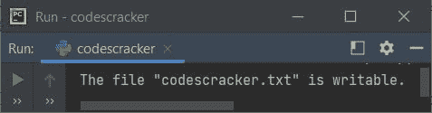
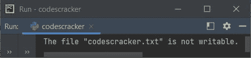

# Python writable()函数

> 原文：<https://codescracker.com/python/python-writable-function.htm>

Python 中的 **writable()** 函数，用于检查文件是否可写。换句话说，我们可以说 这个函数是用来检查我们是否可以写入文件。

**注意-** 文件不可写的原因可能有很多，比如不允许对文件进行写操作，或者 使用了 **r** 的文件打开模式(只读模式)等。

## Python writable()语法

使用 **writable()** 函数的语法是:

```
fh.writable()
```

其中 **fh** 表示文件处理程序或对象。如果句柄为 **fh** 的文件是可写的， 返回**真**，否则返回**假**。

## Python writable()示例

让我们创建一个示例程序，它使用 **writable()** 函数来检查并打印关于 文件是否可写的消息:

```
fh = open("codescracker.txt", "w")
if fh.writable():
    print("The file \"codescracker.txt\" is writable.")
else:
    print("The file \"codescracker.txt\" is not writable.")
fh.close()
```

下面是它的运行示例:



由于文件 **codescracker.txt** 是在 **w** 模式下打开的，因此我们可以使用其处理程序写入该文件。

如果您将打开模式从 **w** 更改为 **r** (只读)，则输出将为:



**注意-** 如果打开文件时使用了 **r** 模式，那么 **open()** 函数会产生错误或者抛出 异常 say **FileNotFoundError** 。这里有一个例子:

```
try:
    fh = open("none.txt", "r")
    if fh.writable():
        print("It is writable.")
    else:
        print("It is not writable.")
except FileNotFoundError:
    print("File not found!")
```

因为文件 **none.txt** 不可用，所以您将看到输出:

```
File not found!
```

[Python 在线测试](/exam/showtest.php?subid=10)

* * *

* * *