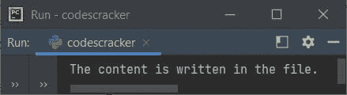
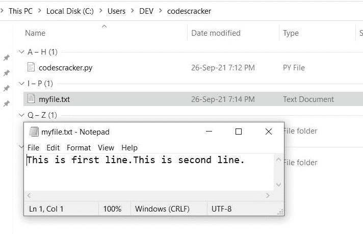
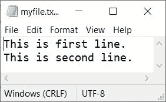
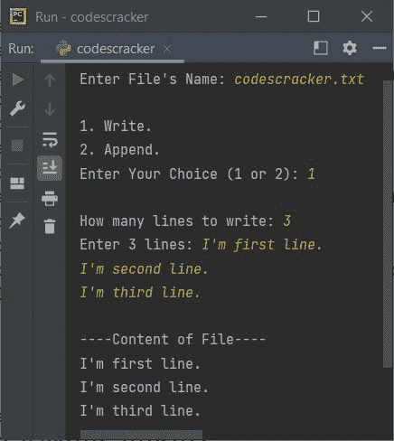

# Python `writelines()`函数

> 原文：<https://codescracker.com/python/python-writelines-function.htm>

Python 中的 **writelines()** 函数，用于一次将多行文本或字符串写入一个文件。这些行是列表元素形式的 。因此，我们可以使用字符串作为列表的元素，使用 **writelines()** 函数一次将多个字符串插入到文件 中。

## Python writelines()语法

Python 中 **writelines()** 函数的语法是:

```
fh.writelines(list_or_sequence)
```

其中 **fh** 表示文件处理程序或文件对象， **list_or_sequence** 表示列表或序列。

## Python writelines()示例

现在让我们创建一个示例程序，演示 Python 的 **writelines()** 函数:

```
file_handler = open("myfile.txt", "w")
file_handler.writelines(["This is first line.", "This is second line."])
file_handler.close()
print("The content is written in the file.")
```

下面给出的快照显示了上述 Python 程序的运行示例:



现在如果你打开当前目录。保存 Python 源代码的目录。然后你会看到，一个名为 **myfile.txt** 的文件是用**创建的，这是第一行。这是第二行。**为其内容。下面是当前目录的快照 ,使用上面的程序示例运行打开这个新创建的文件:



看，文件的内容。两行都是单行写的。这是因为，在写第二个句子之前，我没有插入换行符。因此，当我们想要插入一个新行时，我们需要放置 **\n** 。因此，使用 **【writelines()】可以在文件中写入多个字符串(段落或你所说的任何内容)。**

 **下面是以前程序的修改版本，显示了如何插入一个新行或者如何以逐行的方式在文件中写入内容:

```
file_handler = open("myfile.txt", "w")
file_handler.writelines(["This is first line.\n", "This is second line."])
file_handler.close()
print("The content is written in the file.")
```

这个程序产生与前一个程序相同的输出。但是如果你从当前的 目录中打开名为 **myfile.txt** 的文件。这一次，这两个句子分成两行，如下图所示:



因为我使用了 **w** 的打开方式，所以文件内容会被覆盖。或者之前的内容被 删除，新的内容被写入。

现在让我们修改程序并创建一个新程序，它将在程序运行时从用户那里获取行或文本:

```
print("Enter File's Name: ", end="")
file_name = input()
print("\n1\. Write.")
print("2\. Append.")
print("Enter Your Choice (1 or 2): ", end="")
choice = int(input())
if choice == 1:
    file_handler = open(file_name, "w")
    print("\nHow many lines to write: ", end="")
    no_of_lines = int(input())
    print("Enter", no_of_lines, "lines: ", end="")
    my_lines = list()
    for i in range(no_of_lines):
        line = input()
        line = line + "\n"
        my_lines.append(line)
    file_handler.writelines(my_lines)
    file_handler.close()
    file_handler = open(file_name, "r")
    print("\n----Content of File----")
    print(file_handler.read())
    file_handler.close()
elif choice == 2:
    file_handler = open(file_name, "a")
    print("\nHow many lines to append: ", end="")
    no_of_lines = int(input())
    print("Enter", no_of_lines, "lines: ", end="")
    my_lines = list()
    for i in range(no_of_lines):
        line = input()
        line = line + "\n"
        my_lines.append(line)
    file_handler.writelines(my_lines)
    file_handler.close()
    file_handler = open(file_name, "r")
    print("\n----Content of File----")
    print(file_handler.read())
    file_handler.close()
else:
    print("\nWrong choice!")
```

下面是它的示例运行，用户输入 **codescracker.txt** 作为文件名， **1** 作为选项， **3** 作为要写入的行数， 和**我是第一行。**作为第一要素，**我是第二要素。**作为二次元，而**我是三线。**作为第三个 要素:



[Python 在线测试](/exam/showtest.php?subid=10)

* * *

* * ***