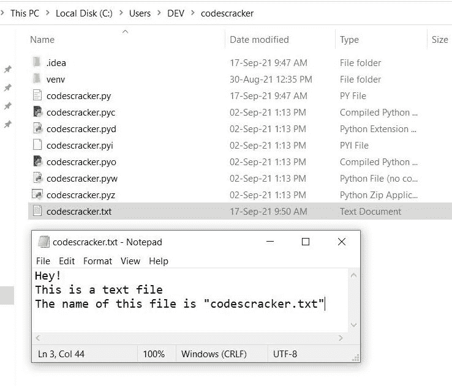
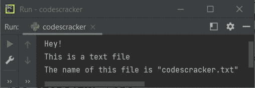
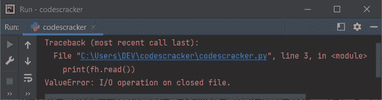
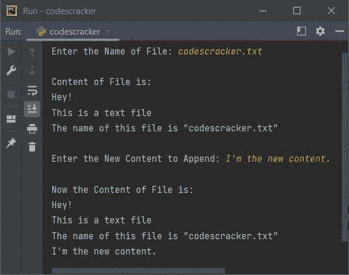
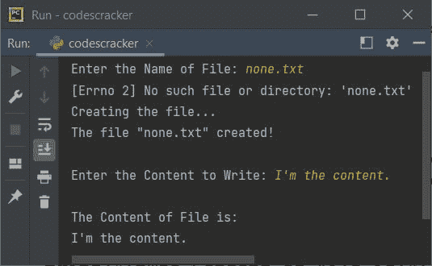

# Python close()函数

> 原文：<https://codescracker.com/python/python-close-function.htm>

Python 中的 **close()** 函数，用于关闭文件。也就是说，当使用 **open()** 函数打开一个文件，并且 对该文件的所有操作都已完成，那么必须使用 **close()** 函数 关闭该文件对象或处理程序，以断开该文件与程序的链接。

## 关闭文件的 close()函数的语法

Python 中关闭文件的 **close()** 函数的语法是:

```
close(fh)
```

其中 **fh** 表示文件处理程序或文件对象。

## Python close()函数示例

在继续下面给出的例子之前，让我们先创建一个包含一些内容的文件，比如 **codescracker.txt** 。文件 必须保存在当前目录下。这是当前目录的快照。这两者都显示了，那就是作为 的文件及其内容:



现在让我们创建一个程序，使用这个文件进行操作(读取其内容)，然后使用 **close()** 函数关闭该文件:

```
fh = open("codescracker.txt", "r")
print(fh.read())
fh.close()
```

如果您执行上面的程序，您将看到该程序产生的以下输出:



现在你可能会想，如果我们在使用 **close()** 函数关闭对象之后，再次使用 **fh** 对象，会怎么样？
让我们用下面给出的程序找出它的答案:

```
fh = open("codescracker.txt", "r")
fh.close()
print(fh.read())
```

以下是该程序产生的输出:



看，声明:

```
fh.read()
```

使用 **close()** 关闭文件对象 **fh** 后，引发一个 **ValueError** 。让我们创建另一个程序 来展示 Python 中文件处理程序、 **open()** 和 **close()** 函数的有效使用:

```
print("Enter the Name of File: ", end="")
filename = input()
try:
    filehandle = open(filename, "r")
    print("\nContent of File is:")
    print(filehandle.read())
    filehandle.close()
    print("\nEnter the New Content to Append: ", end="")
    content = input()
    filehandle = open(filename, "a+")
    filehandle.write("\n")
    filehandle.write(content)
    filehandle.seek(0)
    print("\nNow the Content of File is:")
    print(filehandle.read())
except FileNotFoundError as fnfe:
    print(fnfe)
    print("Creating the file...")
    filehandle = open(filename, "w+")
    print("The file \"", filename,"\" created!", sep="")
    print("\nEnter the Content to Write: ", end="")
    content = input()
    filehandle.write(content)
    filehandle.seek(0)
    print("\nThe Content of File is:")
    print(filehandle.read())
finally:
    filehandle.close()
```

下面是它的示例运行，用户输入 **codescracker.txt** 作为文件名，**我是新内容。**作为内容:



这是另一个运行用户输入的例子 **none.txt** (一个不存在的文件)，我是内容**。**作为内容:



在上面的程序中，语句:

```
filehandle.write("\n")
```

用于在插入或追加新内容之前插入换行符。和声明:

```
filehandle.seek(0)
```

用于将文件指针放在文件的开头。这样，所有的内容都会被阅读。

[Python 在线测试](/exam/showtest.php?subid=10)

* * *

* * *