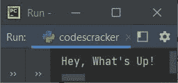
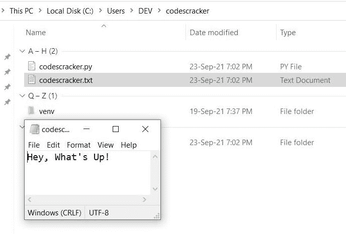
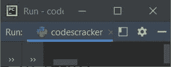
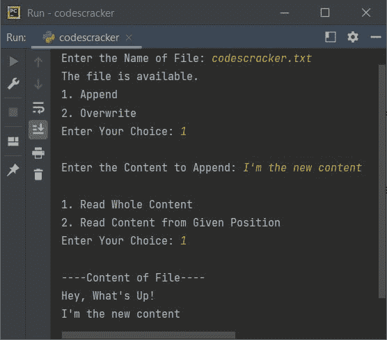
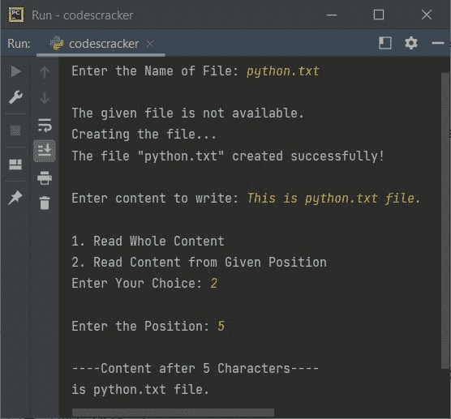

# Python seek()函数

> 原文：<https://codescracker.com/python/python-seek-function.htm>

Python 中的 **seek()** 函数，用于设置/返回文件指针或处理程序在文件中的位置。 换句话说，我们可以说函数 **seek()** 用于设置或定义文件处理程序的位置，从这里 必须执行从/到文件的读或写操作。

## Python seek()语法

在 Python 程序中使用 **seek()** 函数的语法是:

```
fo.seek(offset, from_where)
```

其中 **fo** 表示文件对象或文件处理程序。第一个参数**偏移量**表示从 中的值开始的字节(字符)数。

第二个参数 **from_where** 表示文件对象开始的位置。该参数 接受以下三个值:

*   **0** -在文件开头设置文件处理程序
*   **1** -将文件处理器设置到当前位置
*   **2** -在文件末尾设置文件处理程序

**注意-** 文件处理程序就像光标。也就是说，光标在文件内容中的位置，从那里开始执行读、写、更新等操作 。

**注意-** 只提供一个参数给 **seek()** 会被视为第一个参数。 **from_where** 或 **seek()** 的第二个参数的默认值为 **0** 。

## Python seek()示例

在 Python 程序中使用和演示 **seek()** 函数之前，让我先创建一个程序，如果当前目录中没有 文件，比如说 **codescracker.txt** 。如果可用，则内容将被覆盖:

```
fp = open("codescracker.txt", "w")
content = "Hey, What's Up!"
fp.write(content)
fp.close()

fp = open("codescracker.txt", "r")
content = fp.read()
print(content)
```

如果使用任何 Python 编译器执行这个程序，比如说 **PyCharm** ，那么上面的程序 产生的输出将是:



如果你打开你当前的目录，那么一个文件会被创建或者用**覆盖嘿，怎么了！**。这里是当前目录的快照 ，包括打开的新建或覆盖的文件:



你注意到了吗，在上面的程序中，文件对象或处理程序 **fp** 在 [写完内容](/python/program/python-program-write-to-file.htm)后被关闭，以便 [重新打开同一个文件读取文件](/python/program/python-program-read-file.htm)并将其内容打印回屏幕上。让我们创建另一个程序 ，它不使用处理程序 **fp** 关闭文件:

```
fp = open("codescracker.txt", "w+")
content = "Hey, What's Up!"
fp.write(content)
content = fp.read()
print(content)
```

**注意-** 必须使用 **w+** 的文件打开模式，即允许对文件进行读写两种操作。

现在，上面的程序产生的输出将与下面给出的快照完全不同:



使用上面的程序，因为文件 **codescracker.txt** 已经使用第一个程序创建，因此 内容**嘿，怎么了！**被覆盖。

输出看起来很奇怪。这是因为，在写内容的时候，文件处理程序 **fp** 在写完最后一个字符 之后，会转到文件的末尾，那个字符就是**！**在**之后上升**。因此，我们需要在文件的开头移动文件处理程序 **fp** ，这样就可以读取全部内容并打印在输出上。因此让我们修改上面的 程序:

```
fp = open("codescracker.txt", "w+")
content = "Hey, What's Up!"
fp.write(content)
fp.seek(0, 0)
content = fp.read()
print(content)
```

这一次，输出将与第一个程序的输出相同。那就是:


在上面的程序中，语句:

```
fp.seek(0, 0)
```

将文件处理程序 **fp** 定位为从第 **0** <sup>第</sup>个字符开始。

现在让我创建一个程序，它将是理解 Python 中的 **seek()** 函数如何工作 的完整包。一定要花时间非常仔细地专注于这个程序，以便理解只有一个程序的全部内容。 在理解这个节目的同时，也许你还能理解更多的东西，包括 **seek()** 。所以让我们开始这个项目:

```
print("Enter the Name of File: ", end="")
filename = input()
try:
    fo = open(filename, "r")
    print("The file is available.")
    print("1\. Append")
    print("2\. Overwrite")
    print("Enter Your Choice: ", end="")
    try:
        choice = int(input())
        if choice==1:
            print("\nEnter the Content to Append: ", end="")
            content = input()
            fo.close()
            fo = open(filename, "a+")
            fo.write("\n")
            fo.write(content)
            print("\n1\. Read Whole Content")
            print("2\. Read Content from Given Position")
            print("Enter Your Choice: ", end="")
            try:
                choice = int(input())
                if choice == 1:
                    fo.seek(0)
                    print("\n----Content of File----")
                    print(fo.read())
                elif choice == 2:
                    print("\nEnter the Position: ", end="")
                    try:
                        position = int(input())
                        fo.seek(position)
                        print("\n----Content after", position, "Characters----")
                        print(fo.read())
                    except ValueError:
                        print("\nInvalid Input!")
                else:
                    print("\nInvalid Choice!")
            except ValueError:
                print("\nInvalid Input!")
        elif choice==2:
            print("\nEnter the Content to Write (Overwrite): ", end="")
            content = input()
            fo.close()
            fo = open(filename, "w+")
            fo.write(content)
            print("\n1\. Read Whole Content")
            print("2\. Read Content from Given Position")
            print("Enter Your Choice: ", end="")
            try:
                choice = int(input())
                if choice == 1:
                    fo.seek(0)
                    print("\n----Content of File----")
                    print(fo.read())
                elif choice == 2:
                    print("\nEnter the Position: ", end="")
                    try:
                        position = int(input())
                        fo.seek(position)
                        print("\n----Content after", position, "Characters----")
                        print(fo.read())
                    except ValueError:
                        print("\nInvalid Input!")
                else:
                    print("\nInvalid Choice!")
            except ValueError:
                print("\nInvalid Input!")
    except ValueError:
        print("\nInvalid Input!")
except FileNotFoundError:
    print("\nThe given file is not available.")
    print("Creating the file...")
    fo = open(filename, "w+")
    print("The file \"", filename, "\" created successfully!", sep="")
    print("\nEnter content to write: ", end="")
    content = input()
    fo.write(content)
    print("\n1\. Read Whole Content")
    print("2\. Read Content from Given Position")
    print("Enter Your Choice: ", end="")
    try:
        choice = int(input())
        if choice==1:
            fo.seek(0)
            print("\n----Content of File----")
            print(fo.read())
        elif choice==2:
            print("\nEnter the Position: ", end="")
            try:
                position = int(input())
                fo.seek(position)
                print("\n----Content after", position, "Characters----")
                print(fo.read())
            except ValueError:
                print("\nInvalid Input!")
        else:
            print("\nInvalid Choice!")
    except ValueError:
        print("\nInvalid Input!")
finally:
    fo.close()
```

下面是它的示例运行，用户输入 **codescracker.txt** 作为文件名， **1** 作为选择，**我是新内容** 作为内容， **1** 作为选择:



**注-**[end =](/python/python-end.htm)和 [sep=](/python/python-sep.htm) ，这两个参数 都用来改变 [print()](/python/python-print-statement.htm) 的默认行为。要详细了解，请参考 的单独教程。

深入研究一下上面的程序及其示例运行。您将了解关于 **seek()** 函数的一切。 如果 **seek()** 只有一个参数可用，则认为是第一个参数，即 **offset** 。 或只给 **seek()** 一个参数意味着，文件位置将从文件的开头开始设置，到单个参数的值所提供的字节数 。

下面是另一个运行示例，用户输入 **python.txt** 文件(一个不存在的文件)，**这是 python.txt 文件。**作为 写入该文件的内容， **2** 作为从给定位置读取文件内容的选择， **5** 作为我们必须读取内容的位置 ，如下图所示:



正如你所看到的，读取文件内容的前 5 个字符后，即**这是 python.txt 文件。**表示 的前 5 个字符，即:

1.  T
2.  h
3.  我
4.  s
5.  (一个空格)

被跳过。这 5 个字符之后的所有字符都被读取，如下图所示。上面程序中的语句:

```
fo.seek(position)
```

对应于 5 个字符后读取内容的动作。也就是说，当用户输入 **5** 作为位置时，意味着 代码被转换成:

```
fo.seek(5)
```

因此，使用下面的语句:

```
print(fo.read())
```

处理程序为 **fo** 的文件的所有内容在前五个字符之后打印。就是这样。

[Python 在线测试](/exam/showtest.php?subid=10)

* * *

* * *