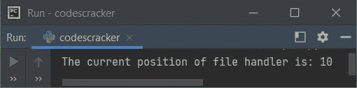

# Python `tell()`关函数

> 原文：<https://codescracker.com/python/python-tell-function.htm>

Python 中的 **tell()** 函数，用于查找文件处理程序或文件对象的当前位置。大多数时候， **tell()**函数对于检查文件处理程序的位置是否在文件的开头很有用。

## Python tell()语法

在 Python 程序中使用名为 **tell()** 的函数的语法是:

```
fo.tell()
```

其中 **fo** 表示文件对象或处理程序。所有的细节都用例子来演示，关于这个函数 下面给出。

## Python tell()示例

下面的例子创建了一个名为 **myfile.txt** 的文件(如果在当前目录中不可用)，并写下一行内容 **怎么了！**入档。如果该文件在当前目录中已经存在，那么 文件中的任何内容都将被替换为【T4 怎么了！。这个程序使用 **tell()** 函数来打印 文件对象或处理程序的当前位置。

```
fo = open("myfile.txt", "w")
text = "What's Up!"
fo.write(text)
print("The current position of file handler is:", fo.tell())
fo.close()
```

上述程序产生的输出显示在下面给出的快照中:



正文**怎么了！**，在文件 **myfile.txt** 中被写入/覆盖。而文件处理程序 的位置用**告诉**产生为 10，因为在写给定的 10 个字符的内容时，文件处理程序或 指针或对象移动到了文件的最后一个位置，即**！**(感叹号)。

以下是写入文件的 10 个字符的文本列表:

1.  W
2.  h
3.  a
4.  t
5.  '
6.  s
7.  (一个空格)
8.  U
9.  p
10.  ！

所以文件处理器的当前位置是 **10** 。如果你打开当前文件夹，a 文件 **myfile.txt** 将 可用，内容与上述程序编写的相同。这是当前目录的快照，包括新创建的 文件:


让我们创建另一个程序，演示如何使用 **tell()** 函数:

```
print("Enter File's Name: ", end="")
filename = input()
fo = open(filename, "a+")
print("\nThe content of file is:", fo.read())
print("\nThe current position of file handler is:", fo.tell())
print("\nEnter the content to append: ", end="")
content = input()
fo.write("\n")
fo.write(content)
print("\nNow the current position of file handler is:", fo.tell())
print("\nAnd the new content of file is:", fo.read())
fo.close()
```

下面是它的示例运行，用户输入 **myfile.txt** 作为文件名，**我是新内容。谢谢大家！**为内容向 追加:


正如您在上面的输出中所看到的，因为文件处理程序的位置发生了变化，在将内容追加到文件后，它转到了文件的末尾。所以文件的内容没有显示出来。因此，这里 [seek()函数](/python/python-seek-function.htm)就进入了画面。一切都用下面给出的程序 来描述。

下面的语句来自上面的程序:

```
fo.write("\n")
```

用于在向文件追加新内容之前插入一个新行，这样，新内容就从新行开始追加。

现在让我们创建另一个程序，它使用 **seek()** 函数和 **tell()** 来清除关于主题的所有剩余疑问 (如果有的话):

```
print("Enter File's Name: ", end="")
filename = input()
try:
    fo = open(filename, "r")
    print("\nThe current position of file handler is:", fo.tell())
    print("\nThe content of file is:", fo.read())
    print("\nAgain the current position of file handler is:", fo.tell())
    fo.close()
    print("\nEnter the content to append: ", end="")
    content = input()
    fo = open(filename, "a+")
    fo.write("\n")
    fo.write(content)
    print("\nThe current position of file handler is:", fo.tell())
    fo.seek(0)
    print("\nNow the current position of file handler is:", fo.tell())
    print("\nAnd the new content of file is:", fo.read())
except FileNotFoundError:
    print("\nThe file is not available in the current directory.")
    print("Creating the file...")
    fo = open(filename, "w+")
    print("The file is created successfully!")
    print("\nThe current position of file handler is:", fo.tell())
    print("Enter the content to write: ", end="")
    content = input()
    fo.write(content)
    print("\nNow the current position of file handler is:", fo.tell())
    fo.seek(0)
    print("\nAgain the current position of file handler is:", fo.tell())
    print("\nAnd the content of file is:", fo.read())
finally:
    fo.close()
```

下面是它的示例运行，将用户输入的 **myfile.txt** (当前目录中的一个文件)， **Hi** 作为 内容添加到:


这是另一个运行用户输入 **yourfile.txt** (一个不存在的文件)的示例，**你好，你的文件也创建好了。** 照内容写:


在程序第二次运行后，一个名为 **yourfile.txt** 的文件会在你当前的目录下创建。

[Python 在线测试](/exam/showtest.php?subid=10)

* * *

* * *