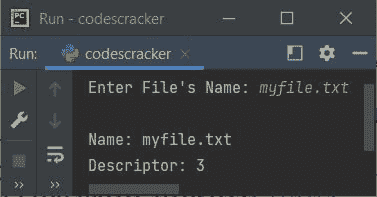

# Python fileno()函数

> 原文：<https://codescracker.com/python/python-fileno-function.htm>

Python 中的 **fileno()** 函数，用于以整数形式获取流的文件描述符。也就是说， **fileno()** 函数返回分配给 file 对象的文件描述符的整数值。

## Python fileno()语法

在 Python 程序中使用 **fileno()** 函数的语法是:

```
file_object.fileno()
```

其中**文件对象**指的是文件处理程序或对象。

## Python fileno()示例

让我们创建一个示例程序，演示一下 **fileno()** 函数。文件中说 **codescracker.txt** 必须在当前目录下的 中可用。否则程序会引发一个错误。因此，在执行下面给出的 程序之前，创建文件。

```
filehandle = open("codescracker.txt", "r")
val = filehandle.fileno()
print("Integer Value of File Descriptor is", val)
filehandle.close()
```

因为在我的例子中，文件 **codescracker.txt** 位于当前目录中。因此，下面是上面程序产生的输出 :


由于上述程序中使用的打开模式是 **r** ，因此该文件必须在当前的 目录中可用。否则程序将抛出或引发错误。但是你也可以将模式从 **r** 更改为 **w** 到 以避免任何错误，同时打印文件描述符的整数值，就像前面的程序一样。以下是之前程序的修改版 :

```
print("Enter File's Name: ", end="")
filename = input()
fileobject = open(filename, "w")
print("\nName:", fileobject.name)
print("Descriptor:", fileobject.fileno())
fileobject.close()
```

下面是它的示例运行，用户输入 **myfile.txt** 作为文件名:



**注-****w**模式用作文件的打开模式，意思是，如果文件不存在，则使用用户输入提供的相同名称创建一个新文件 。

**注意-**[结束参数](/python/python-end.htm)使用 [print()函数](/python/python-print-statement.htm)跳过自动换行符的插入。

[Python 在线测试](/exam/showtest.php?subid=10)

* * *

* * *